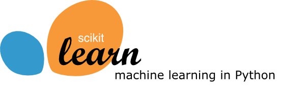

.. -*- mode: rst -*-

|Azure|_ |Travis|_ |Codecov|_ |CircleCI|_ |PythonVersion|_ |PyPi|_ |DOI|_

.. |Azure| image:: https://dev.azure.com/scikit-learn/scikit-learn/_apis/build/status/scikit-learn.scikit-learn?branchName=master
.. _Azure: https://dev.azure.com/scikit-learn/scikit-learn/_build/latest?definitionId=1&branchName=master

.. |Travis| image:: https://api.travis-ci.org/scikit-learn/scikit-learn.svg?branch=master
.. _Travis: https://travis-ci.org/scikit-learn/scikit-learn

.. |Codecov| image:: https://codecov.io/github/scikit-learn/scikit-learn/badge.svg?branch=master&service=github
.. _Codecov: https://codecov.io/github/scikit-learn/scikit-learn?branch=master

.. |CircleCI| image:: https://circleci.com/gh/scikit-learn/scikit-learn/tree/master.svg?style=shield&circle-token=:circle-token
.. _CircleCI: https://circleci.com/gh/scikit-learn/scikit-learn

.. |PythonVersion| image:: https://img.shields.io/badge/python-3.6%20%7C%203.7%20%7C%203.8-blue
.. _PythonVersion: https://img.shields.io/badge/python-3.6%20%7C%203.7%20%7C%203.8-blue

.. |PyPi| image:: https://badge.fury.io/py/scikit-learn.svg
.. _PyPi: https://badge.fury.io/py/scikit-learn

.. |DOI| image:: https://zenodo.org/badge/21369/scikit-learn/scikit-learn.svg
.. _DOI: https://zenodo.org/badge/latestdoi/21369/scikit-learn/scikit-learn

**scikit-learn** is a Python module for machine learning built on top of
SciPy and is distributed under the 3-Clause BSD license.

The project was started in 2007 by David Cournapeau as a Google Summer
of Code project, and since then many volunteers have contributed. See
the `About us <https://scikit-learn.org/dev/about.html#authors>`__ page
for a list of core contributors.

It is currently maintained by a team of volunteers.

Website: https://scikit-learn.org

Installation
------------

Dependencies
~~~~~~~~~~~~

scikit-learn requires:

- Python (>= 3.6)
- NumPy (>= 1.13.3)
- SciPy (>= 0.19.1)
- joblib (>= 0.11)
- threadpoolctl (>= 2.0.0)

=======

**Scikit-learn 0.20 was the last version to support Python 2.7 and Python 3.4.**
scikit-learn 0.23 and later require Python 3.6 or newer.

Scikit-learn plotting capabilities (i.e., functions start with ``plot_``
and classes end with "Display") require Matplotlib (>= 2.1.1). For running the
examples Matplotlib >= 2.1.1 is required. A few examples require
scikit-image >= 0.13, a few examples require pandas >= 0.18.0, some examples
require seaborn >= 0.9.0.

User installation
~~~~~~~~~~~~~~~~~

If you already have a working installation of numpy and scipy,
the easiest way to install scikit-learn is using ``pip``   ::

    pip install -U scikit-learn

or ``conda``::

    conda install scikit-learn

The documentation includes more detailed `installation instructions <https://scikit-learn.org/stable/install.html>`_.

Changelog
---------

See the `changelog <https://scikit-learn.org/dev/whats_new.html>`__
for a history of notable changes to scikit-learn.

Development
-----------

We welcome new contributors of all experience levels. The scikit-learn
community goals are to be helpful, welcoming, and effective. The
`Development Guide <https://scikit-learn.org/stable/developers/index.html>`_
has detailed information about contributing code, documentation, tests, and
more. We've included some basic information in this README.

Important links
~~~~~~~~~~~~~~~

- Official source code repo: https://github.com/scikit-learn/scikit-learn
- Download releases: https://pypi.org/project/scikit-learn/
- Issue tracker: https://github.com/scikit-learn/scikit-learn/issues

Source code
~~~~~~~~~~~

You can check the latest sources with the command::

    git clone https://github.com/scikit-learn/scikit-learn.git

Contributing
~~~~~~~~~~~~

To learn more about making a contribution to scikit-learn, please see our
`Contributing guide
<https://scikit-learn.org/dev/developers/contributing.html>`_.

Testing
~~~~~~~

After installation, you can launch the test suite from outside the
source directory (you will need to have ``pytest`` >= 3.3.0 installed)::

    pytest sklearn

See the web page https://scikit-learn.org/dev/developers/advanced_installation.html#testing
for more information.

    Random number generation can be controlled during testing by setting
    the ``SKLEARN_SEED`` environment variable.

Submitting a Pull Request
~~~~~~~~~~~~~~~~~~~~~~~~~

Before opening a Pull Request, have a look at the
full Contributing page to make sure your code complies
with our guidelines: https://scikit-learn.org/stable/developers/index.html

Project History
---------------

The project was started in 2007 by David Cournapeau as a Google Summer
of Code project, and since then many volunteers have contributed. See
the `About us <https://scikit-learn.org/dev/about.html#authors>`__ page
for a list of core contributors.

The project is currently maintained by a team of volunteers.

**Note**: `scikit-learn` was previously referred to as `scikits.learn`.

Help and Support
----------------

Documentation
~~~~~~~~~~~~~

- HTML documentation (stable release): https://scikit-learn.org
- HTML documentation (development version): https://scikit-learn.org/dev/
- FAQ: https://scikit-learn.org/stable/faq.html

Communication
~~~~~~~~~~~~~

- Mailing list: https://mail.python.org/mailman/listinfo/scikit-learn
- IRC channel: ``#scikit-learn`` at ``webchat.freenode.net``
- Stack Overflow: https://stackoverflow.com/questions/tagged/scikit-learn
- Website: https://scikit-learn.org

Citation
~~~~~~~~

If you use scikit-learn in a scientific publication, we would appreciate citations: https://scikit-learn.org/stable/about.html#citing-scikit-learn
