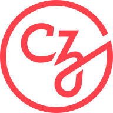

.. _about:

========
About us
========

History
=======

This project was started in 2007 as a Google Summer of Code project by
David Cournapeau. Later that year, Matthieu Brucher started working on this project 
as part of his thesis.

In 2010 Fabian Pedregosa, Gael Varoquaux, Alexandre Gramfort and Vincent
Michel of INRIA took leadership of the project and made the first public
release, February the 1st 2010. Since then, several releases have appeared
following an approximately 3-month cycle, and a thriving international
community has been leading the development. As a result, INRIA holds the
copyright over the work done by people who were employed by INRIA at the
time of the contribution.

Governance
==========

The decision making process and governance structure of scikit-learn, like roles and responsibilities, is laid out in the :ref:`governance document <governance>`.

.. The "author" anchors below is there to ensure that old html links (in
   the form of "about.html#author" still work)

.. _authors:

The people behind scikit-learn
==============================

Scikit-learn is a community project, developed by a large group of
people, all across the world. A few core contributor teams, listed below, have
central roles, however a more complete list of contributors can be found `on
github
<https://github.com/scikit-learn/scikit-learn/graphs/contributors>`__.

Active Core Contributors
------------------------

Maintainers Team
................

The following people are currently maintainers, in charge of
consolidating scikit-learn's development and maintenance:

.. include:: maintainers.rst

.. note::

  Please do not email the authors directly to ask for assistance or report issues.
  Instead, please see `What's the best way to ask questions about scikit-learn
  <https://scikit-learn.org/stable/faq.html#what-s-the-best-way-to-get-help-on-scikit-learn-usage>`_
  in the FAQ.

.. seealso::

  How you can :ref:`contribute to the project <contributing>`.

Documentation Team
..................

The following people help with documenting the project:

.. include:: documentation_team.rst

Contributor Experience Team
...........................

The following people are active contributors who also help with
:ref:`triaging issues <bug_triaging>`, PRs, and general
maintenance:

.. include:: contributor_experience_team.rst

Communication Team
..................

The following people help with :ref:`communication around scikit-learn
<communication_team>`.

.. include:: communication_team.rst

Emeritus Core Contributors
--------------------------

Emeritus Maintainers Team
.........................

The following people have been active contributors in the past, but are no
longer active in the project:

.. include:: maintainers_emeritus.rst

Emeritus Communication Team
...........................

The following people have been active in the communication team in the
past, but no longer have communication responsibilities:

.. include:: communication_team_emeritus.rst

Emeritus Contributor Experience Team
....................................

The following people have been active in the contributor experience team in the
past:

.. include:: contributor_experience_team_emeritus.rst

.. _citing-scikit-learn:

Citing scikit-learn
===================

If you use scikit-learn in a scientific publication, we would appreciate
citations to the following paper:

`Scikit-learn: Machine Learning in Python
<https://jmlr.csail.mit.edu/papers/v12/pedregosa11a.html>`_, Pedregosa
*et al.*, JMLR 12, pp. 2825-2830, 2011.

Bibtex entry::

  @article{scikit-learn,
    title={Scikit-learn: Machine Learning in {P}ython},
    author={Pedregosa, F. and Varoquaux, G. and Gramfort, A. and Michel, V.
            and Thirion, B. and Grisel, O. and Blondel, M. and Prettenhofer, P.
            and Weiss, R. and Dubourg, V. and Vanderplas, J. and Passos, A. and
            Cournapeau, D. and Brucher, M. and Perrot, M. and Duchesnay, E.},
    journal={Journal of Machine Learning Research},
    volume={12},
    pages={2825--2830},
    year={2011}
  }

If you want to cite scikit-learn for its API or design, you may also want to consider the
following paper:

:arxiv:`API design for machine learning software: experiences from the scikit-learn
project <1309.0238>`, Buitinck *et al.*, 2013.

Bibtex entry::

  @inproceedings{sklearn_api,
    author    = {Lars Buitinck and Gilles Louppe and Mathieu Blondel and
                  Fabian Pedregosa and Andreas Mueller and Olivier Grisel and
                  Vlad Niculae and Peter Prettenhofer and Alexandre Gramfort
                  and Jaques Grobler and Robert Layton and Jake VanderPlas and
                  Arnaud Joly and Brian Holt and Ga{\"{e}}l Varoquaux},
    title     = {{API} design for machine learning software: experiences from the scikit-learn
                  project},
    booktitle = {ECML PKDD Workshop: Languages for Data Mining and Machine Learning},
    year      = {2013},
    pages = {108--122},
  }

Artwork
=======

High quality PNG and SVG logos are available in the `doc/logos/
<https://github.com/scikit-learn/scikit-learn/tree/main/doc/logos>`_
source directory.

.. image:: images/scikit-learn-logo-notext.png
  :align: center

Funding
=======

Scikit-learn is a community driven project, however institutional and private
grants help to assure its sustainability.

The project would like to thank the following funders.

...................................

.. div:: sk-text-image-grid-small

  .. div:: text-box

    `:probabl. <https://probabl.ai>`_ employs Adrin Jalali, Arturo Amor,
    François Goupil, Guillaume Lemaitre, Jérémie du Boisberranger, Loïc Estève,
    Olivier Grisel, and Stefanie Senger.

  .. div:: image-box

    .. image:: images/probabl.png
      :target: https://probabl.ai

..........

.. |axa| image:: images/axa.png
  :target: https://www.axa.fr/

.. |bnp| image:: images/bnp.png
  :target: https://www.bnpparibascardif.com/

.. |dataiku| image:: images/dataiku.png
  :target: https://www.dataiku.com/

.. |inria| image:: images/inria-logo.jpg
  :target: https://www.inria.fr

.. raw:: html

  

.. div:: sk-text-image-grid-small

  .. div:: text-box

    The `Members <https://scikit-learn.fondation-inria.fr/en/home/#sponsors>`_ of
    the `Scikit-learn Consortium at Inria Foundation
    <https://scikit-learn.fondation-inria.fr/en/home/>`_ help at maintaining and
    improving the project through their financial support.

  .. div:: image-box

    .. table::
      :class: image-subtable

      +----------+-----------+
      |       |chanel|       |
      +----------+-----------+
      |  |axa|   |    |bnp|  |
      +----------+-----------+
      |       |nvidia|       |
      +----------+-----------+
      |       |dataiku|      |
      +----------+-----------+
      |        |inria|       |
      +----------+-----------+

..........

.. div:: sk-text-image-grid-small

  .. div:: text-box

    `NVidia <https://nvidia.com>`_ funds Tim Head since 2022
    and is part of the scikit-learn consortium at Inria.

  .. div:: image-box

    .. image:: images/nvidia.png
      :target: https://nvidia.com

..........

.. div:: sk-text-image-grid-small

  .. div:: text-box

    `Microsoft <https://microsoft.com/>`_ funds Andreas Müller since 2020.

  .. div:: image-box

    .. image:: images/microsoft.png
      :target: https://microsoft.com

...........

.. div:: sk-text-image-grid-small

  .. div:: text-box

    `Quansight Labs <https://labs.quansight.org>`_ funds Lucy Liu since 2022.

  .. div:: image-box

    .. image:: images/quansight-labs.png
      :target: https://labs.quansight.org

...........

.. div:: sk-text-image-grid-small

  .. div:: text-box

    `The Chan-Zuckerberg Initiative <https://chanzuckerberg.com/>`_ and
    `Wellcome Trust <https://wellcome.org/>`_ fund scikit-learn through the
    `Essential Open Source Software for Science (EOSS) <https://chanzuckerberg.com/eoss/>`_
    cycle 6.

    It supports Lucy Liu and diversity & inclusion initiatives that will
    be announced in the future.

  .. div:: image-box

    .. table::
      :class: image-subtable

      +----------+----------------+
      |  |czi|   |    |wellcome|  |
      +----------+----------------+

...........

.. div:: sk-text-image-grid-small

  .. div:: text-box

    `Tidelift <https://tidelift.com/>`_ supports the project via their service
    agreement.

  .. div:: image-box

    .. image:: images/Tidelift-logo-on-light.svg
      :target: https://tidelift.com/

...........

Past Sponsors
-------------

.. div:: sk-text-image-grid-small

  .. div:: text-box

    `Quansight Labs <https://labs.quansight.org>`_ funded Meekail Zain in 2022 and 2023,
    and funded Thomas J. Fan from 2021 to 2023.

  .. div:: image-box

    .. image:: images/quansight-labs.png
      :target: https://labs.quansight.org

...........

.. div:: sk-text-image-grid-small

  .. div:: text-box

    `Columbia University <https://columbia.edu/>`_ funded Andreas Müller
    (2016-2020).

  .. div:: image-box

    .. image:: images/columbia.png
      :target: https://columbia.edu

........

.. div:: sk-text-image-grid-small

  .. div:: text-box

    `The University of Sydney <https://sydney.edu.au/>`_ funded Joel Nothman
    (2017-2021).

  .. div:: image-box

    .. image:: images/sydney-primary.jpeg
      :target: https://sydney.edu.au/

...........

.. div:: sk-text-image-grid-small

  .. div:: text-box

    Andreas Müller received a grant to improve scikit-learn from the
    `Alfred P. Sloan Foundation <https://sloan.org>`_ .
    This grant supported the position of Nicolas Hug and Thomas J. Fan.

  .. div:: image-box

    .. image:: images/sloan_banner.png
      :target: https://sloan.org/

.............

.. div:: sk-text-image-grid-small

  .. div:: text-box

    `INRIA <https://www.inria.fr>`_ actively supports this project. It has
    provided funding for Fabian Pedregosa (2010-2012), Jaques Grobler
    (2012-2013) and Olivier Grisel (2013-2017) to work on this project
    full-time. It also hosts coding sprints and other events.

  .. div:: image-box

    .. image:: images/inria-logo.jpg
      :target: https://www.inria.fr

.....................

.. div:: sk-text-image-grid-small

  .. div:: text-box

    `Paris-Saclay Center for Data Science <http://www.datascience-paris-saclay.fr/>`_
    funded one year for a developer to work on the project full-time (2014-2015), 50%
    of the time of Guillaume Lemaitre (2016-2017) and 50% of the time of Joris van den
    Bossche (2017-2018).

  .. div:: image-box

    .. image:: images/cds-logo.png
      :target: http://www.datascience-paris-saclay.fr/

..........................

.. div:: sk-text-image-grid-small

  .. div:: text-box

    `NYU Moore-Sloan Data Science Environment <https://cds.nyu.edu/mooresloan/>`_
    funded Andreas Mueller (2014-2016) to work on this project. The Moore-Sloan
    Data Science Environment also funds several students to work on the project
    part-time.

  .. div:: image-box

    .. image:: images/nyu_short_color.png
      :target: https://cds.nyu.edu/mooresloan/

........................

.. div:: sk-text-image-grid-small

  .. div:: text-box

    `Télécom Paristech <https://www.telecom-paristech.fr/>`_ funded Manoj Kumar
    (2014), Tom Dupré la Tour (2015), Raghav RV (2015-2017), Thierry Guillemot
    (2016-2017) and Albert Thomas (2017) to work on scikit-learn.

  .. div:: image-box

    .. image:: images/telecom.png
      :target: https://www.telecom-paristech.fr/

.....................

.. div:: sk-text-image-grid-small

  .. div:: text-box

    `The Labex DigiCosme <https://digicosme.lri.fr>`_ funded Nicolas Goix
    (2015-2016), Tom Dupré la Tour (2015-2016 and 2017-2018), Mathurin Massias
    (2018-2019) to work part time on scikit-learn during their PhDs. It also
    funded a scikit-learn coding sprint in 2015.

  .. div:: image-box

    .. image:: images/digicosme.png
      :target: https://digicosme.lri.fr

.....................

.. div:: sk-text-image-grid-small

  .. div:: text-box

    `The Chan-Zuckerberg Initiative <https://chanzuckerberg.com/>`_ funded Nicolas
    Hug to work full-time on scikit-learn in 2020.

  .. div:: image-box

    .. image:: images/czi.png
      :target: https://chanzuckerberg.com

......................

The following students were sponsored by `Google
<https://opensource.google/>`_ to work on scikit-learn through
the `Google Summer of Code <https://en.wikipedia.org/wiki/Google_Summer_of_Code>`_
program.

- 2007 - David Cournapeau
- 2011 - `Vlad Niculae`_
- 2012 - `Vlad Niculae`_, Immanuel Bayer
- 2013 - Kemal Eren, Nicolas Trésegnie
- 2014 - Hamzeh Alsalhi, Issam Laradji, Maheshakya Wijewardena, Manoj Kumar
- 2015 - `Raghav RV <https://github.com/raghavrv>`_, Wei Xue
- 2016 - `Nelson Liu <http://nelsonliu.me>`_, `YenChen Lin <https://yenchenlin.me/>`_

.. _Vlad Niculae: https://vene.ro/

...................

The `NeuroDebian <http://neuro.debian.net>`_ project providing `Debian
<https://www.debian.org/>`_ packaging and contributions is supported by
`Dr. James V. Haxby <http://haxbylab.dartmouth.edu/>`_ (`Dartmouth
College <https://pbs.dartmouth.edu/>`_).

...................

The following organizations funded the scikit-learn consortium at Inria in
the past:

.. |msn| image:: images/microsoft.png
  :target: https://www.microsoft.com/

.. |bcg| image:: images/bcg.png
  :target: https://www.bcg.com/beyond-consulting/bcg-gamma/default.aspx

.. |fujitsu| image:: images/fujitsu.png
  :target: https://www.fujitsu.com/global/

.. |hf| image:: images/huggingface_logo-noborder.png
  :target: https://huggingface.co

.. raw:: html

  

.. grid:: 2 2 4 4
  :class-row: image-subgrid
  :gutter: 1

  .. grid-item::
    :class: sd-text-center
    :child-align: center

    |msn|

  .. grid-item::
    :class: sd-text-center
    :child-align: center

    |bcg|

  .. grid-item::
    :class: sd-text-center
    :child-align: center

    |fujitsu|

  .. grid-item::
    :class: sd-text-center
    :child-align: center

    |aphp|

  .. grid-item::
    :class: sd-text-center
    :child-align: center

    |hf|

Coding Sprints
==============

The scikit-learn project has a long history of `open source coding sprints
<https://blog.scikit-learn.org/events/sprints-value/>`_ with over 50 sprint
events from 2010 to present day. There are scores of sponsors who contributed
to costs which include venue, food, travel, developer time and more. See
`scikit-learn sprints <https://blog.scikit-learn.org/sprints/>`_ for a full
list of events.

Donating to the project
=======================

If you are interested in donating to the project or to one of our code-sprints,
please donate via the `NumFOCUS Donations Page
<https://numfocus.org/donate-to-scikit-learn>`_.

.. raw:: html

  

    <a class="btn sk-btn-orange mb-1" href="https://numfocus.org/donate-to-scikit-learn">
      Help us, <strong>donate!</strong>
    </a>
  

All donations will be handled by `NumFOCUS <https://numfocus.org/>`_, a non-profit
organization which is managed by a board of `Scipy community members
<https://numfocus.org/board.html>`_. NumFOCUS's mission is to foster scientific
computing software, in particular in Python. As a fiscal home of scikit-learn, it
ensures that money is available when needed to keep the project funded and available
while in compliance with tax regulations.

The received donations for the scikit-learn project mostly will go towards covering
travel-expenses for code sprints, as well as towards the organization budget of the
project [#f1]_.

.. rubric:: Notes

.. [#f1] Regarding the organization budget, in particular, we might use some of
  the donated funds to pay for other project expenses such as DNS,
  hosting or continuous integration services.

Infrastructure support
======================

We would also like to thank `Microsoft Azure <https://azure.microsoft.com/en-us/>`_,
`Cirrus Cl <https://cirrus-ci.org>`_, `CircleCl <https://circleci.com/>`_ for free CPU
time on their Continuous Integration servers, and `Anaconda Inc. <https://www.anaconda.com>`_
for the storage they provide for our staging and nightly builds.
