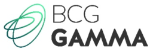
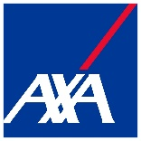
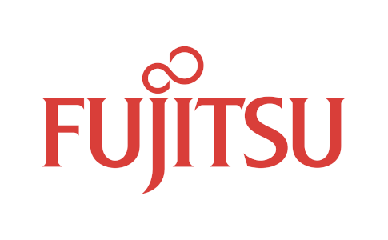
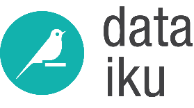
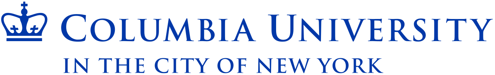
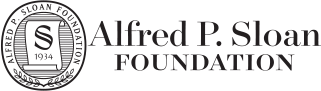
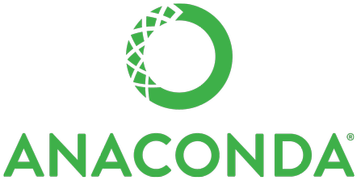
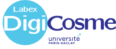

.. _about:

About us
========

History
-------

This project was started in 2007 as a Google Summer of Code project by
David Cournapeau. Later that year, Matthieu Brucher started work on
this project as part of his thesis.

In 2010 Fabian Pedregosa, Gael Varoquaux, Alexandre Gramfort and Vincent
Michel of INRIA took leadership of the project and made the first public
release, February the 1st 2010. Since then, several releases have appeared
following a ~ 3-month cycle, and a thriving international community has
been leading the development.

Governance
----------
The decision making process and governance structure of scikit-learn is laid
out in the :ref:`governance document <governance>`.

Authors
-------

The following people are currently core contributors to scikit-learn's development
and maintenance:

.. include:: authors.rst

Please do not email the authors directly to ask for assistance or report issues.
Instead, please see `What's the best way to ask questions about scikit-learn
<http://scikit-learn.org/stable/faq.html#what-s-the-best-way-to-get-help-on-scikit-learn-usage>`_
in the FAQ.

.. seealso::

   :ref:`How you can contribute to the project <contributing>`

Triage Team
-----------

The following people are active contributors who also help with
:ref:`triaging issues <bug_triaging>`, PRs, and general
maintenance:

.. include:: triage_team.rst

Emeritus Core Developers
------------------------

The following people have been active contributors in the past, but are no
longer active in the project:

.. include:: authors_emeritus.rst

.. _citing-scikit-learn:

Citing scikit-learn
-------------------

If you use scikit-learn in a scientific publication, we would appreciate
citations to the following paper:

  `Scikit-learn: Machine Learning in Python
  <http://jmlr.csail.mit.edu/papers/v12/pedregosa11a.html>`_, Pedregosa
  *et al.*, JMLR 12, pp. 2825-2830, 2011.

  Bibtex entry::

    @article{scikit-learn,
     title={Scikit-learn: Machine Learning in {P}ython},
     author={Pedregosa, F. and Varoquaux, G. and Gramfort, A. and Michel, V.
             and Thirion, B. and Grisel, O. and Blondel, M. and Prettenhofer, P.
             and Weiss, R. and Dubourg, V. and Vanderplas, J. and Passos, A. and
             Cournapeau, D. and Brucher, M. and Perrot, M. and Duchesnay, E.},
     journal={Journal of Machine Learning Research},
     volume={12},
     pages={2825--2830},
     year={2011}
    }

If you want to cite scikit-learn for its API or design, you may also want to consider the
following paper:

  `API design for machine learning software: experiences from the scikit-learn
  project <https://arxiv.org/abs/1309.0238>`_, Buitinck *et al.*, 2013.

  Bibtex entry::

    @inproceedings{sklearn_api,
      author    = {Lars Buitinck and Gilles Louppe and Mathieu Blondel and
                   Fabian Pedregosa and Andreas Mueller and Olivier Grisel and
                   Vlad Niculae and Peter Prettenhofer and Alexandre Gramfort
                   and Jaques Grobler and Robert Layton and Jake VanderPlas and
                   Arnaud Joly and Brian Holt and Ga{\"{e}}l Varoquaux},
      title     = {{API} design for machine learning software: experiences from the scikit-learn
                   project},
      booktitle = {ECML PKDD Workshop: Languages for Data Mining and Machine Learning},
      year      = {2013},
      pages = {108--122},
    }

Artwork
-------

High quality PNG and SVG logos are available in the `doc/logos/
<https://github.com/scikit-learn/scikit-learn/tree/main/doc/logos>`_
source directory.

.. image:: images/scikit-learn-logo-notext.png
   :align: center

Funding
-------
Scikit-Learn is a community driven project, however institutional and private
grants help to assure its sustainability.

The project would like to thank the following funders.

...................................

.. raw:: html

   

   

The `Members <https://scikit-learn.fondation-inria.fr/en/home/#sponsors>`_ of
the `Scikit-Learn Consortium at Inria Foundation
<https://scikit-learn.fondation-inria.fr/en/home/>`_  fund Olivier
Grisel, Guillaume Lemaitre, Jérémie du Boisberranger and Chiara Marmo.

.. raw:: html

   

.. |msn| image:: images/microsoft.png
   :width: 100pt
   :target: https://www.microsoft.com/

.. |inria| image:: images/inria-logo.jpg
   :width: 100pt
   :target: https://www.inria.fr

.. raw:: html

   

.. table::
   :class: sk-sponsor-table align-default

   +---------+----------+
   |       |bcg|        |
   +---------+----------+
   |                    |
   +---------+----------+
   |  |axa|  |   |bnp|  |
   +---------+----------+
   ||fujitsu||  |msn|   |
   +---------+----------+
   |                    |
   +---------+----------+
   |     |dataiku|      |
   +---------+----------+
   |                    |
   +---------+----------+
   |       |inria|      |
   +---------+----------+

.. raw:: html

   

   

........

.. raw:: html

   

   

`Columbia University <https://columbia.edu/>`_ funds Andreas Müller since 2016

.. raw:: html

   

   

.. raw:: html

   

   

..........

.. raw:: html

   

   

Andreas Müller received a grant to improve scikit-learn from the
`Alfred P. Sloan Foundation <https://sloan.org>`_ .
This grant supports the position of Nicolas Hug and Thomas J. Fan.

.. raw:: html

   

   

.. raw:: html

   

   

...........

.. raw:: html

   

   

`The University of Sydney <https://sydney.edu.au/>`_ funds Joel Nothman since
July 2017.

.. raw:: html

   

   

.. image:: themes/scikit-learn/static/img/sydney-primary.jpeg
   :width: 100pt
   :align: center
   :target: https://sydney.edu.au/

.. raw:: html

   

   

...........

.. raw:: html

   

   

`Zalando SE <https://corporate.zalando.com/en>`_ funds Adrin Jalali since
August 2020.

.. raw:: html

   

   

.. raw:: html

   

   

Past Sponsors
.............

.. raw:: html

   

   

`INRIA <https://www.inria.fr>`_ actively supports this project. It has
provided funding for Fabian Pedregosa (2010-2012), Jaques Grobler
(2012-2013) and Olivier Grisel (2013-2017) to work on this project
full-time. It also hosts coding sprints and other events.

.. raw:: html

   

   

.. image:: images/inria-logo.jpg
   :width: 100pt
   :align: center
   :target: https://www.inria.fr

.. raw:: html

   

   

.....................

.. raw:: html

   

   

`Paris-Saclay Center for Data Science
<https://www.datascience-paris-saclay.fr/>`_
funded one year for a developer to work on the project full-time
(2014-2015), 50% of the time of Guillaume Lemaitre (2016-2017) and 50% of the
time of Joris van den Bossche (2017-2018).

.. raw:: html

   

   

.. raw:: html

   

   

............

.. raw:: html

   

   

`Anaconda, Inc <https://www.anaconda.com/>`_ funded Adrin Jalali in 2019.

.. raw:: html

   

   

.. raw:: html

   

   

..........................

.. raw:: html

   

   

`NYU Moore-Sloan Data Science Environment <https://cds.nyu.edu/mooresloan/>`_
funded Andreas Mueller (2014-2016) to work on this project. The Moore-Sloan
Data Science Environment also funds several students to work on the project
part-time.

.. raw:: html

   

   

.. image:: images/nyu_short_color.png
   :width: 100pt
   :align: center
   :target: https://cds.nyu.edu/mooresloan/

.. raw:: html

   

   

........................

.. raw:: html

   

   

`Télécom Paristech <https://www.telecom-paristech.fr/>`_ funded Manoj Kumar
(2014), Tom Dupré la Tour (2015), Raghav RV (2015-2017), Thierry Guillemot
(2016-2017) and Albert Thomas (2017) to work on scikit-learn.

.. raw:: html

   

   

.. image:: themes/scikit-learn/static/img/telecom.png
   :width: 50pt
   :align: center
   :target: https://www.telecom-paristech.fr/

.. raw:: html

   

   

.....................

.. raw:: html

   

   

`The Labex DigiCosme <https://digicosme.lri.fr>`_ funded Nicolas Goix
(2015-2016), Tom Dupré la Tour (2015-2016 and 2017-2018), Mathurin Massias
(2018-2019) to work part time on scikit-learn during their PhDs. It also
funded a scikit-learn coding sprint in 2015.

.. raw:: html

   

   

.. raw:: html

   

   

......................

The following students were sponsored by `Google
<https://developers.google.com/open-source/>`_ to work on scikit-learn through
the `Google Summer of Code <https://en.wikipedia.org/wiki/Google_Summer_of_Code>`_
program.

- 2007 - David Cournapeau
- 2011 - `Vlad Niculae`_
- 2012 - `Vlad Niculae`_, Immanuel Bayer.
- 2013 - Kemal Eren, Nicolas Trésegnie
- 2014 - Hamzeh Alsalhi, Issam Laradji, Maheshakya Wijewardena, Manoj Kumar.
- 2015 - `Raghav RV <https://github.com/raghavrv>`_, Wei Xue
- 2016 - `Nelson Liu <http://nelsonliu.me>`_, `YenChen Lin <https://yclin.me/>`_

.. _Vlad Niculae: https://vene.ro/

...................

The `NeuroDebian <http://neuro.debian.net>`_ project providing `Debian
<https://www.debian.org/>`_ packaging and contributions is supported by
`Dr. James V. Haxby <http://haxbylab.dartmouth.edu/>`_ (`Dartmouth
College <https://pbs.dartmouth.edu/>`_).

Sprints
-------

The International 2019 Paris sprint was kindly hosted by `AXA <https://www.axa.fr/>`_.
Also some participants could attend thanks to the support of the `Alfred P.
Sloan Foundation <https://sloan.org>`_, the `Python Software
Foundation <https://www.python.org/psf/>`_ (PSF) and the `DATAIA Institute
<https://dataia.eu/en>`_.

.....................

The 2013 International Paris Sprint was made possible thanks to the support of
`Télécom Paristech <https://www.telecom-paristech.fr/>`_, `tinyclues
<https://www.tinyclues.com/>`_, the `French Python Association
<https://www.afpy.org/>`_ and the `Fonds de la Recherche Scientifique
<https://www.frs-fnrs.be/-fnrs>`_.

..............

The 2011 International Granada sprint was made possible thanks to the support
of the `PSF <https://www.python.org/psf/>`_ and `tinyclues
<https://www.tinyclues.com/>`_.

Donating to the project
.......................

If you are interested in donating to the project or to one of our code-sprints,
you can use the *Paypal* button below or the `NumFOCUS Donations Page
<https://www.numfocus.org/support-numfocus.html>`_ (if you use the latter,
please indicate that you are donating for the scikit-learn project).

All donations will be handled by `NumFOCUS
<https://numfocus.org/>`_, a non-profit-organization which is
managed by a board of `Scipy community members
<https://numfocus.org/board.html>`_. NumFOCUS's mission is to foster
scientific computing software, in particular in Python. As a fiscal home
of scikit-learn, it ensures that money is available when needed to keep
the project funded and available while in compliance with tax regulations.

The received donations for the scikit-learn project mostly will go towards
covering travel-expenses for code sprints, as well as towards the organization
budget of the project [#f1]_.

.. raw :: html

     
   

   <a class="btn btn-warning btn-big sk-donate-btn mb-1" href="https://numfocus.org/donate-to-scikit-learn">Help us, <strong>donate!</strong></a>
   

    

.. rubric:: Notes

.. [#f1] Regarding the organization budget, in particular, we might use some of
         the donated funds to pay for other project expenses such as DNS,
         hosting or continuous integration services.

Infrastructure support
----------------------

- We would also like to thank `Microsoft Azure
  <https://azure.microsoft.com/en-us/>`_, `Travis Cl <https://travis-ci.org/>`_,
  `CircleCl <https://circleci.com/>`_ for free CPU time on their Continuous
  Integration servers, and `Anaconda Inc. <https://www.anaconda.com>`_ for the
  storage they provide for our staging and nightly builds.
