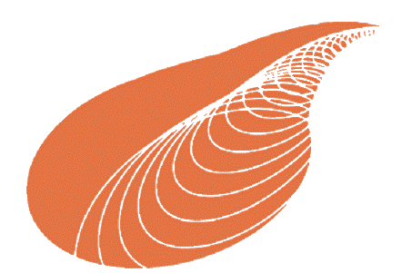

About us
========

History
-------

This project was started in 2007 as a Google Summer of Code project by
David Cournapeau. Later that year, Matthieu Brucher started work on
this project as part of his thesis.

In 2010 Fabian Pedregosa, Gael Varoquaux, Alexandre Gramfort and Vincent
Michel of INRIA took leadership of the project and made the first public
release, February the 1st 2010. Since then, several releases have appeared
following a ~3 month cycle, and a thriving international community has
been leading the development.

Authors
-------

The following people are currently core contributors to scikit-learn's development
and maintenance:

.. include:: authors.rst

Please do not email the authors directly to ask for assistance or report issues.
Instead, please see `What's the best way to ask questions about scikit-learn
<http://scikit-learn.org/stable/faq.html#what-s-the-best-way-to-get-help-on-scikit-learn-usage>`_
in the FAQ.

.. seealso::

   :ref:`How you can contribute to the project <contributing>`

Emeritus Core Developers
------------------------
The following people have been active contributors in the past, but are no longer active in the project

- Alexander Fabisch
- Alexandre Passos
- Angel Soler Gollonet
- Arnaud Joly
- Chris Gorgolewski
- David Cournapeau
- David Warde-Farley
- Eduard Duchesnay
- Fabian Pedragosa
- Gilles Louppe
- Jacob Schreiber
- Jake Vanderplas
- Jaques Grobler
- Jarrod Millman
- Kyle Kastner
- Lars Buitinck
- Manoj Kumar
- Mathieu Blondel
- Matthieu Brucher
- Noel Dawe
- Paolo Losi
- Peter Prettenhofer
- Raghav Rajagopalan
- Robert Layton
- Ron Weiss
- Satrajit Ghosh
- Shiqiao Du
- Thouis (Ray) Jones
- Vincent Dubourg
- Vincent Michel
- Virgile Fritsch
- Wei Li

Governance
----------
The decision making process and governance structure of scikit-learn is laid
out in the :ref:`governance document <governance>`.

.. _citing-scikit-learn:

Citing scikit-learn
-------------------

If you use scikit-learn in a scientific publication, we would appreciate
citations to the following paper:

  `Scikit-learn: Machine Learning in Python
  <http://jmlr.csail.mit.edu/papers/v12/pedregosa11a.html>`_, Pedregosa
  *et al.*, JMLR 12, pp. 2825-2830, 2011.

  Bibtex entry::

    @article{scikit-learn,
     title={Scikit-learn: Machine Learning in {P}ython},
     author={Pedregosa, F. and Varoquaux, G. and Gramfort, A. and Michel, V.
             and Thirion, B. and Grisel, O. and Blondel, M. and Prettenhofer, P.
             and Weiss, R. and Dubourg, V. and Vanderplas, J. and Passos, A. and
             Cournapeau, D. and Brucher, M. and Perrot, M. and Duchesnay, E.},
     journal={Journal of Machine Learning Research},
     volume={12},
     pages={2825--2830},
     year={2011}
    }

If you want to cite scikit-learn for its API or design, you may also want to consider the
following paper:

  `API design for machine learning software: experiences from the scikit-learn
  project <https://arxiv.org/abs/1309.0238>`_, Buitinck *et al.*, 2013.

  Bibtex entry::

    @inproceedings{sklearn_api,
      author    = {Lars Buitinck and Gilles Louppe and Mathieu Blondel and
                   Fabian Pedregosa and Andreas Mueller and Olivier Grisel and
                   Vlad Niculae and Peter Prettenhofer and Alexandre Gramfort
                   and Jaques Grobler and Robert Layton and Jake VanderPlas and
                   Arnaud Joly and Brian Holt and Ga{\"{e}}l Varoquaux},
      title     = {{API} design for machine learning software: experiences from the scikit-learn
                   project},
      booktitle = {ECML PKDD Workshop: Languages for Data Mining and Machine Learning},
      year      = {2013},
      pages = {108--122},
    }

Artwork
-------

High quality PNG and SVG logos are available in the `doc/logos/ <https://github.com/scikit-learn/scikit-learn/tree/master/doc/logos>`_ source directory.

.. image:: images/scikit-learn-logo-notext.png
   :align: center

Funding
-------

`INRIA <https://www.inria.fr>`_ actively supports this project. It has
provided funding for Fabian Pedregosa (2010-2012), Jaques Grobler
(2012-2013) and Olivier Grisel (2013-2017) to work on this project
full-time. It also hosts coding sprints and other events.

.. image:: images/inria-logo.jpg
   :width: 200pt
   :align: center
   :target: https://www.inria.fr

`Paris-Saclay Center for Data Science <https://www.datascience-paris-saclay.fr/>`_
funded one year for a developer to work on the project full-time
(2014-2015) and 50% of the time of Guillaume Lemaitre (2016-2017).

.. image:: images/cds-logo.png
   :width: 200pt
   :align: center
   :target: https://www.datascience-paris-saclay.fr/

`NYU Moore-Sloan Data Science Environment <https://cds.nyu.edu/mooresloan/>`_
funded Andreas Mueller (2014-2016) to work on this project. The Moore-Sloan Data Science
Environment also funds several students to work on the project part-time.

.. image:: images/nyu_short_color.png
   :width: 200pt
   :align: center
   :target: https://cds.nyu.edu/mooresloan/

`Télécom Paristech <https://www.telecom-paristech.fr/>`_ funded Manoj Kumar (2014),
Tom Dupré la Tour (2015), Raghav RV (2015-2017), Thierry Guillemot (2016-2017)
and Albert Thomas (2017) to work on scikit-learn.

.. image:: themes/scikit-learn/static/img/telecom.png
   :width: 100pt
   :align: center
   :target: https://www.telecom-paristech.fr/

`Columbia University <https://columbia.edu/>`_ funds Andreas Müller since 2016.

.. image:: themes/scikit-learn/static/img/columbia.png
   :width: 100pt
   :align: center
   :target: https://www.columbia.edu/

Andreas Müller also received a grant to improve scikit-learn from the `Alfred P. Sloan Foundation <https://sloan.org>`_ in 2017.

.. image:: images/sloan_banner.png
   :width: 200pt
   :align: center
   :target: https://sloan.org/

`The University of Sydney <https://sydney.edu.au/>`_ funds Joel Nothman since July 2017.

.. image:: themes/scikit-learn/static/img/sydney-primary.jpeg
   :width: 200pt
   :align: center
   :target: https://sydney.edu.au/

`The Labex DigiCosme <https://digicosme.lri.fr>`_ funded Nicolas Goix (2015-2016),
Tom Dupré la Tour (2015-2016 and 2017-2018), Mathurin Massias (2018-2019) to work part time
on scikit-learn during their PhDs. It also funded a scikit-learn coding sprint in 2015.

.. image:: themes/scikit-learn/static/img/digicosme.png
   :width: 200pt
   :align: center
   :target: https://digicosme.lri.fr

The following students were sponsored by `Google <https://developers.google.com/open-source/>`_
to work on scikit-learn through the
`Google Summer of Code <https://en.wikipedia.org/wiki/Google_Summer_of_Code>`_
program.

- 2007 - David Cournapeau
- 2011 - `Vlad Niculae`_
- 2012 - `Vlad Niculae`_, Immanuel Bayer.
- 2013 - Kemal Eren, Nicolas Trésegnie
- 2014 - Hamzeh Alsalhi, Issam Laradji, Maheshakya Wijewardena, Manoj Kumar.
- 2015 - `Raghav RV <https://github.com/raghavrv>`_, Wei Xue
- 2016 - `Nelson Liu <http://nelsonliu.me>`_, `YenChen Lin <https://yclin.me/>`_

.. _Vlad Niculae: https://vene.ro/

It also provided funding for sprints and events around scikit-learn. If
you would like to participate in the next Google Summer of code
program, please see `this page
<https://github.com/scikit-learn/scikit-learn/wiki/SummerOfCode>`_.

The `NeuroDebian <http://neuro.debian.net>`_ project providing `Debian
<https://www.debian.org/>`_ packaging and contributions is supported by
`Dr. James V. Haxby <http://haxbylab.dartmouth.edu/>`_ (`Dartmouth
College <https://pbs.dartmouth.edu/>`_).

The `PSF <https://www.python.org/psf/>`_ helped find and manage funding for our
2011 Granada sprint. More information can be found `here
<https://github.com/scikit-learn/scikit-learn/wiki/Past-sprints#granada-19th-21th-dec-2011>`__

`tinyclues <https://www.tinyclues.com/>`_ funded the 2011 international Granada
sprint.

Donating to the project
~~~~~~~~~~~~~~~~~~~~~~~

If you are interested in donating to the project or to one of our code-sprints, you can use
the *Paypal* button below or the `NumFOCUS Donations Page <https://www.numfocus.org/support-numfocus.html>`_ (if you use the latter, please indicate that you are donating for the scikit-learn project).

All donations will be handled by `NumFOCUS
<https://numfocus.org/>`_, a non-profit-organization which is
managed by a board of `Scipy community members
<https://numfocus.org/board.html>`_. NumFOCUS's mission is to foster
scientific computing software, in particular in Python. As a fiscal home
of scikit-learn, it ensures that money is available when needed to keep
the project funded and available while in compliance with tax regulations.

The received donations for the scikit-learn project mostly will go towards covering travel-expenses
for code sprints, as well as towards the organization budget of the project [#f1]_.

.. raw :: html

      
    <form action="https://www.paypal.com/cgi-bin/webscr" method="post"
    target="_top">
    <input type="hidden" name="cmd" value="_s-xclick">
    <input type="hidden" name="hosted_button_id" value="74EYUMF3FTSW8">
    <input type="image"
    src="https://www.paypalobjects.com/en_US/i/btn/btn_donateCC_LG.gif"
    border="0" name="submit" alt="PayPal - The safer, easier way to pay
    online!" style="position: relative;
    left: 40%;">
    
    </form>
     

.. rubric:: Notes

.. [#f1] Regarding the organization budget in particular, we might use some of the donated funds to pay for other project expenses such as DNS, hosting or continuous integration services.

The 2013 Paris international sprint
~~~~~~~~~~~~~~~~~~~~~~~~~~~~~~~~~~~~

|center-div|   |telecom|   |tinyclues|   |afpy| |FNRS|

 |end-div|

.. |center-div| raw:: html

    

.. |telecom| image:: themes/scikit-learn/static/img/telecom.png
   :width: 120pt
   :target: https://www.telecom-paristech.fr/

.. |tinyclues| image:: https://www.tinyclues.com/web/wp-content/uploads/2016/06/Tinyclues-PNG-logo.png
   :width: 120pt
   :target: https://www.tinyclues.com/

.. |afpy| image:: https://www.afpy.org/static/images/logo.svg
   :width: 120pt
   :target: https://www.afpy.org

.. |SGR| image:: http://www.svi.cnrs-bellevue.fr/wikimedia/images/Logo_svi_inp.png
   :width: 120pt
   :target: http://www.svi.cnrs-bellevue.fr

.. |FNRS| image:: http://www.fnrs.be/en/images/FRS-FNRS_rose_transp.png
   :width: 120pt
   :target: http://www.frs-fnrs.be/

   IAP VII/19 - DYSCO

.. |end-div| raw:: html

  

*For more information on this sprint, see* `here
<https://github.com/scikit-learn/administrative/blob/master/sprint_paris_2013/proposal.rst>`__

Infrastructure support
----------------------

- We would like to thank `Rackspace <https://www.rackspace.com>`_ for providing
  us with a free `Rackspace Cloud <https://www.rackspace.com/cloud/>`_ account to
  automatically build the documentation and the example gallery from for the
  development version of scikit-learn using `this tool
  <https://github.com/scikit-learn/sklearn-docbuilder>`_.

- We would also like to thank `Shining Panda
  <http://shiningpanda.com/>`_ for free CPU time on their Continuous
  Integration server.
