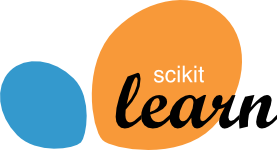

.. _about:

========
About us
========

History
=======

This project was started in 2007 as a Google Summer of Code project by
David Cournapeau. Later that year, Matthieu Brucher started working on this project
as part of his thesis.

In 2010 Fabian Pedregosa, Gael Varoquaux, Alexandre Gramfort and Vincent
Michel of INRIA took leadership of the project and made the first public
release, February the 1st 2010. Since then, several releases have appeared
following an approximately 3-month cycle, and a thriving international
community has been leading the development. As a result, INRIA holds the
copyright over the work done by people who were employed by INRIA at the
time of the contribution.

Governance
==========

The decision making process and governance structure of scikit-learn, like roles and responsibilities, is laid out in the :ref:`governance document <governance>`.

.. The "author" anchors below is there to ensure that old html links (in
   the form of "about.html#author" still work)

.. _authors:

The people behind scikit-learn
==============================

scikit-learn is a community project, developed by a large group of
people, all across the world. A few core contributor teams, listed below, have
central roles, however a more complete list of contributors can be found `on
GitHub
<https://github.com/scikit-learn/scikit-learn/graphs/contributors>`__.

Active Core Contributors
------------------------

Maintainers Team
................

The following people are currently maintainers, in charge of
consolidating scikit-learn's development and maintenance:

.. include:: maintainers.rst

.. note::

  Please do not email the authors directly to ask for assistance or report issues.
  Instead, please see `What's the best way to ask questions about scikit-learn
  <https://scikit-learn.org/stable/faq.html#what-s-the-best-way-to-get-help-on-scikit-learn-usage>`_
  in the FAQ.

.. seealso::

  How you can :ref:`contribute to the project <contributing>`.

Documentation Team
..................

The following people help with documenting the project:

.. include:: documentation_team.rst

Contributor Experience Team
...........................

The following people are active contributors who also help with
:ref:`triaging issues <bug_triaging>`, PRs, and general
maintenance:

.. include:: contributor_experience_team.rst

Communication Team
..................

The following people help with :ref:`communication around scikit-learn
<communication_team>`.

.. include:: communication_team.rst

Emeritus Core Contributors
--------------------------

Emeritus Maintainers Team
.........................

The following people have been active contributors in the past, but are no
longer active in the project:

.. rst-class:: grid-list-three-columns
.. include:: maintainers_emeritus.rst

Emeritus Communication Team
...........................

The following people have been active in the communication team in the
past, but no longer have communication responsibilities:

.. include:: communication_team_emeritus.rst

Emeritus Contributor Experience Team
....................................

The following people have been active in the contributor experience team in the
past:

.. include:: contributor_experience_team_emeritus.rst

.. _citing-scikit-learn:

Citing scikit-learn
===================

If you use scikit-learn in a scientific publication, we would appreciate
citations to the following paper:

`Scikit-learn: Machine Learning in Python
<https://jmlr.csail.mit.edu/papers/v12/pedregosa11a.html>`_, Pedregosa
*et al.*, JMLR 12, pp. 2825-2830, 2011.

Bibtex entry::

  @article{scikit-learn,
    title={Scikit-learn: Machine Learning in {P}ython},
    author={Pedregosa, F. and Varoquaux, G. and Gramfort, A. and Michel, V.
            and Thirion, B. and Grisel, O. and Blondel, M. and Prettenhofer, P.
            and Weiss, R. and Dubourg, V. and Vanderplas, J. and Passos, A. and
            Cournapeau, D. and Brucher, M. and Perrot, M. and Duchesnay, E.},
    journal={Journal of Machine Learning Research},
    volume={12},
    pages={2825--2830},
    year={2011}
  }

If you want to cite scikit-learn for its API or design, you may also want to consider the
following paper:

:arxiv:`API design for machine learning software: experiences from the scikit-learn
project <1309.0238>`, Buitinck *et al.*, 2013.

Bibtex entry::

  @inproceedings{sklearn_api,
    author    = {Lars Buitinck and Gilles Louppe and Mathieu Blondel and
                  Fabian Pedregosa and Andreas Mueller and Olivier Grisel and
                  Vlad Niculae and Peter Prettenhofer and Alexandre Gramfort
                  and Jaques Grobler and Robert Layton and Jake VanderPlas and
                  Arnaud Joly and Brian Holt and Ga{\"{e}}l Varoquaux},
    title     = {{API} design for machine learning software: experiences from the scikit-learn
                  project},
    booktitle = {ECML PKDD Workshop: Languages for Data Mining and Machine Learning},
    year      = {2013},
    pages = {108--122},
  }

.. _branding-and-logos:

Branding & Logos
================

The scikit-learn brand is subject to the following `terms of use and guidelines
<https://blog.scikit-learn.org/assets/brand_guidelines/2025-02-scikit-learn-brand-guidelines.pdf>`_.

High quality PNG and SVG logos are available in the `doc/logos
<https://github.com/scikit-learn/scikit-learn/tree/main/doc/logos>`_
source directory. The color palette is available in the
`Branding Guide <https://github.com/scikit-learn/blog?tab=readme-ov-file#brand-standards>`_.

Institutional support
=====================

scikit-learn is a community driven project, however institutional and private
grants help to assure its sustainability.

More details about institutional support are available in the :ref:`funding`
section.

Coding Sprints
==============

The scikit-learn project has a long history of `open source coding sprints
<https://blog.scikit-learn.org/events/sprints-value/>`_ with over 50 sprint
events from 2010 to present day. There are scores of sponsors who contributed
to costs which include venue, food, travel, developer time and more. See
`scikit-learn sprints <https://blog.scikit-learn.org/sprints/>`_ for a full
list of events.

scikit-learn Swag
-----------------
Official scikit-learn swag is available for purchase at the `NumFOCUS online store
<https://numfocus.myspreadshop.com/scikit-learn+logo?idea=6335cad48f3f5268f5f42559>`_.
A portion of the proceeds from each sale goes to support the scikit-learn project.
