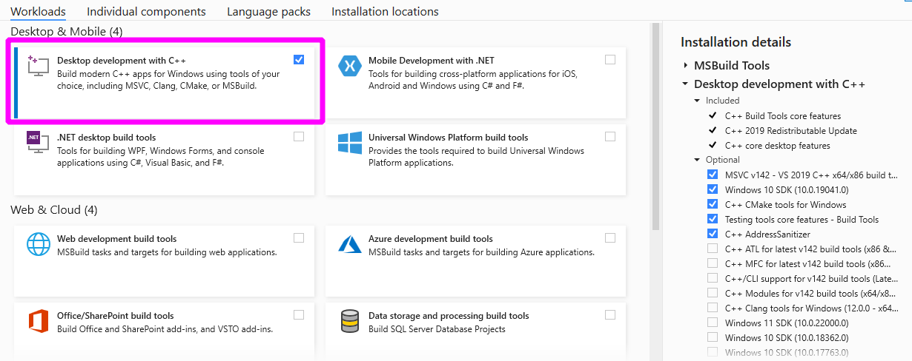

.. _advanced-installation:

.. include:: ../min_dependency_substitutions.rst

==================================================
Installing the development version of scikit-learn
==================================================

This section introduces how to install the **main branch** of scikit-learn.
This can be done by either installing a nightly build or building from source.

.. _install_nightly_builds:

Installing nightly builds
=========================

The continuous integration servers of the scikit-learn project build, test
and upload wheel packages for the most recent Python version on a nightly
basis.

Installing a nightly build is the quickest way to:

- try a new feature that will be shipped in the next release (that is, a
  feature from a pull-request that was recently merged to the main branch);

- check whether a bug you encountered has been fixed since the last release.

You can install the nightly build of scikit-learn using the `scipy-wheels-nightly`
index from the PyPI registry of `anaconda.org`:

.. prompt:: bash $

  pip install --pre --extra-index https://pypi.anaconda.org/scipy-wheels-nightly/simple scikit-learn

Note that first uninstalling scikit-learn might be required to be able to
install nightly builds of scikit-learn.

.. _install_bleeding_edge:

Building from source
====================

Building from source is required to work on a contribution (bug fix, new
feature, code or documentation improvement).

.. _git_repo:

#. Use `Git <https://git-scm.com/>`_ to check out the latest source from the
   `scikit-learn repository <https://github.com/scikit-learn/scikit-learn>`_ on
   Github.:

   .. prompt:: bash $

     git clone git://github.com/scikit-learn/scikit-learn.git  # add --depth 1 if your connection is slow
     cd scikit-learn

   If you plan on submitting a pull-request, you should clone from your fork
   instead.

#. Install a recent version of Python (3.9 is recommended at the time of writing)
   for instance using Miniforge3_. Miniforge provides a conda-based distribution
   of Python and the most popular scientific libraries.

   If you installed Python with conda, we recommend to create a dedicated
   `conda environment`_ with all the build dependencies of scikit-learn
   (namely NumPy_, SciPy_, and Cython_):

   .. prompt:: bash $

     conda create -n sklearn-env -c conda-forge python=3.9 numpy scipy cython
     conda activate sklearn-env

#. **Alternative to conda:** If you run Linux or similar, you can instead use
   your system's Python provided it is recent enough (3.8 or higher
   at the time of writing). In this case, we recommend to create a dedicated
   virtualenv_ and install the scikit-learn build dependencies with pip:

   .. prompt:: bash $

     python3 -m venv sklearn-env
     source sklearn-env/bin/activate
     pip install wheel numpy scipy cython

#. Install a compiler with OpenMP_ support for your platform. See instructions
   for :ref:`compiler_windows`, :ref:`compiler_macos`, :ref:`compiler_linux`
   and :ref:`compiler_freebsd`.

#. Build the project with pip in :ref:`editable_mode`:

   .. prompt:: bash $

     pip install --verbose --no-build-isolation --editable .

#. Check that the installed scikit-learn has a version number ending with
   `.dev0`:

   .. prompt:: bash $

     python -c "import sklearn; sklearn.show_versions()"

#. Please refer to the :ref:`developers_guide` and :ref:`pytest_tips` to run
   the tests on the module of your choice.

.. note::

    You will have to run the ``pip install --no-build-isolation --editable .``
    command every time the source code of a Cython file is updated
    (ending in `.pyx` or `.pxd`). Use the ``--no-build-isolation`` flag to
    avoid compiling the whole project each time, only the files you have
    modified.

Dependencies
------------

Runtime dependencies
~~~~~~~~~~~~~~~~~~~~

Scikit-learn requires the following dependencies both at build time and at
runtime:

- Python (>= 3.8),
- NumPy (>= |NumpyMinVersion|),
- SciPy (>= |ScipyMinVersion|),
- Joblib (>= |JoblibMinVersion|),
- threadpoolctl (>= |ThreadpoolctlMinVersion|).

Build dependencies
~~~~~~~~~~~~~~~~~~

Building Scikit-learn also requires:

..
    # The following places need to be in sync with regard to Cython version:
    # - .circleci config file
    # - sklearn/_build_utils/__init__.py
    # - advanced installation guide

- Cython >= |CythonMinVersion|
- A C/C++ compiler and a matching OpenMP_ runtime library. See the
  :ref:`platform system specific instructions
  <platform_specific_instructions>` for more details.

.. note::

   If OpenMP is not supported by the compiler, the build will be done with
   OpenMP functionalities disabled. This is not recommended since it will force
   some estimators to run in sequential mode instead of leveraging thread-based
   parallelism. Setting the ``SKLEARN_FAIL_NO_OPENMP`` environment variable
   (before cythonization) will force the build to fail if OpenMP is not
   supported.

Since version 0.21, scikit-learn automatically detects and uses the linear
algebra library used by SciPy **at runtime**. Scikit-learn has therefore no
build dependency on BLAS/LAPACK implementations such as OpenBlas, Atlas, Blis
or MKL.

Test dependencies
~~~~~~~~~~~~~~~~~

Running tests requires:

- pytest >= |PytestMinVersion|

Some tests also require `pandas <https://pandas.pydata.org>`_.

Building a specific version from a tag
--------------------------------------

If you want to build a stable version, you can ``git checkout <VERSION>``
to get the code for that particular version, or download an zip archive of
the version from github.

.. _editable_mode:

Editable mode
-------------

If you run the development version, it is cumbersome to reinstall the package
each time you update the sources. Therefore it is recommended that you install
in with the ``pip install --no-build-isolation --editable .`` command, which
allows you to edit the code in-place. This builds the extension in place and
creates a link to the development directory (see `the pip docs
<https://pip.pypa.io/en/stable/topics/local-project-installs/#editable-installs>`_).

As the doc aboves explains, this is fundamentally similar to using the command
``python setup.py develop``. (see `the setuptool docs
<https://setuptools.pypa.io/en/latest/userguide/development_mode.html>`_).
It is however preferred to use pip.

On Unix-like systems, you can equivalently type ``make in`` from the top-level
folder. Have a look at the ``Makefile`` for additional utilities.

.. _platform_specific_instructions:

Platform-specific instructions
==============================

Here are instructions to install a working C/C++ compiler with OpenMP support
to build scikit-learn Cython extensions for each supported platform.

.. _compiler_windows:

Windows
-------

First, download the `Build Tools for Visual Studio 2019 installer
<https://aka.ms/vs/17/release/vs_buildtools.exe>`_.

Run the downloaded `vs_buildtools.exe` file, during the installation you will
need to make sure you select "Desktop development with C++", similarly to this
screenshot:

Secondly, find out if you are running 64-bit or 32-bit Python. The building
command depends on the architecture of the Python interpreter. You can check
the architecture by running the following in ``cmd`` or ``powershell``
console:

.. prompt:: bash $

    python -c "import struct; print(struct.calcsize('P') * 8)"

For 64-bit Python, configure the build environment by running the following
commands in ``cmd`` or an Anaconda Prompt (if you use Anaconda):

    ::

      $ SET DISTUTILS_USE_SDK=1
      $ "C:\Program Files (x86)\Microsoft Visual Studio\2019\BuildTools\VC\Auxiliary\Build\vcvarsall.bat" x64

Replace ``x64`` by ``x86`` to build for 32-bit Python.

Please be aware that the path above might be different from user to user. The
aim is to point to the "vcvarsall.bat" file that will set the necessary
environment variables in the current command prompt.

Finally, build scikit-learn from this command prompt:

.. prompt:: bash $

    pip install --verbose --no-build-isolation --editable .

.. _compiler_macos:

macOS
-----

The default C compiler on macOS, Apple clang (confusingly aliased as
`/usr/bin/gcc`), does not directly support OpenMP. We present two alternatives
to enable OpenMP support:

- either install `conda-forge::compilers` with conda;

- or install `libomp` with Homebrew to extend the default Apple clang compiler.

For Apple Silicon M1 hardware, only the conda-forge method below is known to
work at the time of writing (January 2021). You can install the `macos/arm64`
distribution of conda using the `miniforge installer
<https://github.com/conda-forge/miniforge#miniforge>`_

macOS compilers from conda-forge
~~~~~~~~~~~~~~~~~~~~~~~~~~~~~~~~

If you use the conda package manager (version >= 4.7), you can install the
``compilers`` meta-package from the conda-forge channel, which provides
OpenMP-enabled C/C++ compilers based on the llvm toolchain.

First install the macOS command line tools:

.. prompt:: bash $

    xcode-select --install

It is recommended to use a dedicated `conda environment`_ to build
scikit-learn from source:

.. prompt:: bash $

    conda create -n sklearn-dev -c conda-forge python numpy scipy cython \
        joblib threadpoolctl pytest compilers llvm-openmp
    conda activate sklearn-dev
    make clean
    pip install --verbose --no-build-isolation --editable .

.. note::

    If you get any conflicting dependency error message, try commenting out
    any custom conda configuration in the ``$HOME/.condarc`` file. In
    particular the ``channel_priority: strict`` directive is known to cause
    problems for this setup.

You can check that the custom compilers are properly installed from conda
forge using the following command:

.. prompt:: bash $

    conda list

which should include ``compilers`` and ``llvm-openmp``.

.. note::

   If you installed these packages after creating and activating a new conda
   environment, you will need to first deactivate and then reactivate the
   environment for these changes to take effect.

The compilers meta-package will automatically set custom environment
variables:

.. prompt:: bash $

    echo $CC
    echo $CXX
    echo $CFLAGS
    echo $CXXFLAGS
    echo $LDFLAGS

They point to files and folders from your ``sklearn-dev`` conda environment
(in particular in the bin/, include/ and lib/ subfolders). For instance
``-L/path/to/conda/envs/sklearn-dev/lib`` should appear in ``LDFLAGS``.

In the log, you should see the compiled extension being built with the clang
and clang++ compilers installed by conda with the ``-fopenmp`` command line
flag.

macOS compilers from Homebrew
~~~~~~~~~~~~~~~~~~~~~~~~~~~~~

Another solution is to enable OpenMP support for the clang compiler shipped
by default on macOS.

First install the macOS command line tools:

.. prompt:: bash $

    xcode-select --install

Install the Homebrew_ package manager for macOS.

Install the LLVM OpenMP library:

.. prompt:: bash $

    brew install libomp

Set the following environment variables:

.. prompt:: bash $

    export CC=/usr/bin/clang
    export CXX=/usr/bin/clang++
    export CPPFLAGS="$CPPFLAGS -Xpreprocessor -fopenmp"
    export CFLAGS="$CFLAGS -I/usr/local/opt/libomp/include"
    export CXXFLAGS="$CXXFLAGS -I/usr/local/opt/libomp/include"
    export LDFLAGS="$LDFLAGS -Wl,-rpath,/usr/local/opt/libomp/lib -L/usr/local/opt/libomp/lib -lomp"

Finally, build scikit-learn in verbose mode (to check for the presence of the
``-fopenmp`` flag in the compiler commands):

.. prompt:: bash $

    make clean
    pip install --verbose --no-build-isolation --editable .

.. _compiler_linux:

Linux
-----

Linux compilers from the system
~~~~~~~~~~~~~~~~~~~~~~~~~~~~~~~

Installing scikit-learn from source without using conda requires you to have
installed the scikit-learn Python development headers and a working C/C++
compiler with OpenMP support (typically the GCC toolchain).

Install build dependencies for Debian-based operating systems, e.g.
Ubuntu:

.. prompt:: bash $

    sudo apt-get install build-essential python3-dev python3-pip

then proceed as usual:

.. prompt:: bash $

    pip3 install cython
    pip3 install --verbose --editable .

Cython and the pre-compiled wheels for the runtime dependencies (numpy, scipy
and joblib) should automatically be installed in
``$HOME/.local/lib/pythonX.Y/site-packages``. Alternatively you can run the
above commands from a virtualenv_ or a `conda environment`_ to get full
isolation from the Python packages installed via the system packager. When
using an isolated environment, ``pip3`` should be replaced by ``pip`` in the
above commands.

When precompiled wheels of the runtime dependencies are not available for your
architecture (e.g. ARM), you can install the system versions:

.. prompt:: bash $

    sudo apt-get install cython3 python3-numpy python3-scipy

On Red Hat and clones (e.g. CentOS), install the dependencies using:

.. prompt:: bash $

    sudo yum -y install gcc gcc-c++ python3-devel numpy scipy

Linux compilers from conda-forge
~~~~~~~~~~~~~~~~~~~~~~~~~~~~~~~~

Alternatively, install a recent version of the GNU C Compiler toolchain (GCC)
in the user folder using conda:

.. prompt:: bash $

    conda create -n sklearn-dev -c conda-forge python numpy scipy cython \
        joblib threadpoolctl pytest compilers
    conda activate sklearn-dev
    pip install --verbose --no-build-isolation --editable .

.. _compiler_freebsd:

FreeBSD
-------

The clang compiler included in FreeBSD 12.0 and 11.2 base systems does not
include OpenMP support. You need to install the `openmp` library from packages
(or ports):

.. prompt:: bash $

    sudo pkg install openmp

This will install header files in ``/usr/local/include`` and libs in
``/usr/local/lib``. Since these directories are not searched by default, you
can set the environment variables to these locations:

.. prompt:: bash $

    export CFLAGS="$CFLAGS -I/usr/local/include"
    export CXXFLAGS="$CXXFLAGS -I/usr/local/include"
    export LDFLAGS="$LDFLAGS -Wl,-rpath,/usr/local/lib -L/usr/local/lib -lomp"

Finally, build the package using the standard command:

.. prompt:: bash $

    pip install --verbose --no-build-isolation --editable .

For the upcoming FreeBSD 12.1 and 11.3 versions, OpenMP will be included in
the base system and these steps will not be necessary.

.. _OpenMP: https://en.wikipedia.org/wiki/OpenMP
.. _Cython: https://cython.org
.. _NumPy: https://numpy.org
.. _SciPy: https://www.scipy.org
.. _Homebrew: https://brew.sh
.. _virtualenv: https://docs.python.org/3/tutorial/venv.html
.. _conda environment: https://docs.conda.io/projects/conda/en/latest/user-guide/tasks/manage-environments.html
.. _Miniforge3: https://github.com/conda-forge/miniforge#miniforge3

Parallel builds
===============

It is possible to build scikit-learn compiled extensions in parallel by setting
and environment variable as follows before calling the ``pip install`` or
``python setup.py build_ext`` commands::

    export SKLEARN_BUILD_PARALLEL=3
    pip install --verbose --no-build-isolation --editable .

On a machine with 2 CPU cores, it can be beneficial to use a parallelism level
of 3 to overlap IO bound tasks (reading and writing files on disk) with CPU
bound tasks (actually compiling).
