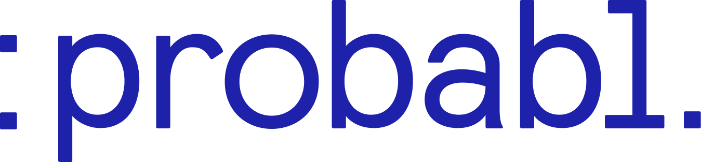
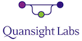

.. _funding:

Institutional support
=====================

Scikit-learn is a community driven project. However, a number of public
institutions and private entities have contributed and keep on contributing to
its success and sustainability.

.. div:: sk-text-image-grid-small

  .. div:: image-box

    .. image:: images/inria-logo.jpg
      :target: https://www.inria.fr

  .. div:: text-box

    Since the inception of scikit-learn and for a good decade, `Inria
    <https://www.inria.fr>`_ has been its main supporting pillar, as the stable
    employer of many core-maintainers and as the host for the scikit-learn
    consortium.

.. div:: sk-text-image-grid-small

  .. div:: image-box

    .. image:: images/probabl.png
      :target: https://probabl.ai

  .. div:: text-box

    In 2023, Inria spun off `Probabl <https://probabl.ai>`_ as a mission driven
    company to take scikit-learn beyond a research lab. All of the
    scikit-learn core-maintainers employed by Inria have joined the spinoff as
    co-founders, most as full-time employees.

    Today, Probabl employs the following core and non-core contributors: Adrin
    Jalali, Antoine Baker, Arturo Amor, François Goupil, Guillaume Lemaitre,
    Jérémie du Boisberranger, Loïc Estève, Olivier Grisel, Shruti Nath and
    Stefanie Senger, as well as Gaël Varoquaux.

The above financial commitments mean that Inria initially and now Probabl have
been and are the main source of financial support for scikit-learn, completed
by additional commitments detailed below. Cumulatively over a decade, these
represent several millions of euros or dollars worth of financial
participation.

Active financial participation (2026)
-------------------------------------

In addition to the above financial commitments, the following organizations
financially support scikit-learn as follows:

.. list-table::
   :widths: 33 33 34
   :header-rows: 1
   :class: sk-funding-participation-table

   * - 5 FTE or more
     - 0.5 FTE or more
     - less than 0.5 FTE
   * - |probabl|
     - * |czi| |wellcome|
       * |nvidia|
       * |nasa| |quansightlabs|
       * |chanel|
     - * |bnpparibasgroup|
       * |michelin|

FTE stands for Full-Time Equivalent.

* `The Chan-Zuckerberg Initiative <https://chanzuckerberg.com/>`_ and `Wellcome
  Trust <https://wellcome.org/>`_ support the work of Lucy Liu, Dea Maria Leon,
  Anne Beyer and Francois Paugam through the `Essential Open Source Software
  for Science (EOSS) <https://chanzuckerberg.com/eoss/>`_ cycle 6.

* `NVIDIA <https://nvidia.com>`_ supports scikit-learn through their
  sponsorship and employs full-time core maintainer Tim Head.

* `NASA <https://www.nasa.gov>`_ supports work done by Quansight Labs and
  Probabl team members via the NASA ROSES grant 80NSSC25K7215: "Ensuring a fast
  and secure core for scientific Python".

* `Quansight Labs <https://labs.quansight.org>`_ funds Lucy Liu since 2022.

* `Chanel <https://www.chanel.com>`_ supports scikit-learn through a
  multi-year sponsorship, initially through the Inria foundation (2023-2024),
  now as a Gold Sponsor via Probabl (2024-2026).

* `BNP Paribas Group <https://group.bnpparibas/>`_ supports scikit-learn
  as a Silver Sponsor via Probabl (2025-2026).

* `Michelin <https://www.michelin.com>`_ supports scikit-learn as a Bronze
  Sponsor via Probabl (2025-2026).

Past Sponsors
-------------

`Microsoft <https://microsoft.com/>`_ funded Andreas Müller from 2020 to 2026.

`APHP <https://aphp.fr/>`_, `AXA <https://www.axa.fr/>`_, `BCG
<https://www.bcg.com/>`_, `BNP-Paribas-Cardiff
<https://www.bnpparibascardif.com/>`_, `Dataiku <https://www.dataiku.com/>`_,
`Fujitsu <https://www.fujitsu.com/>`_, `Hugging Face
<https://huggingface.co/>`_, `Intel <https://www.intel.com/>`_, `Microsoft
<https://microsoft.com/>`_, `NVIDIA <https://nvidia.com>`_ supported the
project through their sponsorship via the Inria foundation between 2020 and
2024.

`Tidelift <https://tidelift.com/>`_ financially supported the project via their
service agreement from 2023 to 2025.

`Quansight Labs <https://labs.quansight.org>`_ and `NASA
<https://www.nasa.gov>`_ funded Meekail Zain in 2022 and 2023, and funded
Thomas J. Fan from 2021 to 2023 via the NASA ROSES grant 80NSSC22K0405:
"Reinforcing the Foundations of Scientific Python".

`Columbia University <https://columbia.edu/>`_ funded Andreas Müller
(2016-2020).

`The University of Sydney <https://sydney.edu.au/>`_ funded Joel Nothman
(2017-2021).

Andreas Müller received a grant to improve scikit-learn from the
`Alfred P. Sloan Foundation <https://sloan.org>`_ .
This grant supported the position of Nicolas Hug and Thomas J. Fan.

`INRIA <https://www.inria.fr>`_ has provided funding for Fabian Pedregosa
(2010-2012), Jaques Grobler (2012-2013) and Olivier Grisel (2013-2017) to
work on this project full-time. It also hosts coding sprints and other events.

`Paris-Saclay Center for Data Science <http://www.datascience-paris-saclay.fr/>`_
funded one year for a developer to work on the project full-time (2014-2015), 50%
of the time of Guillaume Lemaitre (2016-2017) and 50% of the time of Joris van den
Bossche (2017-2018).

`NYU Moore-Sloan Data Science Environment <https://cds.nyu.edu/mooresloan/>`_
funded Andreas Mueller (2014-2016) to work on this project. The Moore-Sloan
Data Science Environment also funds several students to work on the project
part-time.

`Télécom Paristech <https://www.telecom-paristech.fr/>`_ funded Manoj Kumar
(2014), Tom Dupré la Tour (2015), Raghav RV (2015-2017), Thierry Guillemot
(2016-2017) and Albert Thomas (2017) to work on scikit-learn.

`The Labex DigiCosme <https://digicosme.lri.fr>`_ funded Nicolas Goix
(2015-2016), Tom Dupré la Tour (2015-2016 and 2017-2018), Mathurin Massias
(2018-2019) to work part time on scikit-learn during their PhDs. It also
funded a scikit-learn coding sprint in 2015.

`The Chan-Zuckerberg Initiative <https://chanzuckerberg.com/>`_ funded Nicolas
Hug to work full-time on scikit-learn in 2020.

The following students were sponsored by `Google
<https://opensource.google/>`_ to work on scikit-learn through
the `Google Summer of Code <https://en.wikipedia.org/wiki/Google_Summer_of_Code>`_
program.

- 2007 - David Cournapeau
- 2011 - `Vlad Niculae`_
- 2012 - `Vlad Niculae`_, Immanuel Bayer
- 2013 - Kemal Eren, Nicolas Trésegnie
- 2014 - Hamzeh Alsalhi, Issam Laradji, Maheshakya Wijewardena, Manoj Kumar
- 2015 - `Raghav RV <https://github.com/raghavrv>`_, Wei Xue
- 2016 - `Nelson Liu <https://nelsonliu.me>`_, `YenChen Lin <https://yenchenlin.me/>`_

.. _Vlad Niculae: https://vene.ro/

...................

The `NeuroDebian <https://neuro.debian.net>`_ project providing `Debian
<https://www.debian.org/>`_ packaging and contributions is supported by
`Dr. James V. Haxby <http://haxbylab.dartmouth.edu/>`_ (`Dartmouth
College <https://pbs.dartmouth.edu/>`_).

Donating to the project
-----------------------

If you have found scikit-learn to be useful in your work, research, or company,
please consider making a donation to the project commensurate with your resources.
There are several options for making donations:

.. raw:: html

  

    <a class="btn sk-btn-orange mb-1" href="https://numfocus.org/donate-to-scikit-learn">
      Donate via NumFOCUS
    </a>
    <a class="btn sk-btn-orange mb-1" href="https://github.com/sponsors/scikit-learn">
      Donate via GitHub Sponsors
    </a>
    <a class="btn sk-btn-orange mb-1" href="https://causes.benevity.org/projects/433725">
      Donate via Benevity
    </a>
  

**Donation Options:**

* **NumFOCUS**: Donate via the `NumFOCUS Donations Page
  <https://numfocus.org/donate-to-scikit-learn>`_, scikit-learn's fiscal sponsor.

* **GitHub Sponsors**: Support the project directly through `GitHub Sponsors
  <https://github.com/sponsors/scikit-learn>`_.

* **Benevity**: If your company uses scikit-learn, you can also support the
  project through Benevity, a platform to manage employee donations. It is
  widely used by hundreds of Fortune 1000 companies to streamline and scale
  their social impact initiatives. If your company uses Benevity, you are
  able to make a donation with a company match as high as 100%. Our project
  ID is `433725 <https://causes.benevity.org/projects/433725>`_.

All above donation options are managed by `NumFOCUS <https://numfocus.org/>`_,
a 501(c)(3) non-profit organization based in Austin, Texas, USA. The NumFOCUS
board consists of `SciPy community members <https://numfocus.org/board.html>`_.
Contributions are tax-deductible to the extent allowed by law.

.. rubric:: Notes

Contributions support the maintenance of the project, including development,
documentation, infrastructure and coding sprints.

Donations in kind
=================
The following organizations provide non-financial contributions to the
scikit-learn project.

.. raw:: html

  <table cellspacing="0" cellpadding="8">
    <thead>
      <tr>
        <th>Company</th>
        <th>Contribution</th>
      </tr>
    </thead>
    <tbody>
      <tr>
        <td><a href="https://www.github.com">GitHub</a></td>
        <td>CPU time on their Continuous Integration servers + Teams account and web hosting.</td>
      </tr>
      <tr>
        <td><a href="https://circleci.com/">CircleCI</a></td>
        <td>CPU time on their Continuous Integration servers</td>
      </tr>
      <tr>
        <td><a href="https://www.anaconda.com">Anaconda Inc</a></td>
        <td>Storage for our staging and nightly builds</td>
      </tr>
    </tbody>
  </table>
