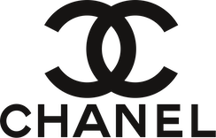
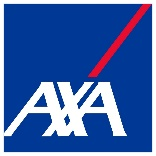
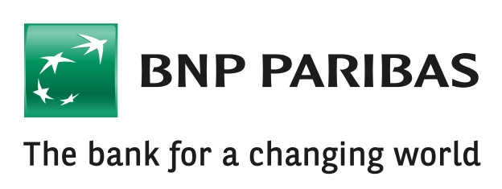
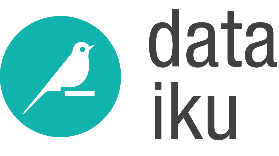
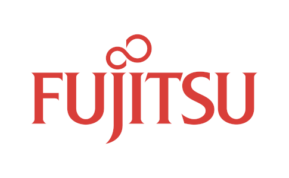
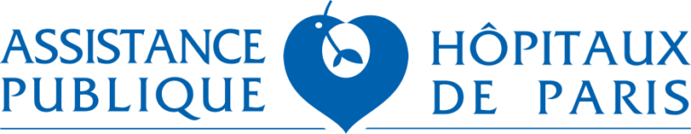

.. _funding:

Institutional support
=====================

Scikit-learn is a community driven project, however institutional and private
grants help to assure its sustainability.

The project would like to thank the following funders.

...................................

.. div:: sk-text-image-grid-small

  .. div:: text-box

    `:probabl. <https://probabl.ai>`_ manages the whole sponsorship program
    and employs the full-time core maintainers Adrin Jalali, Arturo Amor,
    François Goupil, Guillaume Lemaitre, Jérémie du Boisberranger, Loïc Estève,
    Olivier Grisel, and Stefanie Senger.

  .. div:: image-box

    .. image:: images/probabl.png
      :target: https://probabl.ai
      :width: 40%

..........

Active Sponsors
===============

Founding sponsors
-----------------

.. div:: sk-text-image-grid-small

  .. div:: text-box

    `Inria <https://www.inria.fr>`_ supports scikit-learn through their
    sponsorship.

  .. div:: image-box

    .. image:: images/inria-logo.jpg
      :target: https://www.inria.fr

..........

Gold sponsors
-------------

.. div:: sk-text-image-grid-small

  .. div:: text-box

    `Chanel <https://www.chanel.com>`_ supports scikit-learn through their
    sponsorship.

  .. div:: image-box

    .. image:: images/chanel.png
      :target: https://www.chanel.com

..........

Silver sponsors
---------------

.. div:: sk-text-image-grid-small

  .. div:: text-box

    `BNP Paribas Group <https://group.bnpparibas/>`_ supports scikit-learn
    through their sponsorship.

  .. div:: image-box

    .. image:: images/bnp-paribas.jpg
      :target: https://group.bnpparibas/

..........

Bronze sponsors
---------------

.. div:: sk-text-image-grid-small

  .. div:: text-box

    `NVIDIA <https://nvidia.com>`_ supports scikit-learn through their sponsorship and employs full-time core maintainer Tim Head.

  .. div:: image-box

    .. image:: images/nvidia.png
      :target: https://nvidia.com

..........

Other contributions
-------------------

.. raw:: html

  

* `Microsoft <https://microsoft.com/>`_ funds Andreas Müller since 2020.

* `Quansight Labs <https://labs.quansight.org>`_ funds Lucy Liu since 2022.

* `The Chan-Zuckerberg Initiative <https://chanzuckerberg.com/>`_ and
  `Wellcome Trust <https://wellcome.org/>`_ fund scikit-learn through the
  `Essential Open Source Software for Science (EOSS) <https://chanzuckerberg.com/eoss/>`_
  cycle 6.

  It supports Lucy Liu and diversity & inclusion initiatives that will
  be announced in the future.

* `Tidelift <https://tidelift.com/>`_ supports the project via their service
  agreement.

Past Sponsors
=============

`Quansight Labs <https://labs.quansight.org>`_ funded Meekail Zain in 2022 and 2023,
and funded Thomas J. Fan from 2021 to 2023.

`Columbia University <https://columbia.edu/>`_ funded Andreas Müller
(2016-2020).

`The University of Sydney <https://sydney.edu.au/>`_ funded Joel Nothman
(2017-2021).

Andreas Müller received a grant to improve scikit-learn from the
`Alfred P. Sloan Foundation <https://sloan.org>`_ .
This grant supported the position of Nicolas Hug and Thomas J. Fan.

`INRIA <https://www.inria.fr>`_ has provided funding for Fabian Pedregosa
(2010-2012), Jaques Grobler (2012-2013) and Olivier Grisel (2013-2017) to
work on this project full-time. It also hosts coding sprints and other events.

`Paris-Saclay Center for Data Science <http://www.datascience-paris-saclay.fr/>`_
funded one year for a developer to work on the project full-time (2014-2015), 50%
of the time of Guillaume Lemaitre (2016-2017) and 50% of the time of Joris van den
Bossche (2017-2018).

`NYU Moore-Sloan Data Science Environment <https://cds.nyu.edu/mooresloan/>`_
funded Andreas Mueller (2014-2016) to work on this project. The Moore-Sloan
Data Science Environment also funds several students to work on the project
part-time.

`Télécom Paristech <https://www.telecom-paristech.fr/>`_ funded Manoj Kumar
(2014), Tom Dupré la Tour (2015), Raghav RV (2015-2017), Thierry Guillemot
(2016-2017) and Albert Thomas (2017) to work on scikit-learn.

`The Labex DigiCosme <https://digicosme.lri.fr>`_ funded Nicolas Goix
(2015-2016), Tom Dupré la Tour (2015-2016 and 2017-2018), Mathurin Massias
(2018-2019) to work part time on scikit-learn during their PhDs. It also
funded a scikit-learn coding sprint in 2015.

`The Chan-Zuckerberg Initiative <https://chanzuckerberg.com/>`_ funded Nicolas
Hug to work full-time on scikit-learn in 2020.

The following students were sponsored by `Google
<https://opensource.google/>`_ to work on scikit-learn through
the `Google Summer of Code <https://en.wikipedia.org/wiki/Google_Summer_of_Code>`_
program.

- 2007 - David Cournapeau
- 2011 - `Vlad Niculae`_
- 2012 - `Vlad Niculae`_, Immanuel Bayer
- 2013 - Kemal Eren, Nicolas Trésegnie
- 2014 - Hamzeh Alsalhi, Issam Laradji, Maheshakya Wijewardena, Manoj Kumar
- 2015 - `Raghav RV <https://github.com/raghavrv>`_, Wei Xue
- 2016 - `Nelson Liu <https://nelsonliu.me>`_, `YenChen Lin <https://yenchenlin.me/>`_

.. _Vlad Niculae: https://vene.ro/

...................

The `NeuroDebian <https://neuro.debian.net>`_ project providing `Debian
<https://www.debian.org/>`_ packaging and contributions is supported by
`Dr. James V. Haxby <http://haxbylab.dartmouth.edu/>`_ (`Dartmouth
College <https://pbs.dartmouth.edu/>`_).

...................

The following organizations funded the scikit-learn consortium at Inria in
the past:

.. raw:: html

  

.. grid:: 2 2 4 4
  :class-row: image-subgrid
  :gutter: 1

  .. grid-item::
    :class: sd-text-center
    :child-align: center

    |msn|

  .. grid-item::
    :class: sd-text-center
    :child-align: center

    |bcg|

  .. grid-item::
    :class: sd-text-center
    :child-align: center

    |fujitsu|

  .. grid-item::
    :class: sd-text-center
    :child-align: center

    |aphp|

  .. grid-item::
    :class: sd-text-center
    :child-align: center

    |hf|

  .. grid-item::
    :class: sd-text-center
    :child-align: center

    |dataiku|

  .. grid-item::
    :class: sd-text-center
    :child-align: center

    |bnp|

  .. grid-item::
    :class: sd-text-center
    :child-align: center

    |axa|

Donations in Kind
-----------------
The following organizations provide non-financial contributions to the
scikit-learn project.

.. raw:: html

  <table cellspacing="0" cellpadding="8">
    <thead>
      <tr>
        <th>Company</th>
        <th>Contribution</th>
      </tr>
    </thead>
    <tbody>
          <tr>
        <td><a href="https://www.anaconda.com">Anaconda Inc</a></td>
        <td>Storage for our staging and nightly builds</td>
      </tr>
      <tr>
        <td><a href="https://circleci.com/">CircleCI</a></td>
        <td>CPU time on their Continuous Integration servers</td>
      </tr>
      <tr>
        <td><a href="https://www.github.com">GitHub</a></td>
        <td>CPU time on their Continuous Integration servers + Teams account</td>
      </tr>
    </tbody>
  </table>

Coding Sprints
--------------

The scikit-learn project has a long history of `open source coding sprints
<https://blog.scikit-learn.org/events/sprints-value/>`_ with over 50 sprint
events from 2010 to present day. There are scores of sponsors who contributed
to costs which include venue, food, travel, developer time and more. See
`scikit-learn sprints <https://blog.scikit-learn.org/sprints/>`_ for a full
list of events.
