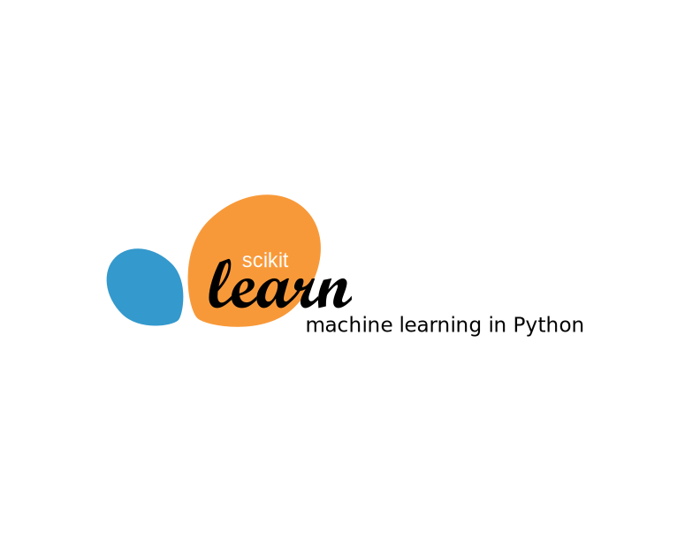
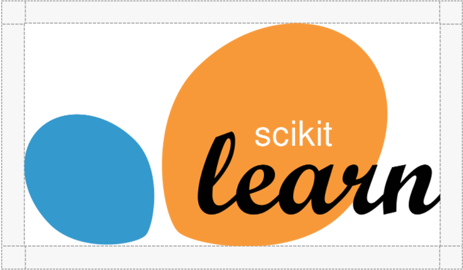

# scikit-learn Brand Guidelines

This section contains information around scikit-learn's brand standards and the use of scikit-learn assets. The purpose of these guidelines are to ensure the scikit-learn logo remains consistent and recognizable across all uses and communications. These guidelines also provide a common language for referring to the logos and their components.

File types:
- `PNG` is a higher-quality compression format; size of file is generally larger
- `ICO` file format refers to an image file format that contains small size computer icon images
- `SVG` Scalable Vector Graphics (SVG) are an XML-based markup language for describing two-dimensional based vector graphics. They can be created and edited with any text editor or with drawing software.

[Brand Name](/doc/logos/README.md#brand-name) | [Color Palette](/doc/logos/README.md#color-palette) | [Typography](/doc/logos/README.md#typography) | [Logos](/doc/logos/README.md#logos)

---
 

## Brand Name
The official name of the package is __scikit-learn__. Do not abbreviate or otherwise alter the name. Always spell ‘scikit’ with a lowercase ‘s’.

## Color Palette

 `RGB 41/171/226 | HEX #29ABE2 | scikit-learn Cyan` | More info: [#29ABE2](https://www.color-hex.com/color/29abe2)

  `RGB 247/147/30 | HEX #F7931E | scikit-learn Orange` | More info: [#F7931E](https://www.color-hex.com/color/f7931e)

 `RGB 155/70/0| HEX #9B4600 | scikit-learn Brown` | More info: [#9B4600](https://www.color-hex.com/color/9b4600)

## Typography
The following typeface is used in the logo:
- "scikit": Helvetica Neue
- "learn": Script MT

## Logos
You may highlight or reference your work with scikit-learn by using one of the logos provided below. Any use must abide by the Logo Integrity Standards defined below.

| | |
| - | - |
|   | __Logo 1__   File type: PNG   File size: 49 KB (1280 x 689 px)   File name: [1280px-scikit-learn-logo.png](https://github.com/scikit-learn/scikit-learn/blob/main/doc/logos/1280px-scikit-learn-logo.png) | 
|   | __Logo 2__   File type: ICO   File size:  2 KB (32 x 32 px)   File name: [favicon.ico](https://github.com/scikit-learn/scikit-learn/blob/main/doc/logos/favicon.ico) |
|   | __Logo 3__   File type: SVG   File size: 5 KB   File name: [scikit-learn-logo-without-subtitle.svg](https://github.com/scikit-learn/scikit-learn/blob/main/doc/logos/scikit-learn-logo-without-subtitle.svg) | 
|   | __Logo 4__   File type: SVG   File size: 4.59 KB   File name: [scikit-learn-logo.svg](https://github.com/scikit-learn/scikit-learn/blob/main/doc/logos/scikit-learn-logo.svg) | 

 

### Logo Integrity Standards

- __Minimum Size:__ For consistent legibility, please do not display the scikit-learn logo at less than 50px wide.
- __Scale:__ Ensure any logos used are scaled proportionally. Stretched, compressed, or otherwise distorted versions of the logo should not be displayed.

- __Clear Space:__ To ensure the logo is clearly visible in all uses, surround it with a sufficient amount of clear space that is free of type, graphics, and other elements that might cause visual clutter. Do not overlap or obscure the logo with text, images, or other elements. The image below demonstrates the suggested amount of clear space margins to use around the logo.   

- __Colors:__ Only use logos in the approved color palette defined above. Do not recolor the logo. 
- __Typeface:__ Do not change the typeface used in the logo. 
- __No Modification:__ Do not attempt recreate or otherwise modify the scikit-learn logo.

---

## Reference
- [color-hex](https://www.color-hex.com): Glossary of Color Palettes

## Other
You can find more variations of the logos here:  https://github.com/scikit-learn/blog/tree/main/assets/images
