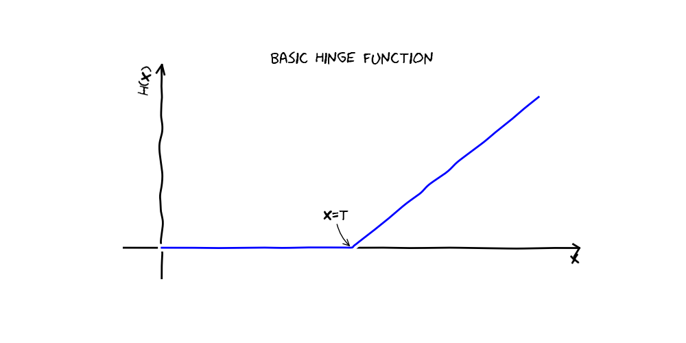
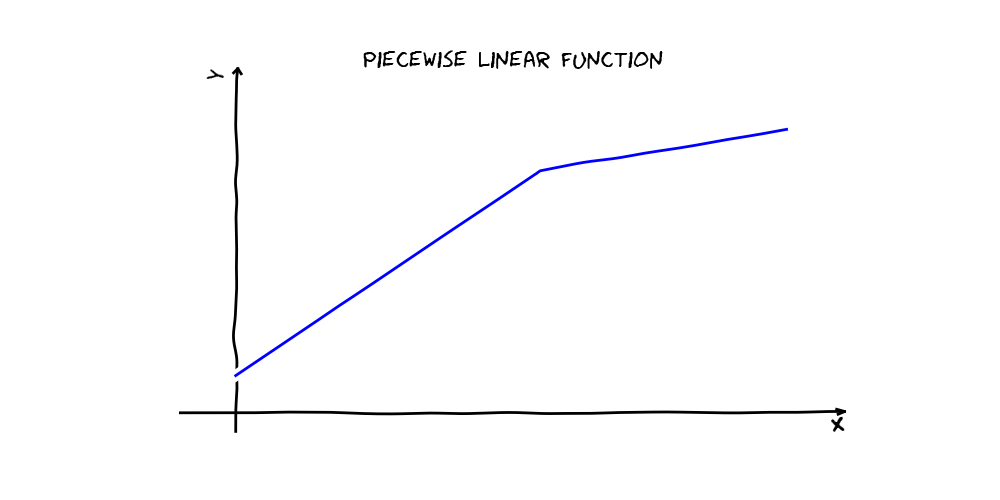
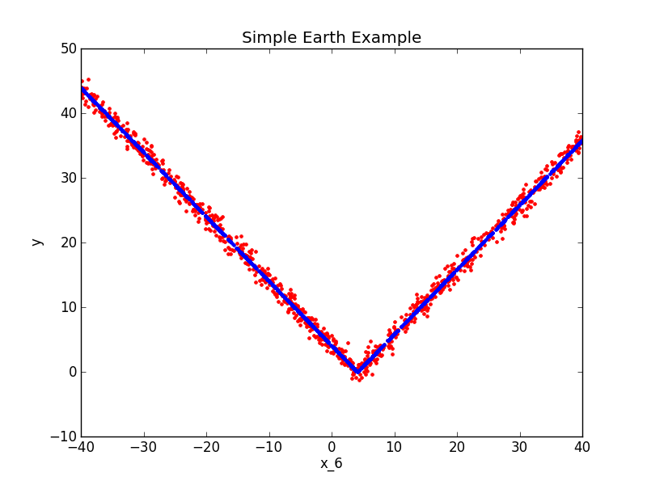

.. _earth:

========================================
Multivariate Adaptive Regression Splines
========================================

.. currentmodule:: sklearn.earth

Multivariate adaptive regression splines, implemented by the :class:`Earth` class, is a method for supervised 
learning that is most commonly used for feature extraction and selection.  Earth models can be thought of as linear models in a higher dimensional 
basis space.  Earth automatically searches for interactions and non-linear relationships.  Each term in an Earth model is a 
product of so called "hinge functions".  A hinge function is a function that's equal to its argument where that argument 
is greater than zero and is zero everywhere else.

.. math::
	\text{h}\left(x-t\right)=\left[x-t\right]_{+}=\begin{cases}
	x-t, & x>t\\
	0, & x\leq t
	\end{cases} 

An Earth model is a linear combination of basis functions, each of which is a product of one 
or more of the following:

	1. A constant
	2. Linear functions of input variables
	3. Hinge functions of input variables  

For example, a simple piecewise linear function in one variable can be expressed 
as a linear combination of two hinge functions and a constant (see below).  During fitting, the Earth class 
automatically determines which variables and basis functions to use.  
The algorithm has two stages.  First, the 
forward pass searches for terms that locally minimize squared error loss on the training set.  Next, a pruning pass selects a subset of those 
terms that produces a locally minimal generalized cross-validation (GCV) score.  The GCV 
score is not actually based on cross-validation, but rather is meant to approximate a true
cross-validation score by penalizing model complexity.  The final result is a set of basis functions
that is nonlinear in the original feature space, may include interactions, and is likely to 
generalize well.

.. math::
	y=1-2\text{h}\left(1-x\right)+\frac{1}{2}\text{h}\left(x-1\right)

A Simple Earth Example
----------------------

::

	import numpy
	from pyearth import Earth
	from matplotlib import pyplot
    
	#Create some fake data
	numpy.random.seed(0)
	m = 1000
	n = 10
	X = 80*numpy.random.uniform(size=(m,n)) - 40
	y = numpy.abs(X[:,6] - 4.0) + 1*numpy.random.normal(size=m)
    
	#Fit an Earth model
	model = Earth()
	model.fit(X,y)
    
	#Print the model
	print model.trace()
	print model.summary()
    
	#Plot the model
	y_hat = model.predict(X)
	pyplot.figure()
	pyplot.plot(X[:,6],y,'r.')
	pyplot.plot(X[:,6],y_hat,'b.')
	pyplot.xlabel('x_6')
	pyplot.ylabel('y')
	pyplot.title('Simple Earth Example')
	pyplot.show()

Bibliography
------------
.. bibliography:: earth_bibliography.bib

References :cite:`Hastie2009`, :cite:`Millborrow2012`, :cite:`Friedman1991`, :cite:`Friedman1993`, 
and :cite:`Friedman1991a` contain discussions likely to be useful to users of py-earth.  
References :cite:`Friedman1991`, :cite:`Millborrow2012`, :cite:`Bjorck1996`, :cite:`Stewart1998`,
:cite:`Golub1996`, :cite:`Friedman1993`, and :cite:`Friedman1991a` were useful during the 
implementation process.

