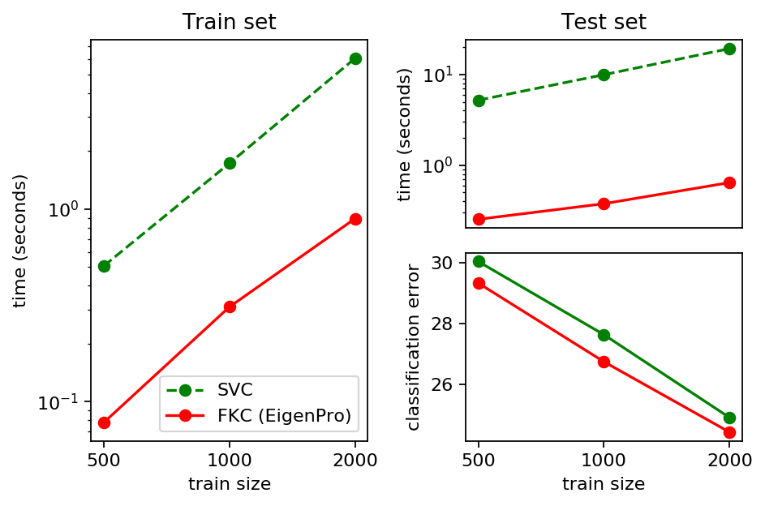
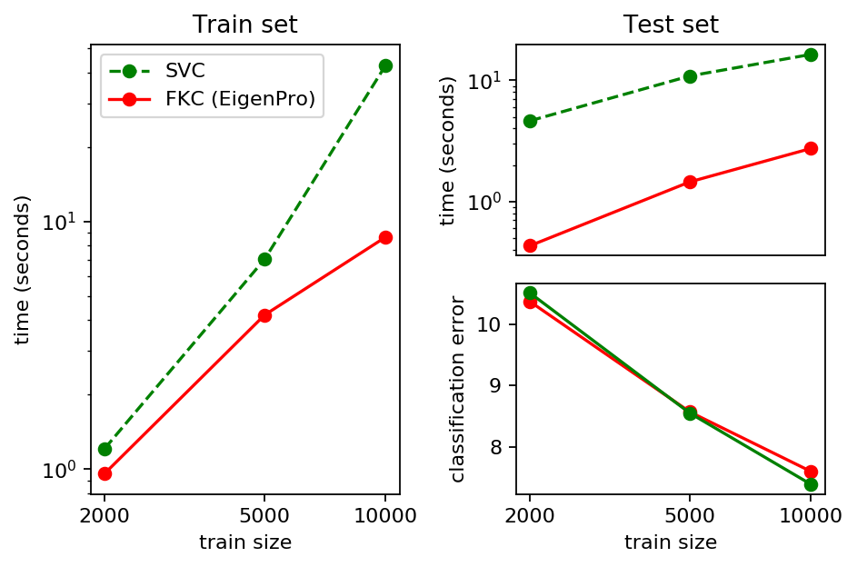

.. _fast_kernel:

================================================================
Fast Kernel Machine (EigenPro) for Regression and Classification
================================================================

.. currentmodule:: sklearn.fast_kernel

Fast Kernel Machine is a very efficient implementation of kernel regression/classification
using *EigenPro iteration* [MB17]_,
an optimization method based on preconditioned stochastic gradient descent.
It essentially implements a "ridgeless" kernel regression.
Regularization, when necessary, can be achieved by early stopping.

Optimization parameters, such as step size, batch size, and the size of the preconditioning
block are chosen automatically and optimally. (They can also be set up manually.)
This results in a simple and user-friendly interface.

Next, we present several experimental results using a server equipped with one
Intel Xeon E5-1620 CPU.
The figure below compares the Fast Kernel Classifier (EigenPro) and the Support Vector
Classifier (:class:`SVC`) on MNIST digits classification task.
We see that EigenPro and SVC give competitive and similar accuracy on test set.
Notably, on the full MNIST training and testing using EigenPro are
approximately 3 times and 6 times faster than that using SVC, respectively.

.. |mnist| image:: ../images/fast_kernel_mnist.png
    :target: ../auto_examples/fast_kernel/plot_mnist.html
    :scale: 70

.. centered:: |mnist|

We then repeat the same experiments on MNIST with added label noise.
Specifically, we randomly reset the label (0-9) of 20% samples.
We see that EigenPro has a significant larger advantage over SVC
on this noisy MNIST. Especially, training and testing using EigenPro are
up to 20 times faster than that using SVC.

.. centered:: |mnist_noisy|

The next figure compares the two methods on a binary classification problem
with synthetic features. Here EigenPro demonstrates nearly 8 times
acceleration on training and testing without loss of accuracy.

.. centered:: |synthetic|

.. topic:: References:

    .. [MB17] Siyuan Ma and Mikhail Belkin,
       `"Diving into the shallows: a computational perspective on large-scale shallow learning"
       <https://arxiv.org/abs/1703.10622>`_,
       Advances in Neural Information Processing Systems, 2017.
