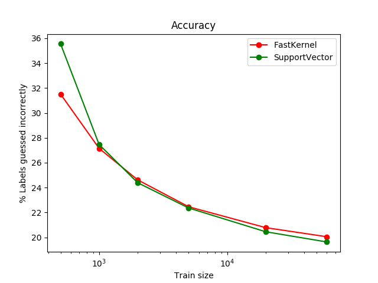
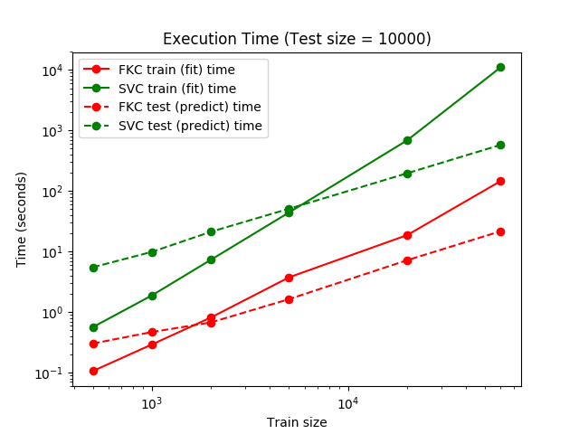
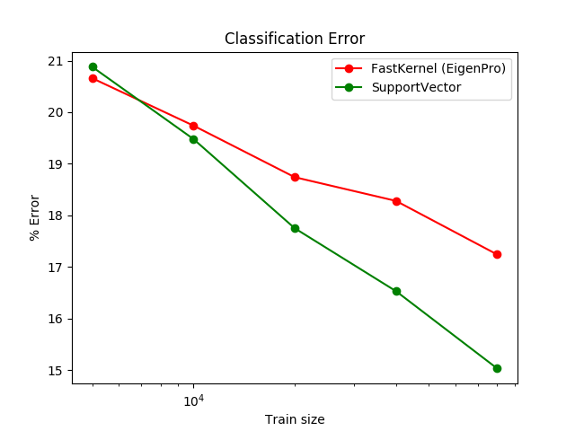

.. _fast_kernel:

=================================================================
Fast Kernel Machines for Regression and Classification (EigenPro)
=================================================================

Fast Kernel is a very efficient implementation of kernel regression using preconditioned Stochastic Gradient Descent (SGD). This is an implementation of "ridgeless" kernel regression. Regularization, when necessary, can be obtained by early stopping.

Optimization parameters, such as step size, batch size, and the size of the preconditioning block are chosen automatically and optimally. (They can also be set up manually.) This results in a simple and user-friendly interface. 

The following example shows the running time of Fast Kernel as compared to Support Vector Machines in recognizing
images of numbers (mnist). As can be seen, Fast Kernel runs about 100 times faster than Support Vector on the largest
60,000 sample data set. However, on smaller datasets, this difference is less defined.

The next example demonstrates both methods on a binary classification problem with many features described mostly
by a few vectors. Fast Kernel is quite effective in cases like these, which come about in most real world applications.
Again, Fast Kernel demonstrates asymptotically superior speed without loss of accuracy.

.. figure:: ../images/fast_kernel_classification_times.png
    :target: ../auto_examples/fast_kernel/plot_classification.html
    :align: center
    :scale: 90%

.. topic:: References:

    .. [BMM18] Mikhail Belkin, Siyuan Ma, and Soumik Mandal. To understand deep learning we need to understand kernel learning. arXiv preprint arXiv:1802.01396, 2018.