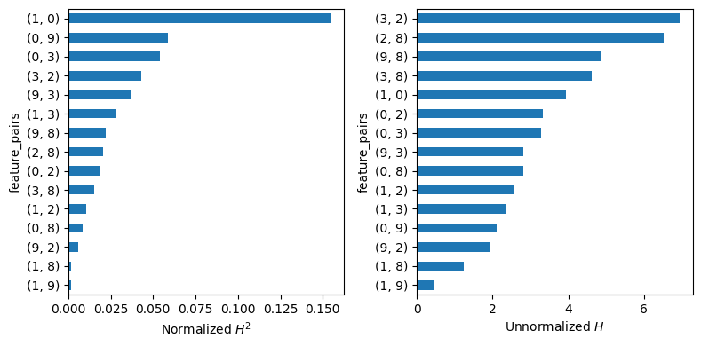

.. _h_statistic:

===============================================================
Friedman and Popescu's H-Statistic
===============================================================

.. currentmodule:: sklearn.inspection

What is the difference between a white box model and a black box model?
It is the many and complicated interaction effects of the latter.

Such interaction effects can be visualized by two-dimensional or stratified
partial dependence plots (PDP). But how to figure out between *which feature pairs*
the strongest interactions occur?

One approach is to study pairwise H-statistics, introduced by Friedman and Popescu
in [F2008]_.

The statistic
=============

The H-statistic of two features is the proportion of effect variability of the 
two features coming from their pairwise interaction. 
Effect variability is measured via partial dependence.

Partial dependence
------------------

Let :math:`F: \mathbb{R}^p \to \mathbb{R}` denote the prediction function that 
maps the :math:`p`-dimensional feature vector :math:`\mathbf x = (x_1, \dots, x_p)`
to its prediction.
Furthermore, let :math:`F_s(\mathbf x_s) = E_{\mathbf x_{\setminus s}}(F(\mathbf x_s, \mathbf x_{\setminus s}))`
be the partial dependence function of :math:`F` on the feature subset 
:math:`\mathbf x_s`, where :math:`s \subseteq \{1, \dots, p\}`, 
Here, the expectation runs over the joint marginal distribution of features 
:math:`\mathbf x_{\setminus s}` not in :math:`\mathbf x_s`.

Given data, :math:`F_s(\mathbf x_s)` can be estimated by the empirical partial 
dependence function

.. math::
  \hat F_s(\mathbf x_s) = \frac{1}{n} \sum_{i = 1}^n F(\mathbf x_s, \mathbf x_{i \setminus s}),

where :math:`\mathbf x_{i\setminus s}`, :math:`i = 1, \dots, n`, 
are the observed values of :math:`\mathbf x_{\setminus s}` in some "background" dataset.

Pairwise H-statistic
--------------------

Following [F2008]_, if there are no interaction effects between features
:math:`x_j` and :math:`x_k`, their two-dimensional partial dependence function
:math:`F_{jk}` can be written as the sum of the univariate partial dependencies, i.e.,

.. math::
  F_{jk}(x_j, x_k) = F_j(x_j) + F_k(x_k).

Correspondingly, Friedman and Popescu's H-statistic of pairwise interaction strength
is defined as

.. math::

  H_{jk}^2 = A_{jk} / B_{jk},

where

.. math::

  A_{jk} = \frac{1}{n} \sum_{i = 1}^n\big[\hat F_{jk}(x_{ij}, x_{ik}) - \hat F_j(x_{ij}) - \hat F_k(x_{ik})\big]^2

and

.. math::

  B_{jk} = \frac{1}{n} \sum_{i = 1}^n\big[\hat F_{jk}(x_{ij}, x_{ik})\big]^2.

Remarks
=======

1. Partial dependence functions and :math:`F` are centered to mean 0.
2. Partial dependence functions and :math:`F` are evaluated over the data distribution.
   This is different to partial dependence plots, where one uses a fixed grid.
3. Weighted versions follow by replacing all arithmetic means by corresponding weighted means.
4. Multi-output prediction (e.g., probabilistic classification) is handled component-wise.
5. Due to undesired extrapolation of partial dependence functions, values above 1 may occur.

Interpretation
==============

* The statistic provides the proportion of joint effect variability explained by the interaction.
* A value of 0 means no interaction.
* If main effects are weak, a small interaction effect can get a high value of the statistic.
  Therefore, it often makes sense to study unnormalized statistics :math:`A_{jk}` or to
  stay on the scale of the prediction :math:`\sqrt{A_{jk}}`.

Workflow
========

Calculating all pairwise H-statistics has computational complexity of :math:`O(n^2p^2)`.
Therefore, our implementation randomly selects ``n_max = 500`` rows from the provided dataset ``X``.
Furthermore, if the number of features :math:`p` is large, use some feature importance measure
to select the most important features and pass them via the ``features=None`` argument.

Example
=======

Let's calculate pairwise H-statistics from a boosted trees model of diabetes data.
There are :math:`p = 10` features, leading to 45 pairwise interactions. To save
time, we select the top 6 predictors via permutation importance, leading to 15 pairs.

    >>> import numpy as np
    >>> from sklearn.ensemble import HistGradientBoostingRegressor
    >>> from sklearn.inspection import permutation_importance, h_statistic
    >>> from sklearn.datasets import load_diabetes
    >>>
    >>> X, y = load_diabetes(return_X_y=True)
    >>> est = HistGradientBoostingRegressor(max_iter=100, max_depth=4).fit(X, y)
    >>>
    >>> # Get Friedman's H-squared for top m=6 predictors
    >>> m = 6
    >>> imp = permutation_importance(est, X, y, random_state=0)
    >>> top_m = np.argsort(imp.importances_mean)[-m:]
    >>> h_statistic(est, X=X, features=top_m, random_state=4)

Then, we plot the statistics:

    >>> import pandas as pd
    >>> import matplotlib.pyplot as plt
    >>>
    >>> fig, axes = plt.subplots(1, 2, figsize=(8, 4), layout="tight")
    >>>
    >>> H_df = pd.DataFrame(H).set_index("feature_pairs")
    >>>
    >>> # H-squared (for interpretation)
    >>> (
    >>>     H_df["h_squared_pairwise"]
    >>>     .sort_values()
    >>>     .plot.barh(xlabel="Normalized $H^2$", ax=axes[0])
    >>> )
    >>>
    >>> # Square-root of numerator (for comparison)
    >>> (
    >>>     np.sqrt(H_df["numerator_pairwise"])
    >>>     .sort_values()
    >>>     .plot.barh(xlabel="Unnormalized $H$", ax=axes[1])
    >>> )

The left plot shows that the interaction between features 0 and 1 explains
about 15% of their joint effect variability. For the other interactions, its
5% or less.

The right plot shows :math:`\sqrt{A_{jk}}`. These values are all on the same
scale and thus can be directly compared: The *strongest* interaction occurs between
feature 2 and 3, even if it explains less than 5% of the joint effect variability.
This happens because features 8 > 2 > 3 are the most important features according to
permutation importance. Thus, a relatively weak interaction between the two very important
features 2 and 3 is still stronger als the strong relative interaction strength
between two quite unimportant features.

Limitations
===========

1. H-statistics are based on partial dependence estimates. Therefore, they are
   just as good or poor as these. The major problem of partial dependence is
   the application of the model to unseen and/or impossible feature combinations.
   H-statistics, which should actually lie in the range between 0 and 1,
   can become greater than 1 in extreme cases.
2. Due to their computational complexity, H-statistics are usually evaluated on
   relatively small subsets of the data. Consequently, the estimates are
   typically not very robust.

.. topic:: References

    .. [F2008] J. H. Friedman and B. E. Popescu,
               "Predictive Learning via Rule Ensembles",
               The Annals of Applied Statistics, 2(3), 916-954, 2008.