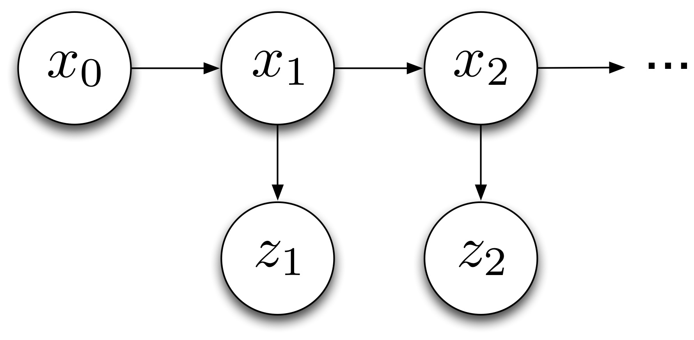

.. _kalman:

=====================
Linear-Gaussian Model
=====================

.. currentmodule:: sklearn.kalman

:mod:`sklearn.kalman` is the continuous domain sister of the methods
implemented in :mod:`sklearn.hmm`.  Like the Hidden Markov Model, The
Linear-Gaussian Model is a generative probability model for explaining a
sequence of measurements observed one after another.  The model assumes that
there exists some unobserved "true state" of the system, and that these
measurements are simply noisy versions of that true state.

In particular, the Linear-Gaussian Model and Hidden Markov Model both assume
that the true state of the system, :math:`x_t`, and the measurements,
:math:`z_t`, influence each other as shown in the following diagram.

Where these two models differ is in what these variables represent.  While in a
Hidden Markov Model both :math:`x_t` and :math:`z_t` are one of a finite set of
values, in a Linear-Gaussian Model both are vectors of real numbers.

The fundamental problems in a Linear-Gaussian Model are identical to those in
the Hidden Markov Model, namely:

* Given the model parameters and a sequence of measurements, estimate the most
  likely sequence of hidden states
* Given the model parameters and a sequence of measurements, estimate the
  likelihood of the measurements
* Given the measurements, estimate the model parameters.

This submodule implements the Kalman Filter and Kalman Smoother, two algorithms
for solving the first two goals.  The third goal is solved by the EM algorithm
as applied to the Linear-Gaussian model.

Mathematical Formulation
========================

In order to understand when the algorithms in this module will be effective, it
is important to understand what assumptions are being made.  In words, the
Linear-Gaussian model assumes that for all :math:`t = 0, \ldots, T-1`,

* :math:`x_0` is distributed according to a Gaussian distribution
* :math:`x_{t+1}` is a linear transformation of :math:`x_t` and additive
  Gaussian noise
* :math:`z_{t}` is a linear transformation of :math:`x_{t}` and additive
  Gaussian noise

These assumptions imply that that :math:`x_t` is always a Gaussian
distribution, even when :math:`z_t` is observed.  If this is the case, the
distribution of :math:`x_t|z_{1:t}` and :math:`x_t | z_{1:T}` are completely
specified by the parameters of the Gaussian distribution, namely its *mean* and
*covariance*.  The Kalman Filter and Kalman Smoother calculate these values,
respectively.

Formally, the Linear-Gaussian Model assumes that states and measurements are
generated in the following way,

.. math::

    x_0               & \sim \text{Gaussian}(\mu_0, \Sigma_0)    \\
    x_{t+1}           & = A x_t + b_t + \epsilon_{t+1}^{1}       \\
    y_{t}             & = C x_{t} + d_{t} + \epsilon_{t}^2       \\
    \epsilon_t^1      & \sim \text{Gaussian}(0, Q)               \\
    \epsilon_{t}^2    & \sim \text{Gaussian}(0, R)

The Gaussian distribution is characterized by its single mode and exponentially
decreasing tails, thus implying the Kalman Filter and Kalman Smoother work best
if one is able to guess fairly well the vicinity of the next state given the
present, but cannot say *exactly* where it will be.  On the other hand, these
methods will fail if there are multiple, disconnected areas where the next
state could be, such as if a car turns one of three ways at an intersection.

Filtering vs. Smoothing
=======================

Both Kalman Filtering and Kalman Smoothing aim to perform the same task:
estimate the hidden state using the measurements.  Why then should one prefer
one over the other?  The answer is that the Filter requires lower computational
complexity while the Smoother gives better estimates.  Mathematically, the
Filter only uses measurements :math:`z_0, \ldots, z_t` to estimates
:math:`x_t`, but the Smoother uses :math:`z_0, \ldots, z_t, \ldots, z_{T-1}`.
In fact, the output of the Kalman Filter is necessary for implementing the
Kalman Smoother.

In general, the computational complexity of the Kalman Filter and the Kalman
Smoother are both :math:`O(Td^3)` where :math:`T` is the total number of time
steps and :math:`d` is the dimensionality of the state space, and thus the
Smoother should be preferred.  In practice, the Smoother takes roughly twice as
long as the Filter as it must perform two passes over the measurements.  The
only case where the Filter is better suited is when measurements :math:`z_t`
come in a streaming fashion and estimates for :math:`x_t` need to be updated
online.

Finally, textbook examples of the Kalman Filter and Kalman Smoother often
assume :math:`x_t` ranges from :math:`t = 0 \ldots T` while :math:`z_t` ranges
from :math:`t = 1 \ldots T`.  This module assumes both :math:`x_t` and
:math:`z_t` range from :math:`t = 0 \ldots T-1`.

.. topic:: Examples:

 * :ref:`example_kalman_plot_online.py`
 * :ref:`example_kalman_plot_filter.py`

EM Algorithm
============

The Expectation-Maximization Algorithm, better known as the EM algorithm, is
actually a bit of a misnomer; it is more like an algorithm *template* than an
algorithm in and of itself.  The EM algorithm seeks to maximize the likelihood
of all measurements by estimating the unknown variables (in this case, the
hidden states) with a fixed set of parameters, then maximizing the expected
value of the log likelihood of all measurements with respect to the parameters,
and repeating.  In mathematical notation, if we define :math:`\theta = (A, b,
C, d, Q, R, \mu_0, \Sigma_0)`, then the EM Algorithm works by finding a closed
form expression for,

.. math::

    P(x_{0:T-1} | \theta_{\text{old}}, z_{0:T-1})

then uses that expression to find,

.. math::

    \theta_{\text{new}} = \arg\max_{\theta'} \mathbb{E}_{x_{0:T-1}} [
      \log P(x_{0:T-1}, z_{0:T-1} | \theta')  | z_{0:T-1}, \theta_{\text{old}}
    ]

:math:`\theta_{\text{new}}` then takes the place of :math:`\theta_{\text{old}}`
and the process is repeated.  On a practical note, each iteration of the EM
algorithm requires running the Kalman Smoother, and thus the running time is
:math:`O(n_{\text{iter}} T d^3)` when the EM algorithm is run for
:math:`n_{\text{iter}}` iterations.

The EM algorithm is always guaranteed to converge, but not necessarily to a
global optimum.  Thus, it is important to start with a good guess for the
original parameter values (typically an order of magnitude is sufficient).
Secondly, the EM algorithm implemented here does not support regularization, so
values parameters can grow extremely out of hand with insufficient data.

.. topic:: Examples:

 * :ref:`example_kalman_plot_em.py`

Missing Observations
====================

A real system will often get measurements at regular points in time, but there
will also be times when the sensor fails.  :mod:`sklearn.kalman` offers you the
ability to continue applying all of its implemented algorithms even if this is
the case.  In order to use this feature, one simply needs to wrap the
measurements in :mod:`numpy.ma` and mark a timestep as masked::

  >>> from sklearn.datasets import load_kalman_data
  >>> import numpy as np
  >>> import numpy.ma as ma
  >>> Z = load_kalman_data().data
  >>> Z = ma.array(Z, mask=np.zeros(Z.shape))
  >>> Z[5] = ma.masked  # observation at time step 5 will now be ignored
  >>> Z[5] = ma.nomask  # observation will be recognized again

.. topic:: Examples:

 * :ref:`example_kalman_plot_missing.py`
