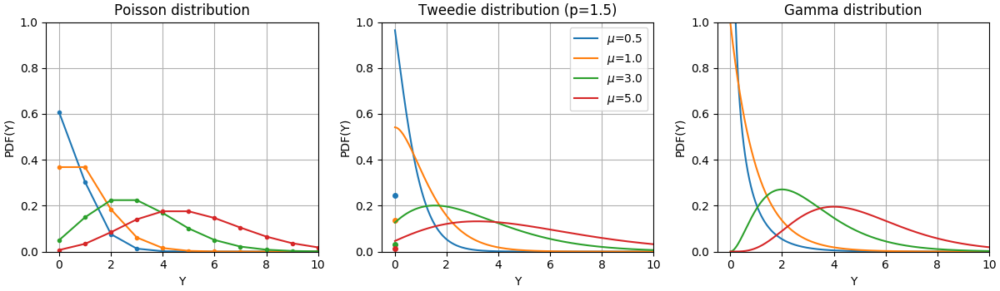

.. _linear_model:

=============
Linear Models
=============

.. currentmodule:: sklearn.linear_model

The following are a set of methods intended for regression in which
the target value is expected to be a linear combination of the features.
In mathematical notation, if :math:`\hat{y}` is the predicted
value.

.. math::    \hat{y}(w, x) = w_0 + w_1 x_1 + ... + w_p x_p

Across the module, we designate the vector :math:`w = (w_1,
..., w_p)` as ``coef_`` and :math:`w_0` as ``intercept_``.

To perform classification with generalized linear models, see
:ref:`Logistic_regression`.

.. _ordinary_least_squares:

Ordinary Least Squares
=======================

:class:`LinearRegression` fits a linear model with coefficients
:math:`w = (w_1, ..., w_p)` to minimize the residual sum
of squares between the observed targets in the dataset, and the
targets predicted by the linear approximation. Mathematically it
solves a problem of the form:

.. math:: \min_{w} || X w - y||_2^2

.. figure:: ../auto_examples/linear_model/images/sphx_glr_plot_ols_001.png
   :target: ../auto_examples/linear_model/plot_ols.html
   :align: center
   :scale: 50%

:class:`LinearRegression` will take in its ``fit`` method arrays X, y
and will store the coefficients :math:`w` of the linear model in its
``coef_`` member::

    >>> from sklearn import linear_model
    >>> reg = linear_model.LinearRegression()
    >>> reg.fit([[0, 0], [1, 1], [2, 2]], [0, 1, 2])
    LinearRegression()
    >>> reg.coef_
    array([0.5, 0.5])

The coefficient estimates for Ordinary Least Squares rely on the
independence of the features. When features are correlated and the
columns of the design matrix :math:`X` have an approximate linear
dependence, the design matrix becomes close to singular
and as a result, the least-squares estimate becomes highly sensitive
to random errors in the observed target, producing a large
variance. This situation of *multicollinearity* can arise, for
example, when data are collected without an experimental design.

.. topic:: Examples:

   * :ref:`sphx_glr_auto_examples_linear_model_plot_ols.py`

Non-Negative Least Squares
--------------------------

It is possible to constrain all the coefficients to be non-negative, which may
be useful when they represent some physical or naturally non-negative
quantities (e.g., frequency counts or prices of goods).
:class:`LinearRegression` accepts a boolean ``positive``
parameter: when set to `True` `Non Negative Least Squares
<https://en.wikipedia.org/wiki/Non-negative_least_squares>`_ are then applied.

.. topic:: Examples:

   * :ref:`sphx_glr_auto_examples_linear_model_plot_nnls.py`

Ordinary Least Squares Complexity
---------------------------------

The least squares solution is computed using the singular value
decomposition of X. If X is a matrix of shape `(n_samples, n_features)`
this method has a cost of
:math:`O(n_{\text{samples}} n_{\text{features}}^2)`, assuming that
:math:`n_{\text{samples}} \geq n_{\text{features}}`.

.. _ridge_regression:

Ridge regression and classification
===================================

Regression
----------

:class:`Ridge` regression addresses some of the problems of
:ref:`ordinary_least_squares` by imposing a penalty on the size of the
coefficients. The ridge coefficients minimize a penalized residual sum
of squares:

.. math::

   \min_{w} || X w - y||_2^2 + \alpha ||w||_2^2

The complexity parameter :math:`\alpha \geq 0` controls the amount
of shrinkage: the larger the value of :math:`\alpha`, the greater the amount
of shrinkage and thus the coefficients become more robust to collinearity.

.. figure:: ../auto_examples/linear_model/images/sphx_glr_plot_ridge_path_001.png
   :target: ../auto_examples/linear_model/plot_ridge_path.html
   :align: center
   :scale: 50%

As with other linear models, :class:`Ridge` will take in its ``fit`` method
arrays X, y and will store the coefficients :math:`w` of the linear model in
its ``coef_`` member::

    >>> from sklearn import linear_model
    >>> reg = linear_model.Ridge(alpha=.5)
    >>> reg.fit([[0, 0], [0, 0], [1, 1]], [0, .1, 1])
    Ridge(alpha=0.5)
    >>> reg.coef_
    array([0.34545455, 0.34545455])
    >>> reg.intercept_
    0.13636...

Classification
--------------

The :class:`Ridge` regressor has a classifier variant:
:class:`RidgeClassifier`. This classifier first converts binary targets to
``{-1, 1}`` and then treats the problem as a regression task, optimizing the
same objective as above. The predicted class corresponds to the sign of the
regressor's prediction. For multiclass classification, the problem is
treated as multi-output regression, and the predicted class corresponds to
the output with the highest value.

It might seem questionable to use a (penalized) Least Squares loss to fit a
classification model instead of the more traditional logistic or hinge
losses. However in practice all those models can lead to similar
cross-validation scores in terms of accuracy or precision/recall, while the
penalized least squares loss used by the :class:`RidgeClassifier` allows for
a very different choice of the numerical solvers with distinct computational
performance profiles.

The :class:`RidgeClassifier` can be significantly faster than e.g.
:class:`LogisticRegression` with a high number of classes, because it is
able to compute the projection matrix :math:`(X^T X)^{-1} X^T` only once.

This classifier is sometimes referred to as a `Least Squares Support Vector
Machines
<https://en.wikipedia.org/wiki/Least-squares_support-vector_machine>`_ with
a linear kernel.

.. topic:: Examples:

   * :ref:`sphx_glr_auto_examples_linear_model_plot_ridge_path.py`
   * :ref:`sphx_glr_auto_examples_text_plot_document_classification_20newsgroups.py`
   * :ref:`sphx_glr_auto_examples_inspection_plot_linear_model_coefficient_interpretation.py`

Ridge Complexity
----------------

This method has the same order of complexity as
:ref:`ordinary_least_squares`.

.. FIXME:
.. Not completely true: OLS is solved by an SVD, while Ridge is solved by
.. the method of normal equations (Cholesky), there is a big flop difference
.. between these

Setting the regularization parameter: leave-one-out Cross-Validation
--------------------------------------------------------------------

:class:`RidgeCV` implements ridge regression with built-in
cross-validation of the alpha parameter. The object works in the same way
as GridSearchCV except that it defaults to Leave-One-Out Cross-Validation::

    >>> import numpy as np
    >>> from sklearn import linear_model
    >>> reg = linear_model.RidgeCV(alphas=np.logspace(-6, 6, 13))
    >>> reg.fit([[0, 0], [0, 0], [1, 1]], [0, .1, 1])
    RidgeCV(alphas=array([1.e-06, 1.e-05, 1.e-04, 1.e-03, 1.e-02, 1.e-01, 1.e+00, 1.e+01,
          1.e+02, 1.e+03, 1.e+04, 1.e+05, 1.e+06]))
    >>> reg.alpha_
    0.01

Specifying the value of the :term:`cv` attribute will trigger the use of
cross-validation with :class:`~sklearn.model_selection.GridSearchCV`, for
example `cv=10` for 10-fold cross-validation, rather than Leave-One-Out
Cross-Validation.

.. topic:: References

    * "Notes on Regularized Least Squares", Rifkin & Lippert (`technical report
      <http://cbcl.mit.edu/publications/ps/MIT-CSAIL-TR-2007-025.pdf>`_,
      `course slides
      <https://www.mit.edu/~9.520/spring07/Classes/rlsslides.pdf>`_).

.. _lasso:

Lasso
=====

The :class:`Lasso` is a linear model that estimates sparse coefficients.
It is useful in some contexts due to its tendency to prefer solutions
with fewer non-zero coefficients, effectively reducing the number of
features upon which the given solution is dependent. For this reason
Lasso and its variants are fundamental to the field of compressed sensing.
Under certain conditions, it can recover the exact set of non-zero
coefficients (see
:ref:`sphx_glr_auto_examples_applications_plot_tomography_l1_reconstruction.py`).

Mathematically, it consists of a linear model with an added regularization term.
The objective function to minimize is:

.. math::  \min_{w} { \frac{1}{2n_{\text{samples}}} ||X w - y||_2 ^ 2 + \alpha ||w||_1}

The lasso estimate thus solves the minimization of the
least-squares penalty with :math:`\alpha ||w||_1` added, where
:math:`\alpha` is a constant and :math:`||w||_1` is the :math:`\ell_1`-norm of
the coefficient vector.

The implementation in the class :class:`Lasso` uses coordinate descent as
the algorithm to fit the coefficients. See :ref:`least_angle_regression`
for another implementation::

    >>> from sklearn import linear_model
    >>> reg = linear_model.Lasso(alpha=0.1)
    >>> reg.fit([[0, 0], [1, 1]], [0, 1])
    Lasso(alpha=0.1)
    >>> reg.predict([[1, 1]])
    array([0.8])

The function :func:`lasso_path` is useful for lower-level tasks, as it
computes the coefficients along the full path of possible values.

.. topic:: Examples:

  * :ref:`sphx_glr_auto_examples_linear_model_plot_lasso_and_elasticnet.py`
  * :ref:`sphx_glr_auto_examples_applications_plot_tomography_l1_reconstruction.py`
  * :ref:`sphx_glr_auto_examples_inspection_plot_linear_model_coefficient_interpretation.py`

.. note:: **Feature selection with Lasso**

      As the Lasso regression yields sparse models, it can
      thus be used to perform feature selection, as detailed in
      :ref:`l1_feature_selection`.

The following two references explain the iterations
used in the coordinate descent solver of scikit-learn, as well as
the duality gap computation used for convergence control.

.. topic:: References

    * "Regularization Path For Generalized linear Models by Coordinate Descent",
      Friedman, Hastie & Tibshirani, J Stat Softw, 2010 (`Paper
      <https://www.jstatsoft.org/article/view/v033i01/v33i01.pdf>`__).
    * "An Interior-Point Method for Large-Scale L1-Regularized Least Squares,"
      S. J. Kim, K. Koh, M. Lustig, S. Boyd and D. Gorinevsky,
      in IEEE Journal of Selected Topics in Signal Processing, 2007
      (`Paper <https://web.stanford.edu/~boyd/papers/pdf/l1_ls.pdf>`__)

Setting regularization parameter
--------------------------------

The ``alpha`` parameter controls the degree of sparsity of the estimated
coefficients.

Using cross-validation
^^^^^^^^^^^^^^^^^^^^^^^

scikit-learn exposes objects that set the Lasso ``alpha`` parameter by
cross-validation: :class:`LassoCV` and :class:`LassoLarsCV`.
:class:`LassoLarsCV` is based on the :ref:`least_angle_regression` algorithm
explained below.

For high-dimensional datasets with many collinear features,
:class:`LassoCV` is most often preferable. However, :class:`LassoLarsCV` has
the advantage of exploring more relevant values of `alpha` parameter, and
if the number of samples is very small compared to the number of
features, it is often faster than :class:`LassoCV`.

.. |lasso_cv_1| image:: ../auto_examples/linear_model/images/sphx_glr_plot_lasso_model_selection_002.png
    :target: ../auto_examples/linear_model/plot_lasso_model_selection.html
    :scale: 48%

.. |lasso_cv_2| image:: ../auto_examples/linear_model/images/sphx_glr_plot_lasso_model_selection_003.png
    :target: ../auto_examples/linear_model/plot_lasso_model_selection.html
    :scale: 48%

.. centered:: |lasso_cv_1| |lasso_cv_2|

Information-criteria based model selection
^^^^^^^^^^^^^^^^^^^^^^^^^^^^^^^^^^^^^^^^^^

Alternatively, the estimator :class:`LassoLarsIC` proposes to use the
Akaike information criterion (AIC) and the Bayes Information criterion (BIC).
It is a computationally cheaper alternative to find the optimal value of alpha
as the regularization path is computed only once instead of k+1 times
when using k-fold cross-validation. However, such criteria needs a
proper estimation of the degrees of freedom of the solution, are
derived for large samples (asymptotic results) and assume the model
is correct, i.e. that the data are actually generated by this model.
They also tend to break when the problem is badly conditioned
(more features than samples).

.. figure:: ../auto_examples/linear_model/images/sphx_glr_plot_lasso_model_selection_001.png
    :target: ../auto_examples/linear_model/plot_lasso_model_selection.html
    :align: center
    :scale: 50%

.. topic:: Examples:

  * :ref:`sphx_glr_auto_examples_linear_model_plot_lasso_model_selection.py`

Comparison with the regularization parameter of SVM
^^^^^^^^^^^^^^^^^^^^^^^^^^^^^^^^^^^^^^^^^^^^^^^^^^^

The equivalence between ``alpha`` and the regularization parameter of SVM,
``C`` is given by ``alpha = 1 / C`` or ``alpha = 1 / (n_samples * C)``,
depending on the estimator and the exact objective function optimized by the
model.

.. _multi_task_lasso:

Multi-task Lasso
================

The :class:`MultiTaskLasso` is a linear model that estimates sparse
coefficients for multiple regression problems jointly: ``y`` is a 2D array,
of shape ``(n_samples, n_tasks)``. The constraint is that the selected
features are the same for all the regression problems, also called tasks.

The following figure compares the location of the non-zero entries in the
coefficient matrix W obtained with a simple Lasso or a MultiTaskLasso.
The Lasso estimates yield scattered non-zeros while the non-zeros of
the MultiTaskLasso are full columns.

.. |multi_task_lasso_1| image:: ../auto_examples/linear_model/images/sphx_glr_plot_multi_task_lasso_support_001.png
    :target: ../auto_examples/linear_model/plot_multi_task_lasso_support.html
    :scale: 48%

.. |multi_task_lasso_2| image:: ../auto_examples/linear_model/images/sphx_glr_plot_multi_task_lasso_support_002.png
    :target: ../auto_examples/linear_model/plot_multi_task_lasso_support.html
    :scale: 48%

.. centered:: |multi_task_lasso_1| |multi_task_lasso_2|

.. centered:: Fitting a time-series model, imposing that any active feature be active at all times.

.. topic:: Examples:

  * :ref:`sphx_glr_auto_examples_linear_model_plot_multi_task_lasso_support.py`

Mathematically, it consists of a linear model trained with a mixed
:math:`\ell_1` :math:`\ell_2`-norm for regularization.
The objective function to minimize is:

.. math::  \min_{W} { \frac{1}{2n_{\text{samples}}} ||X W - Y||_{\text{Fro}} ^ 2 + \alpha ||W||_{21}}

where :math:`\text{Fro}` indicates the Frobenius norm

.. math:: ||A||_{\text{Fro}} = \sqrt{\sum_{ij} a_{ij}^2}

and :math:`\ell_1` :math:`\ell_2` reads

.. math:: ||A||_{2 1} = \sum_i \sqrt{\sum_j a_{ij}^2}.

The implementation in the class :class:`MultiTaskLasso` uses
coordinate descent as the algorithm to fit the coefficients.

.. _elastic_net:

Elastic-Net
===========
:class:`ElasticNet` is a linear regression model trained with both
:math:`\ell_1` and :math:`\ell_2`-norm regularization of the coefficients.
This combination  allows for learning a sparse model where few of
the weights are non-zero like :class:`Lasso`, while still maintaining
the regularization properties of :class:`Ridge`. We control the convex
combination of :math:`\ell_1` and :math:`\ell_2` using the ``l1_ratio``
parameter.

Elastic-net is useful when there are multiple features which are
correlated with one another. Lasso is likely to pick one of these
at random, while elastic-net is likely to pick both.

A practical advantage of trading-off between Lasso and Ridge is that it
allows Elastic-Net to inherit some of Ridge's stability under rotation.

The objective function to minimize is in this case

.. math::

    \min_{w} { \frac{1}{2n_{\text{samples}}} ||X w - y||_2 ^ 2 + \alpha \rho ||w||_1 +
    \frac{\alpha(1-\rho)}{2} ||w||_2 ^ 2}

.. figure:: ../auto_examples/linear_model/images/sphx_glr_plot_lasso_coordinate_descent_path_001.png
   :target: ../auto_examples/linear_model/plot_lasso_coordinate_descent_path.html
   :align: center
   :scale: 50%

The class :class:`ElasticNetCV` can be used to set the parameters
``alpha`` (:math:`\alpha`) and ``l1_ratio`` (:math:`\rho`) by cross-validation.

.. topic:: Examples:

  * :ref:`sphx_glr_auto_examples_linear_model_plot_lasso_and_elasticnet.py`
  * :ref:`sphx_glr_auto_examples_linear_model_plot_lasso_coordinate_descent_path.py`

The following two references explain the iterations
used in the coordinate descent solver of scikit-learn, as well as
the duality gap computation used for convergence control.

.. topic:: References

    * "Regularization Path For Generalized linear Models by Coordinate Descent",
      Friedman, Hastie & Tibshirani, J Stat Softw, 2010 (`Paper
      <https://www.jstatsoft.org/article/view/v033i01/v33i01.pdf>`__).
    * "An Interior-Point Method for Large-Scale L1-Regularized Least Squares,"
      S. J. Kim, K. Koh, M. Lustig, S. Boyd and D. Gorinevsky,
      in IEEE Journal of Selected Topics in Signal Processing, 2007
      (`Paper <https://web.stanford.edu/~boyd/papers/pdf/l1_ls.pdf>`__)

.. _multi_task_elastic_net:

Multi-task Elastic-Net
======================

The :class:`MultiTaskElasticNet` is an elastic-net model that estimates sparse
coefficients for multiple regression problems jointly: ``Y`` is a 2D array
of shape ``(n_samples, n_tasks)``. The constraint is that the selected
features are the same for all the regression problems, also called tasks.

Mathematically, it consists of a linear model trained with a mixed
:math:`\ell_1` :math:`\ell_2`-norm and :math:`\ell_2`-norm for regularization.
The objective function to minimize is:

.. math::

    \min_{W} { \frac{1}{2n_{\text{samples}}} ||X W - Y||_{\text{Fro}}^2 + \alpha \rho ||W||_{2 1} +
    \frac{\alpha(1-\rho)}{2} ||W||_{\text{Fro}}^2}

The implementation in the class :class:`MultiTaskElasticNet` uses coordinate descent as
the algorithm to fit the coefficients.

The class :class:`MultiTaskElasticNetCV` can be used to set the parameters
``alpha`` (:math:`\alpha`) and ``l1_ratio`` (:math:`\rho`) by cross-validation.

.. _least_angle_regression:

Least Angle Regression
======================

Least-angle regression (LARS) is a regression algorithm for
high-dimensional data, developed by Bradley Efron, Trevor Hastie, Iain
Johnstone and Robert Tibshirani. LARS is similar to forward stepwise
regression. At each step, it finds the feature most correlated with the
target. When there are multiple features having equal correlation, instead
of continuing along the same feature, it proceeds in a direction equiangular
between the features.

The advantages of LARS are:

  - It is numerically efficient in contexts where the number of features
    is significantly greater than the number of samples.

  - It is computationally just as fast as forward selection and has
    the same order of complexity as ordinary least squares.

  - It produces a full piecewise linear solution path, which is
    useful in cross-validation or similar attempts to tune the model.

  - If two features are almost equally correlated with the target,
    then their coefficients should increase at approximately the same
    rate. The algorithm thus behaves as intuition would expect, and
    also is more stable.

  - It is easily modified to produce solutions for other estimators,
    like the Lasso.

The disadvantages of the LARS method include:

  - Because LARS is based upon an iterative refitting of the
    residuals, it would appear to be especially sensitive to the
    effects of noise. This problem is discussed in detail by Weisberg
    in the discussion section of the Efron et al. (2004) Annals of
    Statistics article.

The LARS model can be used using estimator :class:`Lars`, or its
low-level implementation :func:`lars_path` or :func:`lars_path_gram`.

LARS Lasso
==========

:class:`LassoLars` is a lasso model implemented using the LARS
algorithm, and unlike the implementation based on coordinate descent,
this yields the exact solution, which is piecewise linear as a
function of the norm of its coefficients.

.. figure:: ../auto_examples/linear_model/images/sphx_glr_plot_lasso_lars_001.png
   :target: ../auto_examples/linear_model/plot_lasso_lars.html
   :align: center
   :scale: 50%

::

   >>> from sklearn import linear_model
   >>> reg = linear_model.LassoLars(alpha=.1)
   >>> reg.fit([[0, 0], [1, 1]], [0, 1])
   LassoLars(alpha=0.1)
   >>> reg.coef_
   array([0.717157..., 0.        ])

.. topic:: Examples:

 * :ref:`sphx_glr_auto_examples_linear_model_plot_lasso_lars.py`

The Lars algorithm provides the full path of the coefficients along
the regularization parameter almost for free, thus a common operation
is to retrieve the path with one of the functions :func:`lars_path`
or :func:`lars_path_gram`.

Mathematical formulation
------------------------

The algorithm is similar to forward stepwise regression, but instead
of including features at each step, the estimated coefficients are
increased in a direction equiangular to each one's correlations with
the residual.

Instead of giving a vector result, the LARS solution consists of a
curve denoting the solution for each value of the :math:`\ell_1` norm of the
parameter vector. The full coefficients path is stored in the array
``coef_path_``, which has size (n_features, max_features+1). The first
column is always zero.

.. topic:: References:

 * Original Algorithm is detailed in the paper `Least Angle Regression
   <https://www-stat.stanford.edu/~hastie/Papers/LARS/LeastAngle_2002.pdf>`_
   by Hastie et al.

.. _omp:

Orthogonal Matching Pursuit (OMP)
=================================
:class:`OrthogonalMatchingPursuit` and :func:`orthogonal_mp` implements the OMP
algorithm for approximating the fit of a linear model with constraints imposed
on the number of non-zero coefficients (ie. the :math:`\ell_0` pseudo-norm).

Being a forward feature selection method like :ref:`least_angle_regression`,
orthogonal matching pursuit can approximate the optimum solution vector with a
fixed number of non-zero elements:

.. math::
    \underset{w}{\operatorname{arg\,min\,}}  ||y - Xw||_2^2 \text{ subject to } ||w||_0 \leq n_{\text{nonzero\_coefs}}

Alternatively, orthogonal matching pursuit can target a specific error instead
of a specific number of non-zero coefficients. This can be expressed as:

.. math::
    \underset{w}{\operatorname{arg\,min\,}} ||w||_0 \text{ subject to } ||y-Xw||_2^2 \leq \text{tol}

OMP is based on a greedy algorithm that includes at each step the atom most
highly correlated with the current residual. It is similar to the simpler
matching pursuit (MP) method, but better in that at each iteration, the
residual is recomputed using an orthogonal projection on the space of the
previously chosen dictionary elements.

.. topic:: Examples:

 * :ref:`sphx_glr_auto_examples_linear_model_plot_omp.py`

.. topic:: References:

 * https://www.cs.technion.ac.il/~ronrubin/Publications/KSVD-OMP-v2.pdf

 * `Matching pursuits with time-frequency dictionaries
   <http://blanche.polytechnique.fr/~mallat/papiers/MallatPursuit93.pdf>`_,
   S. G. Mallat, Z. Zhang,

.. _bayesian_regression:

Bayesian Regression
===================

Bayesian regression techniques can be used to include regularization
parameters in the estimation procedure: the regularization parameter is
not set in a hard sense but tuned to the data at hand.

This can be done by introducing `uninformative priors
<https://en.wikipedia.org/wiki/Non-informative_prior#Uninformative_priors>`__
over the hyper parameters of the model.
The :math:`\ell_{2}` regularization used in :ref:`ridge_regression` is
equivalent to finding a maximum a posteriori estimation under a Gaussian prior
over the coefficients :math:`w` with precision :math:`\lambda^{-1}`.
Instead of setting `\lambda` manually, it is possible to treat it as a random
variable to be estimated from the data.

To obtain a fully probabilistic model, the output :math:`y` is assumed
to be Gaussian distributed around :math:`X w`:

.. math::  p(y|X,w,\alpha) = \mathcal{N}(y|X w,\alpha)

where :math:`\alpha` is again treated as a random variable that is to be
estimated from the data.

The advantages of Bayesian Regression are:

    - It adapts to the data at hand.

    - It can be used to include regularization parameters in the
      estimation procedure.

The disadvantages of Bayesian regression include:

    - Inference of the model can be time consuming.

.. topic:: References

 * A good introduction to Bayesian methods is given in C. Bishop: Pattern
   Recognition and Machine learning

 * Original Algorithm is detailed in the  book `Bayesian learning for neural
   networks` by Radford M. Neal

.. _bayesian_ridge_regression:

Bayesian Ridge Regression
-------------------------

:class:`BayesianRidge` estimates a probabilistic model of the
regression problem as described above.
The prior for the coefficient :math:`w` is given by a spherical Gaussian:

.. math:: p(w|\lambda) =
    \mathcal{N}(w|0,\lambda^{-1}\mathbf{I}_{p})

The priors over :math:`\alpha` and :math:`\lambda` are chosen to be `gamma
distributions <https://en.wikipedia.org/wiki/Gamma_distribution>`__, the
conjugate prior for the precision of the Gaussian. The resulting model is
called *Bayesian Ridge Regression*, and is similar to the classical
:class:`Ridge`.

The parameters :math:`w`, :math:`\alpha` and :math:`\lambda` are estimated
jointly during the fit of the model, the regularization parameters
:math:`\alpha` and :math:`\lambda` being estimated by maximizing the
*log marginal likelihood*. The scikit-learn implementation
is based on the algorithm described in Appendix A of (Tipping, 2001)
where the update of the parameters :math:`\alpha` and :math:`\lambda` is done
as suggested in (MacKay, 1992). The initial value of the maximization procedure
can be set with the hyperparameters ``alpha_init`` and ``lambda_init``.

There are four more hyperparameters, :math:`\alpha_1`, :math:`\alpha_2`,
:math:`\lambda_1` and :math:`\lambda_2` of the gamma prior distributions over
:math:`\alpha` and :math:`\lambda`. These are usually chosen to be
*non-informative*. By default :math:`\alpha_1 = \alpha_2 =  \lambda_1 = \lambda_2 = 10^{-6}`.

.. figure:: ../auto_examples/linear_model/images/sphx_glr_plot_bayesian_ridge_001.png
   :target: ../auto_examples/linear_model/plot_bayesian_ridge.html
   :align: center
   :scale: 50%

Bayesian Ridge Regression is used for regression::

    >>> from sklearn import linear_model
    >>> X = [[0., 0.], [1., 1.], [2., 2.], [3., 3.]]
    >>> Y = [0., 1., 2., 3.]
    >>> reg = linear_model.BayesianRidge()
    >>> reg.fit(X, Y)
    BayesianRidge()

After being fitted, the model can then be used to predict new values::

    >>> reg.predict([[1, 0.]])
    array([0.50000013])

The coefficients :math:`w` of the model can be accessed::

    >>> reg.coef_
    array([0.49999993, 0.49999993])

Due to the Bayesian framework, the weights found are slightly different to the
ones found by :ref:`ordinary_least_squares`. However, Bayesian Ridge Regression
is more robust to ill-posed problems.

.. topic:: Examples:

 * :ref:`sphx_glr_auto_examples_linear_model_plot_bayesian_ridge.py`
 * :ref:`sphx_glr_auto_examples_linear_model_plot_bayesian_ridge_curvefit.py`

.. topic:: References:

    * Section 3.3 in Christopher M. Bishop: Pattern Recognition and Machine Learning, 2006

    * David J. C. MacKay, `Bayesian Interpolation <http://citeseerx.ist.psu.edu/viewdoc/download?doi=10.1.1.27.9072&rep=rep1&type=pdf>`_, 1992.

    * Michael E. Tipping, `Sparse Bayesian Learning and the Relevance Vector Machine <http://www.jmlr.org/papers/volume1/tipping01a/tipping01a.pdf>`_, 2001.

Automatic Relevance Determination - ARD
---------------------------------------

:class:`ARDRegression` is very similar to `Bayesian Ridge Regression`_,
but can lead to sparser coefficients :math:`w` [1]_ [2]_.
:class:`ARDRegression` poses a different prior over :math:`w`, by dropping the
assumption of the Gaussian being spherical.

Instead, the distribution over :math:`w` is assumed to be an axis-parallel,
elliptical Gaussian distribution.

This means each coefficient :math:`w_{i}` is drawn from a Gaussian distribution,
centered on zero and with a precision :math:`\lambda_{i}`:

.. math:: p(w|\lambda) = \mathcal{N}(w|0,A^{-1})

with :math:`\text{diag}(A) = \lambda = \{\lambda_{1},...,\lambda_{p}\}`.

In contrast to `Bayesian Ridge Regression`_, each coordinate of :math:`w_{i}`
has its own standard deviation :math:`\lambda_i`. The prior over all
:math:`\lambda_i` is chosen to be the same gamma distribution given by
hyperparameters :math:`\lambda_1` and :math:`\lambda_2`.

.. figure:: ../auto_examples/linear_model/images/sphx_glr_plot_ard_001.png
   :target: ../auto_examples/linear_model/plot_ard.html
   :align: center
   :scale: 50%

ARD is also known in the literature as *Sparse Bayesian Learning* and
*Relevance Vector Machine* [3]_ [4]_.

.. topic:: Examples:

  * :ref:`sphx_glr_auto_examples_linear_model_plot_ard.py`

.. topic:: References:

    .. [1] Christopher M. Bishop: Pattern Recognition and Machine Learning, Chapter 7.2.1

    .. [2] David Wipf and Srikantan Nagarajan: `A new view of automatic relevance determination <https://papers.nips.cc/paper/3372-a-new-view-of-automatic-relevance-determination.pdf>`_

    .. [3] Michael E. Tipping: `Sparse Bayesian Learning and the Relevance Vector Machine <http://www.jmlr.org/papers/volume1/tipping01a/tipping01a.pdf>`_

    .. [4] Tristan Fletcher: `Relevance Vector Machines explained <http://citeseerx.ist.psu.edu/viewdoc/download?doi=10.1.1.651.8603&rep=rep1&type=pdf>`_

.. _Logistic_regression:

Logistic regression
===================

Logistic regression, despite its name, is a linear model for classification
rather than regression. Logistic regression is also known in the literature as
logit regression, maximum-entropy classification (MaxEnt) or the log-linear
classifier. In this model, the probabilities describing the possible outcomes
of a single trial are modeled using a
`logistic function <https://en.wikipedia.org/wiki/Logistic_function>`_.

Logistic regression is implemented in :class:`LogisticRegression`.
This implementation can fit binary, One-vs-Rest, or multinomial logistic
regression with optional :math:`\ell_1`, :math:`\ell_2` or Elastic-Net
regularization.

.. note::

    Regularization is applied by default, which is common in machine
    learning but not in statistics. Another advantage of regularization is
    that it improves numerical stability. No regularization amounts to
    setting C to a very high value.

As an optimization problem, binary class :math:`\ell_2` penalized logistic
regression minimizes the following cost function:

.. math:: \min_{w, c} \frac{1}{2}w^T w + C \sum_{i=1}^n \log(\exp(- y_i (X_i^T w + c)) + 1) .

Similarly, :math:`\ell_1` regularized logistic regression solves the following
optimization problem:

.. math:: \min_{w, c} \|w\|_1 + C \sum_{i=1}^n \log(\exp(- y_i (X_i^T w + c)) + 1).

Elastic-Net regularization is a combination of :math:`\ell_1` and
:math:`\ell_2`, and minimizes the following cost function:

.. math:: \min_{w, c} \frac{1 - \rho}{2}w^T w + \rho \|w\|_1 + C \sum_{i=1}^n \log(\exp(- y_i (X_i^T w + c)) + 1),

where :math:`\rho` controls the strength of :math:`\ell_1` regularization vs.
:math:`\ell_2` regularization (it corresponds to the `l1_ratio` parameter).

Note that, in this notation, it's assumed that the target :math:`y_i` takes
values in the set :math:`{-1, 1}` at trial :math:`i`. We can also see that
Elastic-Net is equivalent to :math:`\ell_1` when :math:`\rho = 1` and equivalent
to :math:`\ell_2` when :math:`\rho=0`.

The solvers implemented in the class :class:`LogisticRegression`
are "liblinear", "newton-cg", "lbfgs", "sag" and "saga":

The solver "liblinear" uses a coordinate descent (CD) algorithm, and relies
on the excellent C++ `LIBLINEAR library
<https://www.csie.ntu.edu.tw/~cjlin/liblinear/>`_, which is shipped with
scikit-learn. However, the CD algorithm implemented in liblinear cannot learn
a true multinomial (multiclass) model; instead, the optimization problem is
decomposed in a "one-vs-rest" fashion so separate binary classifiers are
trained for all classes. This happens under the hood, so
:class:`LogisticRegression` instances using this solver behave as multiclass
classifiers. For :math:`\ell_1` regularization :func:`sklearn.svm.l1_min_c` allows to
calculate the lower bound for C in order to get a non "null" (all feature
weights to zero) model.

The "lbfgs", "sag" and "newton-cg" solvers only support :math:`\ell_2`
regularization or no regularization, and are found to converge faster for some
high-dimensional data. Setting `multi_class` to "multinomial" with these solvers
learns a true multinomial logistic regression model [5]_, which means that its
probability estimates should be better calibrated than the default "one-vs-rest"
setting.

The "sag" solver uses Stochastic Average Gradient descent [6]_. It is faster
than other solvers for large datasets, when both the number of samples and the
number of features are large.

The "saga" solver [7]_ is a variant of "sag" that also supports the
non-smooth `penalty="l1"`. This is therefore the solver of choice for sparse
multinomial logistic regression. It is also the only solver that supports
`penalty="elasticnet"`.

The "lbfgs" is an optimization algorithm that approximates the
Broyden–Fletcher–Goldfarb–Shanno algorithm [8]_, which belongs to
quasi-Newton methods. The "lbfgs" solver is recommended for use for
small data-sets but for larger datasets its performance suffers. [9]_

The following table summarizes the penalties supported by each solver:

+------------------------------+-----------------+-------------+-----------------+-----------+------------+
|                              |                       **Solvers**                                        |
+------------------------------+-----------------+-------------+-----------------+-----------+------------+
| **Penalties**                | **'liblinear'** | **'lbfgs'** | **'newton-cg'** | **'sag'** | **'saga'** |
+------------------------------+-----------------+-------------+-----------------+-----------+------------+
| Multinomial + L2 penalty     |       no        |     yes     |       yes       |    yes    |    yes     |
+------------------------------+-----------------+-------------+-----------------+-----------+------------+
| OVR + L2 penalty             |       yes       |     yes     |       yes       |    yes    |    yes     |
+------------------------------+-----------------+-------------+-----------------+-----------+------------+
| Multinomial + L1 penalty     |       no        |     no      |       no        |    no     |    yes     |
+------------------------------+-----------------+-------------+-----------------+-----------+------------+
| OVR + L1 penalty             |       yes       |     no      |       no        |    no     |    yes     |
+------------------------------+-----------------+-------------+-----------------+-----------+------------+
| Elastic-Net                  |       no        |     no      |       no        |    no     |    yes     |
+------------------------------+-----------------+-------------+-----------------+-----------+------------+
| No penalty ('none')          |       no        |     yes     |       yes       |    yes    |    yes     |
+------------------------------+-----------------+-------------+-----------------+-----------+------------+
| **Behaviors**                |                                                                          |
+------------------------------+-----------------+-------------+-----------------+-----------+------------+
| Penalize the intercept (bad) |       yes       |     no      |       no        |    no     |    no      |
+------------------------------+-----------------+-------------+-----------------+-----------+------------+
| Faster for large datasets    |       no        |     no      |       no        |    yes    |    yes     |
+------------------------------+-----------------+-------------+-----------------+-----------+------------+
| Robust to unscaled datasets  |       yes       |     yes     |       yes       |    no     |    no      |
+------------------------------+-----------------+-------------+-----------------+-----------+------------+

The "lbfgs" solver is used by default for its robustness. For large datasets
the "saga" solver is usually faster.
For large dataset, you may also consider using :class:`SGDClassifier`
with 'log' loss, which might be even faster but requires more tuning.

.. topic:: Examples:

  * :ref:`sphx_glr_auto_examples_linear_model_plot_logistic_l1_l2_sparsity.py`

  * :ref:`sphx_glr_auto_examples_linear_model_plot_logistic_path.py`

  * :ref:`sphx_glr_auto_examples_linear_model_plot_logistic_multinomial.py`

  * :ref:`sphx_glr_auto_examples_linear_model_plot_sparse_logistic_regression_20newsgroups.py`

  * :ref:`sphx_glr_auto_examples_linear_model_plot_sparse_logistic_regression_mnist.py`

.. _liblinear_differences:

.. topic:: Differences from liblinear:

   There might be a difference in the scores obtained between
   :class:`LogisticRegression` with ``solver=liblinear``
   or :class:`LinearSVC` and the external liblinear library directly,
   when ``fit_intercept=False`` and the fit ``coef_`` (or) the data to
   be predicted are zeroes. This is because for the sample(s) with
   ``decision_function`` zero, :class:`LogisticRegression` and :class:`LinearSVC`
   predict the negative class, while liblinear predicts the positive class.
   Note that a model with ``fit_intercept=False`` and having many samples with
   ``decision_function`` zero, is likely to be a underfit, bad model and you are
   advised to set ``fit_intercept=True`` and increase the intercept_scaling.

.. note:: **Feature selection with sparse logistic regression**

   A logistic regression with :math:`\ell_1` penalty yields sparse models, and can
   thus be used to perform feature selection, as detailed in
   :ref:`l1_feature_selection`.

.. note:: **P-value estimation**

    It is possible to obtain the p-values and confidence intervals for
    coefficients in cases of regression without penalization. The `statsmodels
    package <https://pypi.org/project/statsmodels/>` natively supports this.
    Within sklearn, one could use bootstrapping instead as well.

:class:`LogisticRegressionCV` implements Logistic Regression with built-in
cross-validation support, to find the optimal `C` and `l1_ratio` parameters
according to the ``scoring`` attribute. The "newton-cg", "sag", "saga" and
"lbfgs" solvers are found to be faster for high-dimensional dense data, due
to warm-starting (see :term:`Glossary <warm_start>`).

.. topic:: References:

    .. [5] Christopher M. Bishop: Pattern Recognition and Machine Learning, Chapter 4.3.4

    .. [6] Mark Schmidt, Nicolas Le Roux, and Francis Bach: `Minimizing Finite Sums with the Stochastic Average Gradient. <https://hal.inria.fr/hal-00860051/document>`_

    .. [7] Aaron Defazio, Francis Bach, Simon Lacoste-Julien: `SAGA: A Fast Incremental Gradient Method With Support for Non-Strongly Convex Composite Objectives. <https://arxiv.org/abs/1407.0202>`_

    .. [8] https://en.wikipedia.org/wiki/Broyden%E2%80%93Fletcher%E2%80%93Goldfarb%E2%80%93Shanno_algorithm

    .. [9] `"Performance Evaluation of Lbfgs vs other solvers"
            <http://www.fuzihao.org/blog/2016/01/16/Comparison-of-Gradient-Descent-Stochastic-Gradient-Descent-and-L-BFGS/>`_

.. _Generalized_linear_regression:

Generalized Linear Regression
=============================

Generalized Linear Models (GLM) extend linear models in two ways
[10]_. First, the predicted values :math:`\hat{y}` are linked to a linear
combination of the input variables :math:`X` via an inverse link function
:math:`h` as

.. math::    \hat{y}(w, X) = h(Xw).

Secondly, the squared loss function is replaced by the unit deviance
:math:`d` of a distribution in the exponential family (or more precisely, a
reproductive exponential dispersion model (EDM) [11]_).

The minimization problem becomes:

.. math::    \min_{w} \frac{1}{2 n_{\text{samples}}} \sum_i d(y_i, \hat{y}_i) + \frac{\alpha}{2} ||w||_2,

where :math:`\alpha` is the L2 regularization penalty. When sample weights are
provided, the average becomes a weighted average.

The following table lists some specific EDMs and their unit deviance (all of
these are instances of the Tweedie family):

================= ===============================  ============================================
Distribution       Target Domain                    Unit Deviance :math:`d(y, \hat{y})`
================= ===============================  ============================================
Normal            :math:`y \in (-\infty, \infty)`  :math:`(y-\hat{y})^2`
Poisson           :math:`y \in [0, \infty)`        :math:`2(y\log\frac{y}{\hat{y}}-y+\hat{y})`
Gamma             :math:`y \in (0, \infty)`        :math:`2(\log\frac{\hat{y}}{y}+\frac{y}{\hat{y}}-1)`
Inverse Gaussian  :math:`y \in (0, \infty)`        :math:`\frac{(y-\hat{y})^2}{y\hat{y}^2}`
================= ===============================  ============================================

The Probability Density Functions (PDF) of these distributions are illustrated
in the following figure,

   PDF of a random variable Y following Poisson, Tweedie (power=1.5) and Gamma
   distributions with different mean values (:math:`\mu`). Observe the point
   mass at :math:`Y=0` for the Poisson distribution and the Tweedie (power=1.5)
   distribution, but not for the Gamma distribution which has a strictly
   positive target domain.

The choice of the distribution depends on the problem at hand:

* If the target values :math:`y` are counts (non-negative integer valued) or
  relative frequencies (non-negative), you might use a Poisson deviance
  with log-link.
* If the target values are positive valued and skewed, you might try a
  Gamma deviance with log-link.
* If the target values seem to be heavier tailed than a Gamma distribution,
  you might try an Inverse Gaussian deviance (or even higher variance powers
  of the Tweedie family).

Examples of use cases include:

* Agriculture / weather modeling:  number of rain events per year (Poisson),
  amount of rainfall per event (Gamma), total rainfall per year (Tweedie /
  Compound Poisson Gamma).
* Risk modeling / insurance policy pricing:  number of claim events /
  policyholder per year (Poisson), cost per event (Gamma), total cost per
  policyholder per year (Tweedie / Compound Poisson Gamma).
* Predictive maintenance: number of production interruption events per year
  (Poisson), duration of interruption (Gamma), total interruption time per year
  (Tweedie / Compound Poisson Gamma).

.. topic:: References:

    .. [10] McCullagh, Peter; Nelder, John (1989). Generalized Linear Models,
       Second Edition. Boca Raton: Chapman and Hall/CRC. ISBN 0-412-31760-5.

    .. [11] Jørgensen, B. (1992). The theory of exponential dispersion models
       and analysis of deviance. Monografias de matemática, no. 51.  See also
       `Exponential dispersion model.
       <https://en.wikipedia.org/wiki/Exponential_dispersion_model>`_

Usage
-----

:class:`TweedieRegressor` implements a generalized linear model for the
Tweedie distribution, that allows to model any of the above mentioned
distributions using the appropriate ``power`` parameter. In particular:

- ``power = 0``: Normal distribution. Specific estimators such as
  :class:`Ridge`, :class:`ElasticNet` are generally more appropriate in
  this case.
- ``power = 1``: Poisson distribution. :class:`PoissonRegressor` is exposed
  for convenience. However, it is strictly equivalent to
  `TweedieRegressor(power=1, link='log')`.
- ``power = 2``: Gamma distribution. :class:`GammaRegressor` is exposed for
  convenience. However, it is strictly equivalent to
  `TweedieRegressor(power=2, link='log')`.
- ``power = 3``: Inverse Gaussian distribution.

The link function is determined by the `link` parameter.

Usage example::

    >>> from sklearn.linear_model import TweedieRegressor
    >>> reg = TweedieRegressor(power=1, alpha=0.5, link='log')
    >>> reg.fit([[0, 0], [0, 1], [2, 2]], [0, 1, 2])
    TweedieRegressor(alpha=0.5, link='log', power=1)
    >>> reg.coef_
    array([0.2463..., 0.4337...])
    >>> reg.intercept_
    -0.7638...

.. topic:: Examples:

  * :ref:`sphx_glr_auto_examples_linear_model_plot_poisson_regression_non_normal_loss.py`
  * :ref:`sphx_glr_auto_examples_linear_model_plot_tweedie_regression_insurance_claims.py`

Practical considerations
------------------------

The feature matrix `X` should be standardized before fitting. This ensures
that the penalty treats features equally.

Since the linear predictor :math:`Xw` can be negative and Poisson,
Gamma and Inverse Gaussian distributions don't support negative values, it
is necessary to apply an inverse link function that guarantees the
non-negativeness. For example with `link='log'`, the inverse link function
becomes :math:`h(Xw)=\exp(Xw)`.

If you want to model a relative frequency, i.e. counts per exposure (time,
volume, ...) you can do so by using a Poisson distribution and passing
:math:`y=\frac{\mathrm{counts}}{\mathrm{exposure}}` as target values
together with :math:`\mathrm{exposure}` as sample weights. For a concrete
example see e.g.
:ref:`sphx_glr_auto_examples_linear_model_plot_tweedie_regression_insurance_claims.py`.

When performing cross-validation for the `power` parameter of
`TweedieRegressor`, it is advisable to specify an explicit `scoring` function,
because the default scorer :meth:`TweedieRegressor.score` is a function of
`power` itself.

Stochastic Gradient Descent - SGD
=================================

Stochastic gradient descent is a simple yet very efficient approach
to fit linear models. It is particularly useful when the number of samples
(and the number of features) is very large.
The ``partial_fit`` method allows online/out-of-core learning.

The classes :class:`SGDClassifier` and :class:`SGDRegressor` provide
functionality to fit linear models for classification and regression
using different (convex) loss functions and different penalties.
E.g., with ``loss="log"``, :class:`SGDClassifier`
fits a logistic regression model,
while with ``loss="hinge"`` it fits a linear support vector machine (SVM).

.. topic:: References

 * :ref:`sgd`

.. _perceptron:

Perceptron
==========

The :class:`Perceptron` is another simple classification algorithm suitable for
large scale learning. By default:

    - It does not require a learning rate.

    - It is not regularized (penalized).

    - It updates its model only on mistakes.

The last characteristic implies that the Perceptron is slightly faster to
train than SGD with the hinge loss and that the resulting models are
sparser.

.. _passive_aggressive:

Passive Aggressive Algorithms
=============================

The passive-aggressive algorithms are a family of algorithms for large-scale
learning. They are similar to the Perceptron in that they do not require a
learning rate. However, contrary to the Perceptron, they include a
regularization parameter ``C``.

For classification, :class:`PassiveAggressiveClassifier` can be used with
``loss='hinge'`` (PA-I) or ``loss='squared_hinge'`` (PA-II).  For regression,
:class:`PassiveAggressiveRegressor` can be used with
``loss='epsilon_insensitive'`` (PA-I) or
``loss='squared_epsilon_insensitive'`` (PA-II).

.. topic:: References:

 * `"Online Passive-Aggressive Algorithms"
   <http://jmlr.csail.mit.edu/papers/volume7/crammer06a/crammer06a.pdf>`_
   K. Crammer, O. Dekel, J. Keshat, S. Shalev-Shwartz, Y. Singer - JMLR 7 (2006)

Robustness regression: outliers and modeling errors
=====================================================

Robust regression aims to fit a regression model in the
presence of corrupt data: either outliers, or error in the model.

.. figure:: ../auto_examples/linear_model/images/sphx_glr_plot_theilsen_001.png
   :target: ../auto_examples/linear_model/plot_theilsen.html
   :scale: 50%
   :align: center

Different scenario and useful concepts
----------------------------------------

There are different things to keep in mind when dealing with data
corrupted by outliers:

.. |y_outliers| image:: ../auto_examples/linear_model/images/sphx_glr_plot_robust_fit_003.png
   :target: ../auto_examples/linear_model/plot_robust_fit.html
   :scale: 60%

.. |X_outliers| image:: ../auto_examples/linear_model/images/sphx_glr_plot_robust_fit_002.png
   :target: ../auto_examples/linear_model/plot_robust_fit.html
   :scale: 60%

.. |large_y_outliers| image:: ../auto_examples/linear_model/images/sphx_glr_plot_robust_fit_005.png
   :target: ../auto_examples/linear_model/plot_robust_fit.html
   :scale: 60%

* **Outliers in X or in y**?

  ==================================== ====================================
  Outliers in the y direction          Outliers in the X direction
  ==================================== ====================================
  |y_outliers|                         |X_outliers|
  ==================================== ====================================

* **Fraction of outliers versus amplitude of error**

  The number of outlying points matters, but also how much they are
  outliers.

  ==================================== ====================================
  Small outliers                       Large outliers
  ==================================== ====================================
  |y_outliers|                         |large_y_outliers|
  ==================================== ====================================

An important notion of robust fitting is that of breakdown point: the
fraction of data that can be outlying for the fit to start missing the
inlying data.

Note that in general, robust fitting in high-dimensional setting (large
`n_features`) is very hard. The robust models here will probably not work
in these settings.

.. topic:: **Trade-offs: which estimator?**

  Scikit-learn provides 3 robust regression estimators:
  :ref:`RANSAC <ransac_regression>`,
  :ref:`Theil Sen <theil_sen_regression>` and
  :ref:`HuberRegressor <huber_regression>`.

  * :ref:`HuberRegressor <huber_regression>` should be faster than
    :ref:`RANSAC <ransac_regression>` and :ref:`Theil Sen <theil_sen_regression>`
    unless the number of samples are very large, i.e ``n_samples`` >> ``n_features``.
    This is because :ref:`RANSAC <ransac_regression>` and :ref:`Theil Sen <theil_sen_regression>`
    fit on smaller subsets of the data. However, both :ref:`Theil Sen <theil_sen_regression>`
    and :ref:`RANSAC <ransac_regression>` are unlikely to be as robust as
    :ref:`HuberRegressor <huber_regression>` for the default parameters.

  * :ref:`RANSAC <ransac_regression>` is faster than :ref:`Theil Sen <theil_sen_regression>`
    and scales much better with the number of samples.

  * :ref:`RANSAC <ransac_regression>` will deal better with large
    outliers in the y direction (most common situation).

  * :ref:`Theil Sen <theil_sen_regression>` will cope better with
    medium-size outliers in the X direction, but this property will
    disappear in high-dimensional settings.

 When in doubt, use :ref:`RANSAC <ransac_regression>`.

.. _ransac_regression:

RANSAC: RANdom SAmple Consensus
--------------------------------

RANSAC (RANdom SAmple Consensus) fits a model from random subsets of
inliers from the complete data set.

RANSAC is a non-deterministic algorithm producing only a reasonable result with
a certain probability, which is dependent on the number of iterations (see
`max_trials` parameter). It is typically used for linear and non-linear
regression problems and is especially popular in the field of photogrammetric
computer vision.

The algorithm splits the complete input sample data into a set of inliers,
which may be subject to noise, and outliers, which are e.g. caused by erroneous
measurements or invalid hypotheses about the data. The resulting model is then
estimated only from the determined inliers.

.. figure:: ../auto_examples/linear_model/images/sphx_glr_plot_ransac_001.png
   :target: ../auto_examples/linear_model/plot_ransac.html
   :align: center
   :scale: 50%

Details of the algorithm
^^^^^^^^^^^^^^^^^^^^^^^^

Each iteration performs the following steps:

1. Select ``min_samples`` random samples from the original data and check
   whether the set of data is valid (see ``is_data_valid``).
2. Fit a model to the random subset (``base_estimator.fit``) and check
   whether the estimated model is valid (see ``is_model_valid``).
3. Classify all data as inliers or outliers by calculating the residuals
   to the estimated model (``base_estimator.predict(X) - y``) - all data
   samples with absolute residuals smaller than the ``residual_threshold``
   are considered as inliers.
4. Save fitted model as best model if number of inlier samples is
   maximal. In case the current estimated model has the same number of
   inliers, it is only considered as the best model if it has better score.

These steps are performed either a maximum number of times (``max_trials``) or
until one of the special stop criteria are met (see ``stop_n_inliers`` and
``stop_score``). The final model is estimated using all inlier samples (consensus
set) of the previously determined best model.

The ``is_data_valid`` and ``is_model_valid`` functions allow to identify and reject
degenerate combinations of random sub-samples. If the estimated model is not
needed for identifying degenerate cases, ``is_data_valid`` should be used as it
is called prior to fitting the model and thus leading to better computational
performance.

.. topic:: Examples:

  * :ref:`sphx_glr_auto_examples_linear_model_plot_ransac.py`
  * :ref:`sphx_glr_auto_examples_linear_model_plot_robust_fit.py`

.. topic:: References:

 * https://en.wikipedia.org/wiki/RANSAC
 * `"Random Sample Consensus: A Paradigm for Model Fitting with Applications to
   Image Analysis and Automated Cartography"
   <https://www.sri.com/sites/default/files/publications/ransac-publication.pdf>`_
   Martin A. Fischler and Robert C. Bolles - SRI International (1981)
 * `"Performance Evaluation of RANSAC Family"
   <http://www.bmva.org/bmvc/2009/Papers/Paper355/Paper355.pdf>`_
   Sunglok Choi, Taemin Kim and Wonpil Yu - BMVC (2009)

.. _theil_sen_regression:

Theil-Sen estimator: generalized-median-based estimator
--------------------------------------------------------

The :class:`TheilSenRegressor` estimator uses a generalization of the median in
multiple dimensions. It is thus robust to multivariate outliers. Note however
that the robustness of the estimator decreases quickly with the dimensionality
of the problem. It loses its robustness properties and becomes no
better than an ordinary least squares in high dimension.

.. topic:: Examples:

  * :ref:`sphx_glr_auto_examples_linear_model_plot_theilsen.py`
  * :ref:`sphx_glr_auto_examples_linear_model_plot_robust_fit.py`

.. topic:: References:

 * https://en.wikipedia.org/wiki/Theil%E2%80%93Sen_estimator

Theoretical considerations
^^^^^^^^^^^^^^^^^^^^^^^^^^

:class:`TheilSenRegressor` is comparable to the :ref:`Ordinary Least Squares
(OLS) <ordinary_least_squares>` in terms of asymptotic efficiency and as an
unbiased estimator. In contrast to OLS, Theil-Sen is a non-parametric
method which means it makes no assumption about the underlying
distribution of the data. Since Theil-Sen is a median-based estimator, it
is more robust against corrupted data aka outliers. In univariate
setting, Theil-Sen has a breakdown point of about 29.3% in case of a
simple linear regression which means that it can tolerate arbitrary
corrupted data of up to 29.3%.

.. figure:: ../auto_examples/linear_model/images/sphx_glr_plot_theilsen_001.png
   :target: ../auto_examples/linear_model/plot_theilsen.html
   :align: center
   :scale: 50%

The implementation of :class:`TheilSenRegressor` in scikit-learn follows a
generalization to a multivariate linear regression model [#f1]_ using the
spatial median which is a generalization of the median to multiple
dimensions [#f2]_.

In terms of time and space complexity, Theil-Sen scales according to

.. math::
    \binom{n_{\text{samples}}}{n_{\text{subsamples}}}

which makes it infeasible to be applied exhaustively to problems with a
large number of samples and features. Therefore, the magnitude of a
subpopulation can be chosen to limit the time and space complexity by
considering only a random subset of all possible combinations.

.. topic:: Examples:

  * :ref:`sphx_glr_auto_examples_linear_model_plot_theilsen.py`

.. topic:: References:

    .. [#f1] Xin Dang, Hanxiang Peng, Xueqin Wang and Heping Zhang: `Theil-Sen Estimators in a Multiple Linear Regression Model. <http://home.olemiss.edu/~xdang/papers/MTSE.pdf>`_

    .. [#f2] T. Kärkkäinen and S. Äyrämö: `On Computation of Spatial Median for Robust Data Mining. <http://users.jyu.fi/~samiayr/pdf/ayramo_eurogen05.pdf>`_

.. _huber_regression:

Huber Regression
----------------

The :class:`HuberRegressor` is different to :class:`Ridge` because it applies a
linear loss to samples that are classified as outliers.
A sample is classified as an inlier if the absolute error of that sample is
lesser than a certain threshold. It differs from :class:`TheilSenRegressor`
and :class:`RANSACRegressor` because it does not ignore the effect of the outliers
but gives a lesser weight to them.

.. figure:: /auto_examples/linear_model/images/sphx_glr_plot_huber_vs_ridge_001.png
   :target: ../auto_examples/linear_model/plot_huber_vs_ridge.html
   :align: center
   :scale: 50%

The loss function that :class:`HuberRegressor` minimizes is given by

.. math::

  \min_{w, \sigma} {\sum_{i=1}^n\left(\sigma + H_{\epsilon}\left(\frac{X_{i}w - y_{i}}{\sigma}\right)\sigma\right) + \alpha {||w||_2}^2}

where

.. math::

  H_{\epsilon}(z) = \begin{cases}
         z^2, & \text {if } |z| < \epsilon, \\
         2\epsilon|z| - \epsilon^2, & \text{otherwise}
  \end{cases}

It is advised to set the parameter ``epsilon`` to 1.35 to achieve 95% statistical efficiency.

Notes
-----
The :class:`HuberRegressor` differs from using :class:`SGDRegressor` with loss set to `huber`
in the following ways.

- :class:`HuberRegressor` is scaling invariant. Once ``epsilon`` is set, scaling ``X`` and ``y``
  down or up by different values would produce the same robustness to outliers as before.
  as compared to :class:`SGDRegressor` where ``epsilon`` has to be set again when ``X`` and ``y`` are
  scaled.

- :class:`HuberRegressor` should be more efficient to use on data with small number of
  samples while :class:`SGDRegressor` needs a number of passes on the training data to
  produce the same robustness.

.. topic:: Examples:

  * :ref:`sphx_glr_auto_examples_linear_model_plot_huber_vs_ridge.py`

.. topic:: References:

  * Peter J. Huber, Elvezio M. Ronchetti: Robust Statistics, Concomitant scale estimates, pg 172

Note that this estimator is different from the R implementation of Robust Regression
(http://www.ats.ucla.edu/stat/r/dae/rreg.htm) because the R implementation does a weighted least
squares implementation with weights given to each sample on the basis of how much the residual is
greater than a certain threshold.

.. _polynomial_regression:

Polynomial regression: extending linear models with basis functions
===================================================================

.. currentmodule:: sklearn.preprocessing

One common pattern within machine learning is to use linear models trained
on nonlinear functions of the data.  This approach maintains the generally
fast performance of linear methods, while allowing them to fit a much wider
range of data.

For example, a simple linear regression can be extended by constructing
**polynomial features** from the coefficients.  In the standard linear
regression case, you might have a model that looks like this for
two-dimensional data:

.. math::    \hat{y}(w, x) = w_0 + w_1 x_1 + w_2 x_2

If we want to fit a paraboloid to the data instead of a plane, we can combine
the features in second-order polynomials, so that the model looks like this:

.. math::    \hat{y}(w, x) = w_0 + w_1 x_1 + w_2 x_2 + w_3 x_1 x_2 + w_4 x_1^2 + w_5 x_2^2

The (sometimes surprising) observation is that this is *still a linear model*:
to see this, imagine creating a new set of features

.. math::  z = [x_1, x_2, x_1 x_2, x_1^2, x_2^2]

With this re-labeling of the data, our problem can be written

.. math::    \hat{y}(w, z) = w_0 + w_1 z_1 + w_2 z_2 + w_3 z_3 + w_4 z_4 + w_5 z_5

We see that the resulting *polynomial regression* is in the same class of
linear models we considered above (i.e. the model is linear in :math:`w`)
and can be solved by the same techniques.  By considering linear fits within
a higher-dimensional space built with these basis functions, the model has the
flexibility to fit a much broader range of data.

Here is an example of applying this idea to one-dimensional data, using
polynomial features of varying degrees:

.. figure:: ../auto_examples/linear_model/images/sphx_glr_plot_polynomial_interpolation_001.png
   :target: ../auto_examples/linear_model/plot_polynomial_interpolation.html
   :align: center
   :scale: 50%

This figure is created using the :class:`PolynomialFeatures` transformer, which
transforms an input data matrix into a new data matrix of a given degree.
It can be used as follows::

    >>> from sklearn.preprocessing import PolynomialFeatures
    >>> import numpy as np
    >>> X = np.arange(6).reshape(3, 2)
    >>> X
    array([[0, 1],
           [2, 3],
           [4, 5]])
    >>> poly = PolynomialFeatures(degree=2)
    >>> poly.fit_transform(X)
    array([[ 1.,  0.,  1.,  0.,  0.,  1.],
           [ 1.,  2.,  3.,  4.,  6.,  9.],
           [ 1.,  4.,  5., 16., 20., 25.]])

The features of ``X`` have been transformed from :math:`[x_1, x_2]` to
:math:`[1, x_1, x_2, x_1^2, x_1 x_2, x_2^2]`, and can now be used within
any linear model.

This sort of preprocessing can be streamlined with the
:ref:`Pipeline <pipeline>` tools. A single object representing a simple
polynomial regression can be created and used as follows::

    >>> from sklearn.preprocessing import PolynomialFeatures
    >>> from sklearn.linear_model import LinearRegression
    >>> from sklearn.pipeline import Pipeline
    >>> import numpy as np
    >>> model = Pipeline([('poly', PolynomialFeatures(degree=3)),
    ...                   ('linear', LinearRegression(fit_intercept=False))])
    >>> # fit to an order-3 polynomial data
    >>> x = np.arange(5)
    >>> y = 3 - 2 * x + x ** 2 - x ** 3
    >>> model = model.fit(x[:, np.newaxis], y)
    >>> model.named_steps['linear'].coef_
    array([ 3., -2.,  1., -1.])

The linear model trained on polynomial features is able to exactly recover
the input polynomial coefficients.

In some cases it's not necessary to include higher powers of any single feature,
but only the so-called *interaction features*
that multiply together at most :math:`d` distinct features.
These can be gotten from :class:`PolynomialFeatures` with the setting
``interaction_only=True``.

For example, when dealing with boolean features,
:math:`x_i^n = x_i` for all :math:`n` and is therefore useless;
but :math:`x_i x_j` represents the conjunction of two booleans.
This way, we can solve the XOR problem with a linear classifier::

    >>> from sklearn.linear_model import Perceptron
    >>> from sklearn.preprocessing import PolynomialFeatures
    >>> import numpy as np
    >>> X = np.array([[0, 0], [0, 1], [1, 0], [1, 1]])
    >>> y = X[:, 0] ^ X[:, 1]
    >>> y
    array([0, 1, 1, 0])
    >>> X = PolynomialFeatures(interaction_only=True).fit_transform(X).astype(int)
    >>> X
    array([[1, 0, 0, 0],
           [1, 0, 1, 0],
           [1, 1, 0, 0],
           [1, 1, 1, 1]])
    >>> clf = Perceptron(fit_intercept=False, max_iter=10, tol=None,
    ...                  shuffle=False).fit(X, y)

And the classifier "predictions" are perfect::

    >>> clf.predict(X)
    array([0, 1, 1, 0])
    >>> clf.score(X, y)
    1.0
