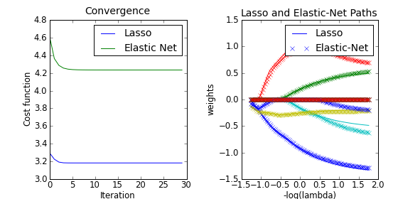

=================
Linear Regression
=================

Linear Regression
=================

In this model, the target value is expected to be a linear combination
of the input variables.

.. math::    y(X, W) = w_0 + w_1 x_1 + ... + w_D x_D

Parameter W is estimated by least squares.

.. what happens if there are duplicate rows ?

Linear regression is done via instances of :class:`LinearRegression`.

.. autoclass:: scikits.learn.linreg.LinearRegression
    :members:

>>> from scikits.learn import linreg
>>> 
>>> clf = Linre

Ridge Regression
================

Coefficient estimates for multiple linear regression models rely on
the independence of the model terms. When terms are correlated and the
columns of the design matrix :math:`X` have an approximate linear
dependence, the matrix :math:`X(X^T X)^{-1}` becomes close to
singular. As a result, the least-squares estimate:

.. math::    \hat{\beta} = (X^T X)^{-1} X^T y

becomes highly sensitive to random errors in the observed response
:math:`y`, producing a large variance. This situation of
*multicollinearity* can arise, for example, when data are collected
without an experimental design.

Ridge regression adresses the problem by estimating regression
coefficients using:

.. math::    \hat{\beta} = (X^T X + \alpha I)^{-1} X^T y

.. autoclass:: scikits.learn.glm.ridge.Ridge
   :members:

Formulations
============

Parameters
==========

Lasso and Elastic-Net
=====================

Examples
========

.. literalinclude:: ../../examples/lasso_enet_coordinate_descent.py

