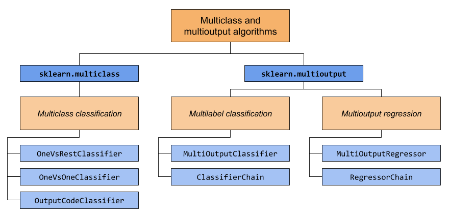

.. _multiclass:

=====================================
Multiclass and multioutput algorithms
=====================================

This section of the user guide covers functionality related to multi-learning
problems, including :term:`multiclass`, :term:`multilabel`, and
:term:`multioutput` classification and regression.

The modules in this section implement :term:`meta-estimators`, which require a
base estimator to be provided in their constructor. Meta-estimators extend the
functionality of the base estimator to support multi-learning problems, which
is accomplished by transforming the multi-learning problem into a set of
simpler problems, then fitting one estimator per problem.

This section covers two modules: :mod:`sklearn.multiclass` and
:mod:`sklearn.multioutput`. The chart below demonstrates the problem types
that each module is responsible for, and the corresponding meta-estimators
that each module provides.

The table below provides a quick reference on the differences between problem
types. More detailed explanations can be found in subsequent sections of this
guide.

+------------------------------+-----------------------+-------------------------+--------------------------------------------------+
|                              | Number of targets     | Target cardinality      | Valid                                            |
|                              |                       |                         | :func:`~sklearn.utils.multiclass.type_of_target` |
+==============================+=======================+=========================+==================================================+
| Multiclass                   |  1                    | >2                      | 'multiclass'                                     |
| classification               |                       |                         |                                                  |
+------------------------------+-----------------------+-------------------------+--------------------------------------------------+
| Multilabel                   | >1                    |  2 (0 or 1)             | 'multilabel-indicator'                           |
| classification               |                       |                         |                                                  |
+------------------------------+-----------------------+-------------------------+--------------------------------------------------+
| Multiclass-multioutput       | >1                    | >2                      | 'multiclass-multioutput'                         |
| classification               |                       |                         |                                                  |
+------------------------------+-----------------------+-------------------------+--------------------------------------------------+
| Multioutput                  | >1                    | Continuous              | 'continuous-multioutput'                         |
| regression                   |                       |                         |                                                  |
+------------------------------+-----------------------+-------------------------+--------------------------------------------------+

Below is a summary of scikit-learn estimators that have multi-learning support
built-in, grouped by strategy. You don't need the meta-estimators provided by
this section if you're using one of these estimators. However, meta-estimators
can provide additional strategies beyond what is built-in:

.. currentmodule:: sklearn

- **Inherently multiclass:**

  - :class:`naive_bayes.BernoulliNB`
  - :class:`tree.DecisionTreeClassifier`
  - :class:`tree.ExtraTreeClassifier`
  - :class:`ensemble.ExtraTreesClassifier`
  - :class:`naive_bayes.GaussianNB`
  - :class:`neighbors.KNeighborsClassifier`
  - :class:`semi_supervised.LabelPropagation`
  - :class:`semi_supervised.LabelSpreading`
  - :class:`discriminant_analysis.LinearDiscriminantAnalysis`
  - :class:`svm.LinearSVC` (setting multi_class="crammer_singer")
  - :class:`linear_model.LogisticRegression` (setting multi_class="multinomial")
  - :class:`linear_model.LogisticRegressionCV` (setting multi_class="multinomial")
  - :class:`neural_network.MLPClassifier`
  - :class:`neighbors.NearestCentroid`
  - :class:`discriminant_analysis.QuadraticDiscriminantAnalysis`
  - :class:`neighbors.RadiusNeighborsClassifier`
  - :class:`ensemble.RandomForestClassifier`
  - :class:`linear_model.RidgeClassifier`
  - :class:`linear_model.RidgeClassifierCV`

- **Multiclass as One-Vs-One:**

  - :class:`svm.NuSVC`
  - :class:`svm.SVC`.
  - :class:`gaussian_process.GaussianProcessClassifier` (setting multi_class = "one_vs_one")

- **Multiclass as One-Vs-The-Rest:**

  - :class:`ensemble.GradientBoostingClassifier`
  - :class:`gaussian_process.GaussianProcessClassifier` (setting multi_class = "one_vs_rest")
  - :class:`svm.LinearSVC` (setting multi_class="ovr")
  - :class:`linear_model.LogisticRegression` (setting multi_class="ovr")
  - :class:`linear_model.LogisticRegressionCV` (setting multi_class="ovr")
  - :class:`linear_model.SGDClassifier`
  - :class:`linear_model.Perceptron`
  - :class:`linear_model.PassiveAggressiveClassifier`

- **Support multilabel:**

  - :class:`tree.DecisionTreeClassifier`
  - :class:`tree.ExtraTreeClassifier`
  - :class:`ensemble.ExtraTreesClassifier`
  - :class:`neighbors.KNeighborsClassifier`
  - :class:`neural_network.MLPClassifier`
  - :class:`neighbors.RadiusNeighborsClassifier`
  - :class:`ensemble.RandomForestClassifier`
  - :class:`linear_model.RidgeClassifier`
  - :class:`linear_model.RidgeClassifierCV`

- **Support multiclass-multioutput:**

  - :class:`tree.DecisionTreeClassifier`
  - :class:`tree.ExtraTreeClassifier`
  - :class:`ensemble.ExtraTreesClassifier`
  - :class:`neighbors.KNeighborsClassifier`
  - :class:`neighbors.RadiusNeighborsClassifier`
  - :class:`ensemble.RandomForestClassifier`

.. _multiclass_classification:

Multiclass classification
=========================

.. warning::
    All classifiers in scikit-learn do multiclass classification
    out-of-the-box. You don't need to use the :mod:`sklearn.multiclass` module
    unless you want to experiment with different multiclass strategies.

**Multiclass classification** is a classification task with more than two
classes. Each sample can only be labeled as one class.

For example, classification using features extracted from a set of images of
fruit, where each image may either be of an orange, an apple, or a pear.
Each image is one sample and is labeled as one of the 3 possible classes.
Multiclass classification makes the assumption that each sample is assigned
to one and only one label - one sample cannot, for example, be both a pear
and an apple.

While all scikit-learn classifiers are capable of multiclass classification,
the meta-estimators offered by :mod:`sklearn.multiclass`
permit changing the way they handle more than two classes
because this may have an effect on classifier performance
(either in terms of generalization error or required computational resources).

Target format
-------------

Valid :term:`multiclass` representations for
:func:`~sklearn.utils.multiclass.type_of_target` (`y`) are:

  - 1d or column vector containing more than two discrete values. An
    example of a vector ``y`` for 4 samples:

      >>> import numpy as np
      >>> y = np.array(['apple', 'pear', 'apple', 'orange'])
      >>> print(y)
      ['apple' 'pear' 'apple' 'orange']

  - Dense or sparse :term:`binary` matrix of shape ``(n_samples, n_classes)``
    with a single sample per row, where each column represents one class. An
    example of both a dense and sparse :term:`binary` matrix ``y`` for 4
    samples, where the columns, in order, are apple, orange, and pear:

      >>> import numpy as np
      >>> from sklearn.preprocessing import LabelBinarizer
      >>> y = np.array(['apple', 'pear', 'apple', 'orange'])
      >>> y_dense = LabelBinarizer().fit_transform(y)
      >>> print(y_dense)
        [[1 0 0]
         [0 0 1]
         [1 0 0]
         [0 1 0]]
      >>> from scipy import sparse
      >>> y_sparse = sparse.csr_matrix(y_dense)
      >>> print(y_sparse)
          (0, 0)	1
          (1, 2)	1
          (2, 0)	1
          (3, 1)	1

For more information about :class:`~sklearn.preprocessing.LabelBinarizer`,
refer to :ref:`preprocessing_targets`.

.. _ovr_classification:

OneVsRestClassifier
-------------------

The **one-vs-rest** strategy, also known as **one-vs-all**, is implemented in
:class:`~sklearn.multiclass.OneVsRestClassifier`.  The strategy consists in
fitting one classifier per class. For each classifier, the class is fitted
against all the other classes. In addition to its computational efficiency
(only `n_classes` classifiers are needed), one advantage of this approach is
its interpretability. Since each class is represented by one and only one
classifier, it is possible to gain knowledge about the class by inspecting its
corresponding classifier. This is the most commonly used strategy and is a fair
default choice.

Below is an example of multiclass learning using OvR::

  >>> from sklearn import datasets
  >>> from sklearn.multiclass import OneVsRestClassifier
  >>> from sklearn.svm import LinearSVC
  >>> X, y = datasets.load_iris(return_X_y=True)
  >>> OneVsRestClassifier(LinearSVC(dual="auto", random_state=0)).fit(X, y).predict(X)
  array([0, 0, 0, 0, 0, 0, 0, 0, 0, 0, 0, 0, 0, 0, 0, 0, 0, 0, 0, 0, 0, 0, 0,
         0, 0, 0, 0, 0, 0, 0, 0, 0, 0, 0, 0, 0, 0, 0, 0, 0, 0, 0, 0, 0, 0, 0,
         0, 0, 0, 0, 1, 1, 1, 1, 1, 1, 1, 1, 1, 1, 1, 1, 1, 1, 1, 1, 1, 1, 1,
         1, 2, 1, 1, 1, 1, 1, 1, 1, 1, 1, 1, 1, 1, 2, 2, 1, 1, 1, 1, 1, 1, 1,
         1, 1, 1, 1, 1, 1, 1, 1, 2, 2, 2, 2, 2, 2, 2, 2, 2, 2, 2, 2, 2, 2, 2,
         2, 2, 2, 2, 2, 2, 2, 2, 2, 2, 2, 2, 2, 2, 1, 2, 2, 2, 1, 2, 2, 2, 2,
         2, 2, 2, 2, 2, 2, 2, 2, 2, 2, 2, 2])

:class:`~sklearn.multiclass.OneVsRestClassifier` also supports multilabel
classification. To use this feature, feed the classifier an indicator matrix,
in which cell [i, j] indicates the presence of label j in sample i.

.. figure:: ../auto_examples/miscellaneous/images/sphx_glr_plot_multilabel_001.png
    :target: ../auto_examples/miscellaneous/plot_multilabel.html
    :align: center
    :scale: 75%

.. topic:: Examples:

    * :ref:`sphx_glr_auto_examples_miscellaneous_plot_multilabel.py`

.. _ovo_classification:

OneVsOneClassifier
------------------

:class:`~sklearn.multiclass.OneVsOneClassifier` constructs one classifier per
pair of classes. At prediction time, the class which received the most votes
is selected. In the event of a tie (among two classes with an equal number of
votes), it selects the class with the highest aggregate classification
confidence by summing over the pair-wise classification confidence levels
computed by the underlying binary classifiers.

Since it requires to fit ``n_classes * (n_classes - 1) / 2`` classifiers,
this method is usually slower than one-vs-the-rest, due to its
O(n_classes^2) complexity. However, this method may be advantageous for
algorithms such as kernel algorithms which don't scale well with
``n_samples``. This is because each individual learning problem only involves
a small subset of the data whereas, with one-vs-the-rest, the complete
dataset is used ``n_classes`` times. The decision function is the result
of a monotonic transformation of the one-versus-one classification.

Below is an example of multiclass learning using OvO::

  >>> from sklearn import datasets
  >>> from sklearn.multiclass import OneVsOneClassifier
  >>> from sklearn.svm import LinearSVC
  >>> X, y = datasets.load_iris(return_X_y=True)
  >>> OneVsOneClassifier(LinearSVC(dual="auto", random_state=0)).fit(X, y).predict(X)
  array([0, 0, 0, 0, 0, 0, 0, 0, 0, 0, 0, 0, 0, 0, 0, 0, 0, 0, 0, 0, 0, 0, 0,
         0, 0, 0, 0, 0, 0, 0, 0, 0, 0, 0, 0, 0, 0, 0, 0, 0, 0, 0, 0, 0, 0, 0,
         0, 0, 0, 0, 1, 1, 1, 1, 1, 1, 1, 1, 1, 1, 1, 1, 1, 1, 1, 1, 1, 1, 1,
         1, 2, 1, 2, 1, 1, 1, 1, 1, 1, 1, 1, 1, 1, 2, 1, 1, 1, 1, 1, 1, 1, 1,
         1, 1, 1, 1, 1, 1, 1, 1, 2, 2, 2, 2, 2, 2, 2, 2, 2, 2, 2, 2, 2, 2, 2,
         2, 2, 2, 2, 2, 2, 2, 2, 2, 2, 2, 2, 2, 2, 2, 2, 2, 2, 2, 2, 2, 2, 2,
         2, 2, 2, 2, 2, 2, 2, 2, 2, 2, 2, 2])

.. topic:: References:

    * "Pattern Recognition and Machine Learning. Springer",
      Christopher M. Bishop, page 183, (First Edition)

.. _ecoc:

OutputCodeClassifier
--------------------

Error-Correcting Output Code-based strategies are fairly different from
one-vs-the-rest and one-vs-one. With these strategies, each class is
represented in a Euclidean space, where each dimension can only be 0 or 1.
Another way to put it is that each class is represented by a binary code (an
array of 0 and 1). The matrix which keeps track of the location/code of each
class is called the code book. The code size is the dimensionality of the
aforementioned space. Intuitively, each class should be represented by a code
as unique as possible and a good code book should be designed to optimize
classification accuracy. In this implementation, we simply use a
randomly-generated code book as advocated in [3]_ although more elaborate
methods may be added in the future.

At fitting time, one binary classifier per bit in the code book is fitted.
At prediction time, the classifiers are used to project new points in the
class space and the class closest to the points is chosen.

In :class:`~sklearn.multiclass.OutputCodeClassifier`, the ``code_size``
attribute allows the user to control the number of classifiers which will be
used. It is a percentage of the total number of classes.

A number between 0 and 1 will require fewer classifiers than
one-vs-the-rest. In theory, ``log2(n_classes) / n_classes`` is sufficient to
represent each class unambiguously. However, in practice, it may not lead to
good accuracy since ``log2(n_classes)`` is much smaller than `n_classes`.

A number greater than 1 will require more classifiers than
one-vs-the-rest. In this case, some classifiers will in theory correct for
the mistakes made by other classifiers, hence the name "error-correcting".
In practice, however, this may not happen as classifier mistakes will
typically be correlated. The error-correcting output codes have a similar
effect to bagging.

Below is an example of multiclass learning using Output-Codes::

  >>> from sklearn import datasets
  >>> from sklearn.multiclass import OutputCodeClassifier
  >>> from sklearn.svm import LinearSVC
  >>> X, y = datasets.load_iris(return_X_y=True)
  >>> clf = OutputCodeClassifier(LinearSVC(dual="auto", random_state=0),
  ...                            code_size=2, random_state=0)
  >>> clf.fit(X, y).predict(X)
  array([0, 0, 0, 0, 0, 0, 0, 0, 0, 0, 0, 0, 0, 0, 0, 0, 0, 0, 0, 0, 0, 0, 0,
         0, 0, 0, 0, 0, 0, 0, 0, 0, 0, 0, 0, 0, 0, 0, 0, 0, 0, 0, 0, 0, 0, 0,
         0, 0, 0, 0, 1, 1, 1, 1, 1, 1, 2, 1, 1, 1, 1, 1, 1, 1, 1, 1, 2, 1, 1,
         1, 2, 1, 1, 1, 1, 1, 1, 2, 1, 1, 1, 1, 1, 2, 2, 2, 1, 1, 1, 1, 1, 1,
         1, 1, 1, 1, 1, 1, 1, 1, 2, 2, 2, 2, 2, 2, 2, 2, 2, 2, 2, 2, 2, 2, 2,
         2, 2, 2, 2, 1, 2, 2, 2, 2, 2, 2, 2, 2, 2, 1, 2, 2, 2, 1, 1, 2, 2, 2,
         2, 2, 2, 2, 2, 2, 2, 2, 2, 2, 2, 2])

.. topic:: References:

    * "Solving multiclass learning problems via error-correcting output codes",
      Dietterich T., Bakiri G.,
      Journal of Artificial Intelligence Research 2,
      1995.

    .. [3] "The error coding method and PICTs",
        James G., Hastie T.,
        Journal of Computational and Graphical statistics 7,
        1998.

    * "The Elements of Statistical Learning",
      Hastie T., Tibshirani R., Friedman J., page 606 (second-edition)
      2008.

.. _multilabel_classification:

Multilabel classification
=========================

**Multilabel classification** (closely related to **multioutput**
**classification**) is a classification task labeling each sample with ``m``
labels from ``n_classes`` possible classes, where ``m`` can be 0 to
``n_classes`` inclusive. This can be thought of as predicting properties of a
sample that are not mutually exclusive. Formally, a binary output is assigned
to each class, for every sample. Positive classes are indicated with 1 and
negative classes with 0 or -1. It is thus comparable to running ``n_classes``
binary classification tasks, for example with
:class:`~sklearn.multioutput.MultiOutputClassifier`. This approach treats
each label independently whereas multilabel classifiers *may* treat the
multiple classes simultaneously, accounting for correlated behavior among
them.

For example, prediction of the topics relevant to a text document or video.
The document or video may be about one of 'religion', 'politics', 'finance'
or 'education', several of the topic classes or all of the topic classes.

Target format
-------------

A valid representation of :term:`multilabel` `y` is an either dense or sparse
:term:`binary` matrix of shape ``(n_samples, n_classes)``. Each column
represents a class. The ``1``'s in each row denote the positive classes a
sample has been labeled with. An example of a dense matrix ``y`` for 3
samples:

  >>> y = np.array([[1, 0, 0, 1], [0, 0, 1, 1], [0, 0, 0, 0]])
  >>> print(y)
  [[1 0 0 1]
   [0 0 1 1]
   [0 0 0 0]]

Dense binary matrices can also be created using
:class:`~sklearn.preprocessing.MultiLabelBinarizer`. For more information,
refer to :ref:`preprocessing_targets`.

An example of the same ``y`` in sparse matrix form:

  >>> y_sparse = sparse.csr_matrix(y)
  >>> print(y_sparse)
    (0, 0)	1
    (0, 3)	1
    (1, 2)	1
    (1, 3)	1

.. _multioutputclassfier:

MultiOutputClassifier
---------------------

Multilabel classification support can be added to any classifier with
:class:`~sklearn.multioutput.MultiOutputClassifier`. This strategy consists of
fitting one classifier per target.  This allows multiple target variable
classifications. The purpose of this class is to extend estimators
to be able to estimate a series of target functions (f1,f2,f3...,fn)
that are trained on a single X predictor matrix to predict a series
of responses (y1,y2,y3...,yn).

You can find a usage example for
:class:`~sklearn.multioutput.MultiOutputClassifier`
as part of the section on :ref:`multiclass_multioutput_classification`
since it is a generalization of multilabel classification to
multiclass outputs instead of binary outputs.

.. _classifierchain:

ClassifierChain
---------------

Classifier chains (see :class:`~sklearn.multioutput.ClassifierChain`) are a way
of combining a number of binary classifiers into a single multi-label model
that is capable of exploiting correlations among targets.

For a multi-label classification problem with N classes, N binary
classifiers are assigned an integer between 0 and N-1. These integers
define the order of models in the chain. Each classifier is then fit on the
available training data plus the true labels of the classes whose
models were assigned a lower number.

When predicting, the true labels will not be available. Instead the
predictions of each model are passed on to the subsequent models in the
chain to be used as features.

Clearly the order of the chain is important. The first model in the chain
has no information about the other labels while the last model in the chain
has features indicating the presence of all of the other labels. In general
one does not know the optimal ordering of the models in the chain so
typically many randomly ordered chains are fit and their predictions are
averaged together.

.. topic:: References:

    Jesse Read, Bernhard Pfahringer, Geoff Holmes, Eibe Frank,
        "Classifier Chains for Multi-label Classification", 2009.

.. _multiclass_multioutput_classification:

Multiclass-multioutput classification
=====================================

**Multiclass-multioutput classification**
(also known as **multitask classification**) is a
classification task which labels each sample with a set of **non-binary**
properties. Both the number of properties and the number of
classes per property is greater than 2. A single estimator thus
handles several joint classification tasks. This is both a generalization of
the multi\ *label* classification task, which only considers binary
attributes, as well as a generalization of the multi\ *class* classification
task, where only one property is considered.

For example, classification of the properties "type of fruit" and "colour"
for a set of images of fruit. The property "type of fruit" has the possible
classes: "apple", "pear" and "orange". The property "colour" has the
possible classes: "green", "red", "yellow" and "orange". Each sample is an
image of a fruit, a label is output for both properties and each label is
one of the possible classes of the corresponding property.

Note that all classifiers handling multiclass-multioutput (also known as
multitask classification) tasks, support the multilabel classification task
as a special case. Multitask classification is similar to the multioutput
classification task with different model formulations. For more information,
see the relevant estimator documentation.

Below is an example of multiclass-multioutput classification:

    >>> from sklearn.datasets import make_classification
    >>> from sklearn.multioutput import MultiOutputClassifier
    >>> from sklearn.ensemble import RandomForestClassifier
    >>> from sklearn.utils import shuffle
    >>> import numpy as np
    >>> X, y1 = make_classification(n_samples=10, n_features=100,
    ...                             n_informative=30, n_classes=3,
    ...                             random_state=1)
    >>> y2 = shuffle(y1, random_state=1)
    >>> y3 = shuffle(y1, random_state=2)
    >>> Y = np.vstack((y1, y2, y3)).T
    >>> n_samples, n_features = X.shape # 10,100
    >>> n_outputs = Y.shape[1] # 3
    >>> n_classes = 3
    >>> forest = RandomForestClassifier(random_state=1)
    >>> multi_target_forest = MultiOutputClassifier(forest, n_jobs=2)
    >>> multi_target_forest.fit(X, Y).predict(X)
    array([[2, 2, 0],
           [1, 2, 1],
           [2, 1, 0],
           [0, 0, 2],
           [0, 2, 1],
           [0, 0, 2],
           [1, 1, 0],
           [1, 1, 1],
           [0, 0, 2],
           [2, 0, 0]])

.. warning::
    At present, no metric in :mod:`sklearn.metrics`
    supports the multiclass-multioutput classification task.

Target format
-------------

A valid representation of :term:`multioutput` `y` is a dense matrix of shape
``(n_samples, n_classes)`` of class labels. A column wise concatenation of 1d
:term:`multiclass` variables. An example of ``y`` for 3 samples:

  >>> y = np.array([['apple', 'green'], ['orange', 'orange'], ['pear', 'green']])
  >>> print(y)
  [['apple' 'green']
   ['orange' 'orange']
   ['pear' 'green']]

.. _multioutput_regression:

Multioutput regression
======================

**Multioutput regression** predicts multiple numerical properties for each
sample. Each property is a numerical variable and the number of properties
to be predicted for each sample is greater than or equal to 2. Some estimators
that support multioutput regression are faster than just running ``n_output``
estimators.

For example, prediction of both wind speed and wind direction, in degrees,
using data obtained at a certain location. Each sample would be data
obtained at one location and both wind speed and direction would be
output for each sample.

Target format
-------------

A valid representation of :term:`multioutput` `y` is a dense matrix of shape
``(n_samples, n_output)`` of floats. A column wise concatenation of
:term:`continuous` variables. An example of ``y`` for 3 samples:

  >>> y = np.array([[31.4, 94], [40.5, 109], [25.0, 30]])
  >>> print(y)
  [[ 31.4  94. ]
   [ 40.5 109. ]
   [ 25.   30. ]]

.. _multioutputregressor:

MultiOutputRegressor
--------------------

Multioutput regression support can be added to any regressor with
:class:`~sklearn.multioutput.MultiOutputRegressor`.  This strategy consists of
fitting one regressor per target. Since each target is represented by exactly
one regressor it is possible to gain knowledge about the target by
inspecting its corresponding regressor. As
:class:`~sklearn.multioutput.MultiOutputRegressor` fits one regressor per
target it can not take advantage of correlations between targets.

Below is an example of multioutput regression:

  >>> from sklearn.datasets import make_regression
  >>> from sklearn.multioutput import MultiOutputRegressor
  >>> from sklearn.ensemble import GradientBoostingRegressor
  >>> X, y = make_regression(n_samples=10, n_targets=3, random_state=1)
  >>> MultiOutputRegressor(GradientBoostingRegressor(random_state=0)).fit(X, y).predict(X)
  array([[-154.75474165, -147.03498585,  -50.03812219],
         [   7.12165031,    5.12914884,  -81.46081961],
         [-187.8948621 , -100.44373091,   13.88978285],
         [-141.62745778,   95.02891072, -191.48204257],
         [  97.03260883,  165.34867495,  139.52003279],
         [ 123.92529176,   21.25719016,   -7.84253   ],
         [-122.25193977,  -85.16443186, -107.12274212],
         [ -30.170388  ,  -94.80956739,   12.16979946],
         [ 140.72667194,  176.50941682,  -17.50447799],
         [ 149.37967282,  -81.15699552,   -5.72850319]])

.. _regressorchain:

RegressorChain
--------------

Regressor chains (see :class:`~sklearn.multioutput.RegressorChain`) is
analogous to :class:`~sklearn.multioutput.ClassifierChain` as a way of
combining a number of regressions into a single multi-target model that is
capable of exploiting correlations among targets.
