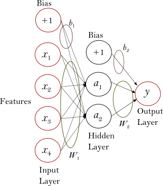

.. _neural_networks_supervised:

==================================
Neural network models (supervised)
==================================

.. currentmodule:: sklearn.neural_network

.. warning::

    This implementation is not intended for large-scale applications. In particular,
    scikit-learn offers no GPU support. For much faster, GPU-based implementations,
    as well as frameworks offering much more flexibility to build deep learning
    architectures, see  :ref:`related_projects`.

.. _multilayer_perceptron:

Multi-layer Perceptron
======================

**Multi-layer Perceptron (MLP)** is a supervised learning algorithm that learns
a function :math:`f: R^m \rightarrow R^o` by training on a dataset,
where :math:`m` is the number of dimensions for input and :math:`o` is the
number of dimensions for output. Given a set of features :math:`X = \{x_1, x_2, ..., x_m\}`
and a target :math:`y`, it can learn a non-linear function approximator for either
classification or regression. It is different from logistic regression, in that
between the input and the output layer, there can be one or more non-linear
layers, called hidden layers. Figure 1 shows a one hidden layer MLP with scalar
output.

   **Figure 1 : One hidden layer MLP.**

The leftmost layer, known as the input layer, consists of a set of neurons
:math:`\{x_i | x_1, x_2, ..., x_m\}` representing the input features. Each
neuron in the hidden layer transforms the values from the previous layer with
a weighted linear summation :math:`w_1x_1 + w_2x_2 + ... + w_mx_m`, followed
by a non-linear activation function :math:`g(\cdot):R \rightarrow R` - like
the hyperbolic tan function. The output layer receives the values from the
last hidden layer and transforms them into output values.

The module contains the public attributes ``coefs_`` and ``intercepts_``.
``coefs_`` is a list of weight matrices, where weight matrix at index
:math:`i` represents the weights between layer :math:`i` and layer
:math:`i+1`. ``intercepts_`` is a list of bias vectors, where the vector
at index :math:`i` represents the bias values added to layer :math:`i+1`.

.. dropdown:: Advantages and disadvantages of Multi-layer Perceptron

  The advantages of Multi-layer Perceptron are:

  + Capability to learn non-linear models.

  + Capability to learn models in real-time (on-line learning)
    using ``partial_fit``.

  The disadvantages of Multi-layer Perceptron (MLP) include:

  + MLP with hidden layers has a non-convex loss function where there exists
    more than one local minimum. Therefore, different random weight
    initializations can lead to different validation accuracy.

  + MLP requires tuning a number of hyperparameters such as the number of
    hidden neurons, layers, and iterations.

  + MLP is sensitive to feature scaling.

  Please see :ref:`Tips on Practical Use <mlp_tips>` section that addresses
  some of these disadvantages.

Classification
==============

Class :class:`MLPClassifier` implements a multi-layer perceptron (MLP) algorithm
that trains using `Backpropagation <http://ufldl.stanford.edu/tutorial/supervised/MultiLayerNeuralNetworks/#backpropagation_algorithm>`_.

MLP trains on two arrays: array X of size (n_samples, n_features), which holds
the training samples represented as floating point feature vectors; and array
y of size (n_samples,), which holds the target values (class labels) for the
training samples::

    >>> from sklearn.neural_network import MLPClassifier
    >>> X = [[0., 0.], [1., 1.]]
    >>> y = [0, 1]
    >>> clf = MLPClassifier(solver='lbfgs', alpha=1e-5,
    ...                     hidden_layer_sizes=(5, 2), random_state=1)
    ...
    >>> clf.fit(X, y)
    MLPClassifier(alpha=1e-05, hidden_layer_sizes=(5, 2), random_state=1,
                  solver='lbfgs')

After fitting (training), the model can predict labels for new samples::

    >>> clf.predict([[2., 2.], [-1., -2.]])
    array([1, 0])

MLP can fit a non-linear model to the training data. ``clf.coefs_``
contains the weight matrices that constitute the model parameters::

    >>> [coef.shape for coef in clf.coefs_]
    [(2, 5), (5, 2), (2, 1)]

Currently, :class:`MLPClassifier` supports only the
Cross-Entropy loss function, which allows probability estimates by running the
``predict_proba`` method.

MLP trains using Backpropagation. More precisely, it trains using some form of
gradient descent and the gradients are calculated using Backpropagation. For
classification, it minimizes the Cross-Entropy loss function, giving a vector
of probability estimates :math:`P(y|x)` per sample :math:`x`::

    >>> clf.predict_proba([[2., 2.], [1., 2.]])
    array([[1.967e-04, 9.998e-01],
           [1.967e-04, 9.998e-01]])

:class:`MLPClassifier` supports multi-class classification by
applying `Softmax <https://en.wikipedia.org/wiki/Softmax_activation_function>`_
as the output function.

Further, the model supports :ref:`multi-label classification <multiclass>`
in which a sample can belong to more than one class. For each class, the raw
output passes through the logistic function. Values larger or equal to `0.5`
are rounded to `1`, otherwise to `0`. For a predicted output of a sample, the
indices where the value is `1` represent the assigned classes of that sample::

    >>> X = [[0., 0.], [1., 1.]]
    >>> y = [[0, 1], [1, 1]]
    >>> clf = MLPClassifier(solver='lbfgs', alpha=1e-5,
    ...                     hidden_layer_sizes=(15,), random_state=1)
    ...
    >>> clf.fit(X, y)
    MLPClassifier(alpha=1e-05, hidden_layer_sizes=(15,), random_state=1,
                  solver='lbfgs')
    >>> clf.predict([[1., 2.]])
    array([[1, 1]])
    >>> clf.predict([[0., 0.]])
    array([[0, 1]])

See the examples below and the docstring of
:meth:`MLPClassifier.fit` for further information.

.. rubric:: Examples

* :ref:`sphx_glr_auto_examples_neural_networks_plot_mlp_training_curves.py`
* See :ref:`sphx_glr_auto_examples_neural_networks_plot_mnist_filters.py` for
  visualized representation of trained weights.

Regression
==========

Class :class:`MLPRegressor` implements a multi-layer perceptron (MLP) that
trains using backpropagation with no activation function in the output layer,
which can also be seen as using the identity function as activation function.
Therefore, it uses the square error as the loss function, and the output is a
set of continuous values.

:class:`MLPRegressor` also supports multi-output regression, in
which a sample can have more than one target.

Regularization
==============

Both :class:`MLPRegressor` and :class:`MLPClassifier` use parameter ``alpha``
for regularization (L2 regularization) term which helps in avoiding overfitting
by penalizing weights with large magnitudes. Following plot displays varying
decision function with value of alpha.

.. figure:: ../auto_examples/neural_networks/images/sphx_glr_plot_mlp_alpha_001.png
   :target: ../auto_examples/neural_networks/plot_mlp_alpha.html
   :align: center
   :scale: 75

See the examples below for further information.

.. rubric:: Examples

* :ref:`sphx_glr_auto_examples_neural_networks_plot_mlp_alpha.py`

Algorithms
==========

MLP trains using `Stochastic Gradient Descent
<https://en.wikipedia.org/wiki/Stochastic_gradient_descent>`_,
:arxiv:`Adam <1412.6980>`, or
`L-BFGS <https://en.wikipedia.org/wiki/Limited-memory_BFGS>`__.
Stochastic Gradient Descent (SGD) updates parameters using the gradient of the
loss function with respect to a parameter that needs adaptation, i.e.

.. math::

    w \leftarrow w - \eta (\alpha \frac{\partial R(w)}{\partial w}
    + \frac{\partial Loss}{\partial w})

where :math:`\eta` is the learning rate which controls the step-size in
the parameter space search.  :math:`Loss` is the loss function used
for the network.

More details can be found in the documentation of
`SGD <https://scikit-learn.org/stable/modules/sgd.html>`_

Adam is similar to SGD in a sense that it is a stochastic optimizer, but it can
automatically adjust the amount to update parameters based on adaptive estimates
of lower-order moments.

With SGD or Adam, training supports online and mini-batch learning.

L-BFGS is a solver that approximates the Hessian matrix which represents the
second-order partial derivative of a function. Further it approximates the
inverse of the Hessian matrix to perform parameter updates. The implementation
uses the Scipy version of `L-BFGS
<https://docs.scipy.org/doc/scipy/reference/generated/scipy.optimize.fmin_l_bfgs_b.html>`_.

If the selected solver is 'L-BFGS', training does not support online nor
mini-batch learning.

Complexity
==========

Suppose there are :math:`n` training samples, :math:`m` features, :math:`k`
hidden layers, each containing :math:`h` neurons - for simplicity, and :math:`o`
output neurons.  The time complexity of backpropagation is
:math:`O(i \cdot n \cdot (m \cdot h + (k - 1) \cdot h \cdot h + h \cdot o))`, where :math:`i` is the number
of iterations. Since backpropagation has a high time complexity, it is advisable
to start with smaller number of hidden neurons and few hidden layers for
training.

.. dropdown:: Mathematical formulation

  Given a set of training examples :math:`\{(x_1, y_1), (x_2, y_2), \ldots, (x_n, y_n)\}`
  where :math:`x_i \in \mathbf{R}^n` and :math:`y_i \in \{0, 1\}`, a one hidden
  layer one hidden neuron MLP learns the function :math:`f(x) = W_2 g(W_1^T x + b_1) + b_2`
  where :math:`W_1 \in \mathbf{R}^m` and :math:`W_2, b_1, b_2 \in \mathbf{R}` are
  model parameters. :math:`W_1, W_2` represent the weights of the input layer and
  hidden layer, respectively; and :math:`b_1, b_2` represent the bias added to
  the hidden layer and the output layer, respectively.
  :math:`g(\cdot) : R \rightarrow R` is the activation function, set by default as
  the hyperbolic tan. It is given as,

  .. math::
        g(z)= \frac{e^z-e^{-z}}{e^z+e^{-z}}

  For binary classification, :math:`f(x)` passes through the logistic function
  :math:`g(z)=1/(1+e^{-z})` to obtain output values between zero and one. A
  threshold, set to 0.5, would assign samples of outputs larger or equal 0.5
  to the positive class, and the rest to the negative class.

  If there are more than two classes, :math:`f(x)` itself would be a vector of
  size (n_classes,). Instead of passing through logistic function, it passes
  through the softmax function, which is written as,

  .. math::
        \text{softmax}(z)_i = \frac{\exp(z_i)}{\sum_{l=1}^k\exp(z_l)}

  where :math:`z_i` represents the :math:`i` th element of the input to softmax,
  which corresponds to class :math:`i`, and :math:`K` is the number of classes.
  The result is a vector containing the probabilities that sample :math:`x`
  belongs to each class. The output is the class with the highest probability.

  In regression, the output remains as :math:`f(x)`; therefore, output activation
  function is just the identity function.

  MLP uses different loss functions depending on the problem type. The loss
  function for classification is Average Cross-Entropy, which in binary case is
  given as,

  .. math::

      Loss(\hat{y},y,W) = -\dfrac{1}{n}\sum_{i=0}^n(y_i \ln {\hat{y_i}} + (1-y_i) \ln{(1-\hat{y_i})}) + \dfrac{\alpha}{2n} ||W||_2^2

  where :math:`\alpha ||W||_2^2` is an L2-regularization term (aka penalty)
  that penalizes complex models; and :math:`\alpha > 0` is a non-negative
  hyperparameter that controls the magnitude of the penalty.

  For regression, MLP uses the Mean Square Error loss function; written as,

  .. math::

      Loss(\hat{y},y,W) = \frac{1}{2n}\sum_{i=0}^n||\hat{y}_i - y_i ||_2^2 + \frac{\alpha}{2n} ||W||_2^2

  Starting from initial random weights, multi-layer perceptron (MLP) minimizes
  the loss function by repeatedly updating these weights. After computing the
  loss, a backward pass propagates it from the output layer to the previous
  layers, providing each weight parameter with an update value meant to decrease
  the loss.

  In gradient descent, the gradient :math:`\nabla Loss_{W}` of the loss with respect
  to the weights is computed and deducted from :math:`W`.
  More formally, this is expressed as,

  .. math::
      W^{i+1} = W^i - \epsilon \nabla {Loss}_{W}^{i}

  where :math:`i` is the iteration step, and :math:`\epsilon` is the learning rate
  with a value larger than 0.

  The algorithm stops when it reaches a preset maximum number of iterations; or
  when the improvement in loss is below a certain, small number.

.. _mlp_tips:

Tips on Practical Use
=====================

* Multi-layer Perceptron is sensitive to feature scaling, so it
  is highly recommended to scale your data. For example, scale each
  attribute on the input vector X to [0, 1] or [-1, +1], or standardize
  it to have mean 0 and variance 1. Note that you must apply the *same*
  scaling to the test set for meaningful results.
  You can use :class:`~sklearn.preprocessing.StandardScaler` for standardization.

    >>> from sklearn.preprocessing import StandardScaler  # doctest: +SKIP
    >>> scaler = StandardScaler()  # doctest: +SKIP
    >>> # Don't cheat - fit only on training data
    >>> scaler.fit(X_train)  # doctest: +SKIP
    >>> X_train = scaler.transform(X_train)  # doctest: +SKIP
    >>> # apply same transformation to test data
    >>> X_test = scaler.transform(X_test)  # doctest: +SKIP

  An alternative and recommended approach is to use
  :class:`~sklearn.preprocessing.StandardScaler` in a
  :class:`~sklearn.pipeline.Pipeline`

* Finding a reasonable regularization parameter :math:`\alpha` is best done
  using :class:`~sklearn.model_selection.GridSearchCV`, usually in the range
  ``10.0 ** -np.arange(1, 7)``.

* Empirically, we observed that `L-BFGS` converges faster and
  with better solutions on small datasets. For relatively large
  datasets, however, `Adam` is very robust. It usually converges
  quickly and gives pretty good performance. `SGD` with momentum or
  nesterov's momentum, on the other hand, can perform better than
  those two algorithms if learning rate is correctly tuned.

More control with warm_start
============================
If you want more control over stopping criteria or learning rate in SGD,
or want to do additional monitoring, using ``warm_start=True`` and
``max_iter=1`` and iterating yourself can be helpful::

    >>> X = [[0., 0.], [1., 1.]]
    >>> y = [0, 1]
    >>> clf = MLPClassifier(hidden_layer_sizes=(15,), random_state=1, max_iter=1, warm_start=True)
    >>> for i in range(10):
    ...     clf.fit(X, y)
    ...     # additional monitoring / inspection
    MLPClassifier(...

.. dropdown:: References

  * `"Learning representations by back-propagating errors."
    <https://www.iro.umontreal.ca/~pift6266/A06/refs/backprop_old.pdf>`_
    Rumelhart, David E., Geoffrey E. Hinton, and Ronald J. Williams.

  * `"Stochastic Gradient Descent" <https://leon.bottou.org/projects/sgd>`_ L. Bottou - Website, 2010.

  * `"Backpropagation" <http://ufldl.stanford.edu/wiki/index.php/Backpropagation_Algorithm>`_
    Andrew Ng, Jiquan Ngiam, Chuan Yu Foo, Yifan Mai, Caroline Suen - Website, 2011.

  * `"Efficient BackProp" <http://yann.lecun.com/exdb/publis/pdf/lecun-98b.pdf>`_
    Y. LeCun, L. Bottou, G. Orr, K. Müller - In Neural Networks: Tricks of the Trade 1998.

  * :arxiv:`"Adam: A method for stochastic optimization." <1412.6980>`
    Kingma, Diederik, and Jimmy Ba (2014)
