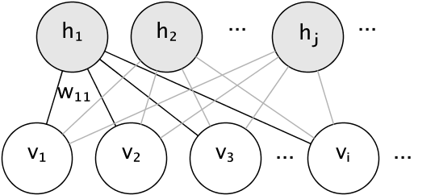

.. _neural_networks_unsupervised:

====================================
Neural network models (unsupervised)
====================================

.. currentmodule:: sklearn.neural_network

.. _rbm:

Restricted Boltzmann machines
=============================

Restricted Boltzmann machines (RBM) are unsupervised nonlinear feature learners
based on a probabilistic model. The features extracted by an RBM or a hierarchy
of RBMs often give good results when fed into a linear classifier such as a
linear SVM or a perceptron.

The model makes assumptions regarding the distribution of inputs. At the moment,
scikit-learn only provides :class:`BernoulliRBM`, which assumes the inputs are
either binary values or values between 0 and 1, each encoding the probability
that the specific feature would be turned on.

The RBM tries to maximize the likelihood of the data using a particular
graphical model. The parameter learning algorithm used (:ref:`Stochastic
Maximum Likelihood <sml>`) prevents the representations from straying far
from the input data, which makes them capture interesting regularities, but
makes the model less useful for small datasets, and usually not useful for
density estimation.

The method gained popularity for initializing deep neural networks with the
weights of independent RBMs. This method is known as unsupervised pre-training.

.. figure:: ../auto_examples/neural_networks/images/sphx_glr_plot_rbm_logistic_classification_001.png
   :target: ../auto_examples/neural_networks/plot_rbm_logistic_classification.html
   :align: center
   :scale: 100%

.. topic:: Examples:

   * :ref:`sphx_glr_auto_examples_neural_networks_plot_rbm_logistic_classification.py`

Graphical model and parametrization
-----------------------------------

The graphical model of an RBM is a fully-connected bipartite graph.

The nodes are random variables whose states depend on the state of the other
nodes they are connected to. The model is therefore parameterized by the
weights of the connections, as well as one intercept (bias) term for each
visible and hidden unit, omitted from the image for simplicity.

The energy function measures the quality of a joint assignment:

.. math:: 

   E(\mathbf{v}, \mathbf{h}) = -\sum_i \sum_j w_{ij}v_ih_j - \sum_i b_iv_i
     - \sum_j c_jh_j

In the formula above, :math:`\mathbf{b}` and :math:`\mathbf{c}` are the
intercept vectors for the visible and hidden layers, respectively. The
joint probability of the model is defined in terms of the energy:

.. math::

   P(\mathbf{v}, \mathbf{h}) = \frac{e^{-E(\mathbf{v}, \mathbf{h})}}{Z}

The word *restricted* refers to the bipartite structure of the model, which
prohibits direct interaction between hidden units, or between visible units.
This means that the following conditional independencies are assumed:

.. math::

   h_i \bot h_j | \mathbf{v} \\
   v_i \bot v_j | \mathbf{h}

The bipartite structure allows for the use of efficient block Gibbs sampling for
inference.

Bernoulli Restricted Boltzmann machines
---------------------------------------

In the :class:`BernoulliRBM`, all units are binary stochastic units. This
means that the input data should either be binary, or real-valued between 0 and
1 signifying the probability that the visible unit would turn on or off. This
is a good model for character recognition, where the interest is on which
pixels are active and which aren't. For images of natural scenes it no longer
fits because of background, depth and the tendency of neighbouring pixels to
take the same values.

The conditional probability distribution of each unit is given by the
logistic sigmoid activation function of the input it receives:

.. math::

   P(v_i=1|\mathbf{h}) = \sigma(\sum_j w_{ij}h_j + b_i) \\
   P(h_i=1|\mathbf{v}) = \sigma(\sum_i w_{ij}v_i + c_j)

where :math:`\sigma` is the logistic sigmoid function:

.. math::

   \sigma(x) = \frac{1}{1 + e^{-x}}

.. _sml:

Stochastic Maximum Likelihood learning
--------------------------------------

The training algorithm implemented in :class:`BernoulliRBM` is known as
Stochastic Maximum Likelihood (SML) or Persistent Contrastive Divergence
(PCD). Optimizing maximum likelihood directly is infeasible because of
the form of the data likelihood:

.. math::

   \log P(v) = \log \sum_h e^{-E(v, h)} - \log \sum_{x, y} e^{-E(x, y)}

For simplicity the equation above is written for a single training example.
The gradient with respect to the weights is formed of two terms corresponding to
the ones above. They are usually known as the positive gradient and the negative
gradient, because of their respective signs.  In this implementation, the
gradients are estimated over mini-batches of samples.

In maximizing the log-likelihood, the positive gradient makes the model prefer
hidden states that are compatible with the observed training data. Because of
the bipartite structure of RBMs, it can be computed efficiently. The
negative gradient, however, is intractable. Its goal is to lower the energy of
joint states that the model prefers, therefore making it stay true to the data.
It can be approximated by Markov chain Monte Carlo using block Gibbs sampling by
iteratively sampling each of :math:`v` and :math:`h` given the other, until the
chain mixes. Samples generated in this way are sometimes referred as fantasy
particles. This is inefficient and it is difficult to determine whether the
Markov chain mixes.

The Contrastive Divergence method suggests to stop the chain after a small
number of iterations, :math:`k`, usually even 1. This method is fast and has
low variance, but the samples are far from the model distribution.

Persistent Contrastive Divergence addresses this. Instead of starting a new
chain each time the gradient is needed, and performing only one Gibbs sampling
step, in PCD we keep a number of chains (fantasy particles) that are updated
:math:`k` Gibbs steps after each weight update. This allows the particles to
explore the space more thoroughly.

.. topic:: References:

    * `"A fast learning algorithm for deep belief nets"
      <http://www.cs.toronto.edu/~hinton/absps/fastnc.pdf>`_
      G. Hinton, S. Osindero, Y.-W. Teh, 2006

    * `"Training Restricted Boltzmann Machines using Approximations to
      the Likelihood Gradient"
      <http://www.cs.toronto.edu/~tijmen/pcd/pcd.pdf>`_
      T. Tieleman, 2008
