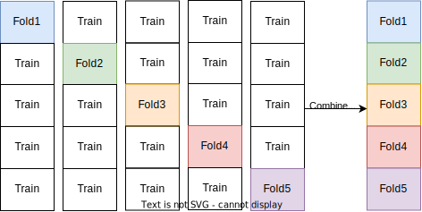

.. _preprocessing:

==================
Preprocessing data
==================

.. currentmodule:: sklearn.preprocessing

The ``sklearn.preprocessing`` package provides several common
utility functions and transformer classes to change raw feature vectors
into a representation that is more suitable for the downstream estimators.

In general, many learning algorithms such as linear models benefit from standardization of the data set
(see :ref:`sphx_glr_auto_examples_preprocessing_plot_scaling_importance.py`).
If some outliers are present in the set, robust scalers or other transformers can
be more appropriate. The behaviors of the different scalers, transformers, and
normalizers on a dataset containing marginal outliers is highlighted in
:ref:`sphx_glr_auto_examples_preprocessing_plot_all_scaling.py`.

.. _preprocessing_scaler:

Standardization, or mean removal and variance scaling
=====================================================

**Standardization** of datasets is a **common requirement for many
machine learning estimators** implemented in scikit-learn; they might behave
badly if the individual features do not more or less look like standard
normally distributed data: Gaussian with **zero mean and unit variance**.

In practice we often ignore the shape of the distribution and just
transform the data to center it by removing the mean value of each
feature, then scale it by dividing non-constant features by their
standard deviation.

For instance, many elements used in the objective function of
a learning algorithm (such as the RBF kernel of Support Vector
Machines or the l1 and l2 regularizers of linear models) may assume that
all features are centered around zero or have variance in the same
order. If a feature has a variance that is orders of magnitude larger
than others, it might dominate the objective function and make the
estimator unable to learn from other features correctly as expected.

The :mod:`~sklearn.preprocessing` module provides the
:class:`StandardScaler` utility class, which is a quick and
easy way to perform the following operation on an array-like
dataset::

  >>> from sklearn import preprocessing
  >>> import numpy as np
  >>> X_train = np.array([[ 1., -1.,  2.],
  ...                     [ 2.,  0.,  0.],
  ...                     [ 0.,  1., -1.]])
  >>> scaler = preprocessing.StandardScaler().fit(X_train)
  >>> scaler
  StandardScaler()

  >>> scaler.mean_
  array([1. ..., 0. ..., 0.33...])

  >>> scaler.scale_
  array([0.81..., 0.81..., 1.24...])

  >>> X_scaled = scaler.transform(X_train)
  >>> X_scaled
  array([[ 0.  ..., -1.22...,  1.33...],
         [ 1.22...,  0.  ..., -0.26...],
         [-1.22...,  1.22..., -1.06...]])

..
        >>> import numpy as np
        >>> print_options = np.get_printoptions()
        >>> np.set_printoptions(suppress=True)

Scaled data has zero mean and unit variance::

  >>> X_scaled.mean(axis=0)
  array([0., 0., 0.])

  >>> X_scaled.std(axis=0)
  array([1., 1., 1.])

..    >>> print_options = np.set_printoptions(print_options)

This class implements the ``Transformer`` API to compute the mean and
standard deviation on a training set so as to be able to later re-apply the
same transformation on the testing set. This class is hence suitable for
use in the early steps of a :class:`~sklearn.pipeline.Pipeline`::

  >>> from sklearn.datasets import make_classification
  >>> from sklearn.linear_model import LogisticRegression
  >>> from sklearn.model_selection import train_test_split
  >>> from sklearn.pipeline import make_pipeline
  >>> from sklearn.preprocessing import StandardScaler

  >>> X, y = make_classification(random_state=42)
  >>> X_train, X_test, y_train, y_test = train_test_split(X, y, random_state=42)
  >>> pipe = make_pipeline(StandardScaler(), LogisticRegression())
  >>> pipe.fit(X_train, y_train)  # apply scaling on training data
  Pipeline(steps=[('standardscaler', StandardScaler()),
                  ('logisticregression', LogisticRegression())])

  >>> pipe.score(X_test, y_test)  # apply scaling on testing data, without leaking training data.
  0.96

It is possible to disable either centering or scaling by either
passing ``with_mean=False`` or ``with_std=False`` to the constructor
of :class:`StandardScaler`.

Scaling features to a range
---------------------------

An alternative standardization is scaling features to
lie between a given minimum and maximum value, often between zero and one,
or so that the maximum absolute value of each feature is scaled to unit size.
This can be achieved using :class:`MinMaxScaler` or :class:`MaxAbsScaler`,
respectively.

The motivation to use this scaling include robustness to very small
standard deviations of features and preserving zero entries in sparse data.

Here is an example to scale a toy data matrix to the ``[0, 1]`` range::

  >>> X_train = np.array([[ 1., -1.,  2.],
  ...                     [ 2.,  0.,  0.],
  ...                     [ 0.,  1., -1.]])
  ...
  >>> min_max_scaler = preprocessing.MinMaxScaler()
  >>> X_train_minmax = min_max_scaler.fit_transform(X_train)
  >>> X_train_minmax
  array([[0.5       , 0.        , 1.        ],
         [1.        , 0.5       , 0.33333333],
         [0.        , 1.        , 0.        ]])

The same instance of the transformer can then be applied to some new test data
unseen during the fit call: the same scaling and shifting operations will be
applied to be consistent with the transformation performed on the train data::

  >>> X_test = np.array([[-3., -1.,  4.]])
  >>> X_test_minmax = min_max_scaler.transform(X_test)
  >>> X_test_minmax
  array([[-1.5       ,  0.        ,  1.66666667]])

It is possible to introspect the scaler attributes to find about the exact
nature of the transformation learned on the training data::

  >>> min_max_scaler.scale_
  array([0.5       , 0.5       , 0.33...])

  >>> min_max_scaler.min_
  array([0.        , 0.5       , 0.33...])

If :class:`MinMaxScaler` is given an explicit ``feature_range=(min, max)`` the
full formula is::

    X_std = (X - X.min(axis=0)) / (X.max(axis=0) - X.min(axis=0))

    X_scaled = X_std * (max - min) + min

:class:`MaxAbsScaler` works in a very similar fashion, but scales in a way
that the training data lies within the range ``[-1, 1]`` by dividing through
the largest maximum value in each feature. It is meant for data
that is already centered at zero or sparse data.

Here is how to use the toy data from the previous example with this scaler::

  >>> X_train = np.array([[ 1., -1.,  2.],
  ...                     [ 2.,  0.,  0.],
  ...                     [ 0.,  1., -1.]])
  ...
  >>> max_abs_scaler = preprocessing.MaxAbsScaler()
  >>> X_train_maxabs = max_abs_scaler.fit_transform(X_train)
  >>> X_train_maxabs
  array([[ 0.5, -1. ,  1. ],
         [ 1. ,  0. ,  0. ],
         [ 0. ,  1. , -0.5]])
  >>> X_test = np.array([[ -3., -1.,  4.]])
  >>> X_test_maxabs = max_abs_scaler.transform(X_test)
  >>> X_test_maxabs
  array([[-1.5, -1. ,  2. ]])
  >>> max_abs_scaler.scale_
  array([2.,  1.,  2.])

Scaling sparse data
-------------------
Centering sparse data would destroy the sparseness structure in the data, and
thus rarely is a sensible thing to do. However, it can make sense to scale
sparse inputs, especially if features are on different scales.

:class:`MaxAbsScaler` was specifically designed for scaling
sparse data, and is the recommended way to go about this.
However, :class:`StandardScaler` can accept ``scipy.sparse``
matrices  as input, as long as ``with_mean=False`` is explicitly passed
to the constructor. Otherwise a ``ValueError`` will be raised as
silently centering would break the sparsity and would often crash the
execution by allocating excessive amounts of memory unintentionally.
:class:`RobustScaler` cannot be fitted to sparse inputs, but you can use
the ``transform`` method on sparse inputs.

Note that the scalers accept both Compressed Sparse Rows and Compressed
Sparse Columns format (see ``scipy.sparse.csr_matrix`` and
``scipy.sparse.csc_matrix``). Any other sparse input will be **converted to
the Compressed Sparse Rows representation**.  To avoid unnecessary memory
copies, it is recommended to choose the CSR or CSC representation upstream.

Finally, if the centered data is expected to be small enough, explicitly
converting the input to an array using the ``toarray`` method of sparse matrices
is another option.

Scaling data with outliers
--------------------------

If your data contains many outliers, scaling using the mean and variance
of the data is likely to not work very well. In these cases, you can use
:class:`RobustScaler` as a drop-in replacement instead. It uses
more robust estimates for the center and range of your data.

.. topic:: References:

  Further discussion on the importance of centering and scaling data is
  available on this FAQ: `Should I normalize/standardize/rescale the data?
  <http://www.faqs.org/faqs/ai-faq/neural-nets/part2/section-16.html>`_

.. topic:: Scaling vs Whitening

  It is sometimes not enough to center and scale the features
  independently, since a downstream model can further make some assumption
  on the linear independence of the features.

  To address this issue you can use :class:`~sklearn.decomposition.PCA` with
  ``whiten=True`` to further remove the linear correlation across features.

.. _kernel_centering:

Centering kernel matrices
-------------------------

If you have a kernel matrix of a kernel :math:`K` that computes a dot product
in a feature space (possibly implicitly) defined by a function
:math:`\phi(\cdot)`, a :class:`KernelCenterer` can transform the kernel matrix
so that it contains inner products in the feature space defined by :math:`\phi`
followed by the removal of the mean in that space. In other words,
:class:`KernelCenterer` computes the centered Gram matrix associated to a
positive semidefinite kernel :math:`K`.

**Mathematical formulation**

We can have a look at the mathematical formulation now that we have the
intuition. Let :math:`K` be a kernel matrix of shape `(n_samples, n_samples)`
computed from :math:`X`, a data matrix of shape `(n_samples, n_features)`,
during the `fit` step. :math:`K` is defined by

.. math::
  K(X, X) = \phi(X) . \phi(X)^{T}

:math:`\phi(X)` is a function mapping of :math:`X` to a Hilbert space. A
centered kernel :math:`\tilde{K}` is defined as:

.. math::
  \tilde{K}(X, X) = \tilde{\phi}(X) . \tilde{\phi}(X)^{T}

where :math:`\tilde{\phi}(X)` results from centering :math:`\phi(X)` in the
Hilbert space.

Thus, one could compute :math:`\tilde{K}` by mapping :math:`X` using the
function :math:`\phi(\cdot)` and center the data in this new space. However,
kernels are often used because they allows some algebra calculations that
avoid computing explicitly this mapping using :math:`\phi(\cdot)`. Indeed, one
can implicitly center as shown in Appendix B in [Scholkopf1998]_:

.. math::
  \tilde{K} = K - 1_{\text{n}_{samples}} K - K 1_{\text{n}_{samples}} + 1_{\text{n}_{samples}} K 1_{\text{n}_{samples}}

:math:`1_{\text{n}_{samples}}` is a matrix of `(n_samples, n_samples)` where
all entries are equal to :math:`\frac{1}{\text{n}_{samples}}`. In the
`transform` step, the kernel becomes :math:`K_{test}(X, Y)` defined as:

.. math::
  K_{test}(X, Y) = \phi(Y) . \phi(X)^{T}

:math:`Y` is the test dataset of shape `(n_samples_test, n_features)` and thus
:math:`K_{test}` is of shape `(n_samples_test, n_samples)`. In this case,
centering :math:`K_{test}` is done as:

.. math::
  \tilde{K}_{test}(X, Y) = K_{test} - 1'_{\text{n}_{samples}} K - K_{test} 1_{\text{n}_{samples}} + 1'_{\text{n}_{samples}} K 1_{\text{n}_{samples}}

:math:`1'_{\text{n}_{samples}}` is a matrix of shape
`(n_samples_test, n_samples)` where all entries are equal to
:math:`\frac{1}{\text{n}_{samples}}`.

.. topic:: References

  .. [Scholkopf1998] B. Schölkopf, A. Smola, and K.R. Müller,
    `"Nonlinear component analysis as a kernel eigenvalue problem."
    <https://www.mlpack.org/papers/kpca.pdf>`_
    Neural computation 10.5 (1998): 1299-1319.

.. _preprocessing_transformer:

Non-linear transformation
=========================

Two types of transformations are available: quantile transforms and power
transforms. Both quantile and power transforms are based on monotonic
transformations of the features and thus preserve the rank of the values
along each feature.

Quantile transforms put all features into the same desired distribution based
on the formula :math:`G^{-1}(F(X))` where :math:`F` is the cumulative
distribution function of the feature and :math:`G^{-1}` the
`quantile function <https://en.wikipedia.org/wiki/Quantile_function>`_ of the
desired output distribution :math:`G`. This formula is using the two following
facts: (i) if :math:`X` is a random variable with a continuous cumulative
distribution function :math:`F` then :math:`F(X)` is uniformly distributed on
:math:`[0,1]`; (ii) if :math:`U` is a random variable with uniform distribution
on :math:`[0,1]` then :math:`G^{-1}(U)` has distribution :math:`G`. By performing
a rank transformation, a quantile transform smooths out unusual distributions
and is less influenced by outliers than scaling methods. It does, however,
distort correlations and distances within and across features.

Power transforms are a family of parametric transformations that aim to map
data from any distribution to as close to a Gaussian distribution.

Mapping to a Uniform distribution
---------------------------------

:class:`QuantileTransformer` provides a non-parametric
transformation to map the data to a uniform distribution
with values between 0 and 1::

  >>> from sklearn.datasets import load_iris
  >>> from sklearn.model_selection import train_test_split
  >>> X, y = load_iris(return_X_y=True)
  >>> X_train, X_test, y_train, y_test = train_test_split(X, y, random_state=0)
  >>> quantile_transformer = preprocessing.QuantileTransformer(random_state=0)
  >>> X_train_trans = quantile_transformer.fit_transform(X_train)
  >>> X_test_trans = quantile_transformer.transform(X_test)
  >>> np.percentile(X_train[:, 0], [0, 25, 50, 75, 100]) # doctest: +SKIP
  array([ 4.3,  5.1,  5.8,  6.5,  7.9])

This feature corresponds to the sepal length in cm. Once the quantile
transformation applied, those landmarks approach closely the percentiles
previously defined::

  >>> np.percentile(X_train_trans[:, 0], [0, 25, 50, 75, 100])
  ... # doctest: +SKIP
  array([ 0.00... ,  0.24...,  0.49...,  0.73...,  0.99... ])

This can be confirmed on a independent testing set with similar remarks::

  >>> np.percentile(X_test[:, 0], [0, 25, 50, 75, 100])
  ... # doctest: +SKIP
  array([ 4.4  ,  5.125,  5.75 ,  6.175,  7.3  ])
  >>> np.percentile(X_test_trans[:, 0], [0, 25, 50, 75, 100])
  ... # doctest: +SKIP
  array([ 0.01...,  0.25...,  0.46...,  0.60... ,  0.94...])

Mapping to a Gaussian distribution
----------------------------------

In many modeling scenarios, normality of the features in a dataset is desirable.
Power transforms are a family of parametric, monotonic transformations that aim
to map data from any distribution to as close to a Gaussian distribution as
possible in order to stabilize variance and minimize skewness.

:class:`PowerTransformer` currently provides two such power transformations,
the Yeo-Johnson transform and the Box-Cox transform.

The Yeo-Johnson transform is given by:

.. math::
    x_i^{(\lambda)} =
    \begin{cases}
     [(x_i + 1)^\lambda - 1] / \lambda & \text{if } \lambda \neq 0, x_i \geq 0, \\[8pt]
    \ln{(x_i + 1)} & \text{if } \lambda = 0, x_i \geq 0 \\[8pt]
    -[(-x_i + 1)^{2 - \lambda} - 1] / (2 - \lambda) & \text{if } \lambda \neq 2, x_i < 0, \\[8pt]
     - \ln (- x_i + 1) & \text{if } \lambda = 2, x_i < 0
    \end{cases}

while the Box-Cox transform is given by:

.. math::
    x_i^{(\lambda)} =
    \begin{cases}
    \dfrac{x_i^\lambda - 1}{\lambda} & \text{if } \lambda \neq 0, \\[8pt]
    \ln{(x_i)} & \text{if } \lambda = 0,
    \end{cases}

Box-Cox can only be applied to strictly positive data. In both methods, the
transformation is parameterized by :math:`\lambda`, which is determined through
maximum likelihood estimation. Here is an example of using Box-Cox to map
samples drawn from a lognormal distribution to a normal distribution::

  >>> pt = preprocessing.PowerTransformer(method='box-cox', standardize=False)
  >>> X_lognormal = np.random.RandomState(616).lognormal(size=(3, 3))
  >>> X_lognormal
  array([[1.28..., 1.18..., 0.84...],
         [0.94..., 1.60..., 0.38...],
         [1.35..., 0.21..., 1.09...]])
  >>> pt.fit_transform(X_lognormal)
  array([[ 0.49...,  0.17..., -0.15...],
         [-0.05...,  0.58..., -0.57...],
         [ 0.69..., -0.84...,  0.10...]])

While the above example sets the `standardize` option to `False`,
:class:`PowerTransformer` will apply zero-mean, unit-variance normalization
to the transformed output by default.

Below are examples of Box-Cox and Yeo-Johnson applied to various probability
distributions.  Note that when applied to certain distributions, the power
transforms achieve very Gaussian-like results, but with others, they are
ineffective. This highlights the importance of visualizing the data before and
after transformation.

.. figure:: ../auto_examples/preprocessing/images/sphx_glr_plot_map_data_to_normal_001.png
   :target: ../auto_examples/preprocessing/plot_map_data_to_normal.html
   :align: center
   :scale: 100

It is also possible to map data to a normal distribution using
:class:`QuantileTransformer` by setting ``output_distribution='normal'``.
Using the earlier example with the iris dataset::

  >>> quantile_transformer = preprocessing.QuantileTransformer(
  ...     output_distribution='normal', random_state=0)
  >>> X_trans = quantile_transformer.fit_transform(X)
  >>> quantile_transformer.quantiles_
  array([[4.3, 2. , 1. , 0.1],
         [4.4, 2.2, 1.1, 0.1],
         [4.4, 2.2, 1.2, 0.1],
         ...,
         [7.7, 4.1, 6.7, 2.5],
         [7.7, 4.2, 6.7, 2.5],
         [7.9, 4.4, 6.9, 2.5]])

Thus the median of the input becomes the mean of the output, centered at 0. The
normal output is clipped so that the input's minimum and maximum ---
corresponding to the 1e-7 and 1 - 1e-7 quantiles respectively --- do not
become infinite under the transformation.

.. _preprocessing_normalization:

Normalization
=============

**Normalization** is the process of **scaling individual samples to have
unit norm**. This process can be useful if you plan to use a quadratic form
such as the dot-product or any other kernel to quantify the similarity
of any pair of samples.

This assumption is the base of the `Vector Space Model
<https://en.wikipedia.org/wiki/Vector_Space_Model>`_ often used in text
classification and clustering contexts.

The function :func:`normalize` provides a quick and easy way to perform this
operation on a single array-like dataset, either using the ``l1``, ``l2``, or
``max`` norms::

  >>> X = [[ 1., -1.,  2.],
  ...      [ 2.,  0.,  0.],
  ...      [ 0.,  1., -1.]]
  >>> X_normalized = preprocessing.normalize(X, norm='l2')

  >>> X_normalized
  array([[ 0.40..., -0.40...,  0.81...],
         [ 1.  ...,  0.  ...,  0.  ...],
         [ 0.  ...,  0.70..., -0.70...]])

The ``preprocessing`` module further provides a utility class
:class:`Normalizer` that implements the same operation using the
``Transformer`` API (even though the ``fit`` method is useless in this case:
the class is stateless as this operation treats samples independently).

This class is hence suitable for use in the early steps of a
:class:`~sklearn.pipeline.Pipeline`::

  >>> normalizer = preprocessing.Normalizer().fit(X)  # fit does nothing
  >>> normalizer
  Normalizer()

The normalizer instance can then be used on sample vectors as any transformer::

  >>> normalizer.transform(X)
  array([[ 0.40..., -0.40...,  0.81...],
         [ 1.  ...,  0.  ...,  0.  ...],
         [ 0.  ...,  0.70..., -0.70...]])

  >>> normalizer.transform([[-1.,  1., 0.]])
  array([[-0.70...,  0.70...,  0.  ...]])

Note: L2 normalization is also known as spatial sign preprocessing.

.. topic:: Sparse input

  :func:`normalize` and :class:`Normalizer` accept **both dense array-like
  and sparse matrices from scipy.sparse as input**.

  For sparse input the data is **converted to the Compressed Sparse Rows
  representation** (see ``scipy.sparse.csr_matrix``) before being fed to
  efficient Cython routines. To avoid unnecessary memory copies, it is
  recommended to choose the CSR representation upstream.

.. _preprocessing_categorical_features:

Encoding categorical features
=============================
Often features are not given as continuous values but categorical.
For example a person could have features ``["male", "female"]``,
``["from Europe", "from US", "from Asia"]``,
``["uses Firefox", "uses Chrome", "uses Safari", "uses Internet Explorer"]``.
Such features can be efficiently coded as integers, for instance
``["male", "from US", "uses Internet Explorer"]`` could be expressed as
``[0, 1, 3]`` while ``["female", "from Asia", "uses Chrome"]`` would be
``[1, 2, 1]``.

To convert categorical features to such integer codes, we can use the
:class:`OrdinalEncoder`. This estimator transforms each categorical feature to one
new feature of integers (0 to n_categories - 1)::

    >>> enc = preprocessing.OrdinalEncoder()
    >>> X = [['male', 'from US', 'uses Safari'], ['female', 'from Europe', 'uses Firefox']]
    >>> enc.fit(X)
    OrdinalEncoder()
    >>> enc.transform([['female', 'from US', 'uses Safari']])
    array([[0., 1., 1.]])

Such integer representation can, however, not be used directly with all
scikit-learn estimators, as these expect continuous input, and would interpret
the categories as being ordered, which is often not desired (i.e. the set of
browsers was ordered arbitrarily).

By default, :class:`OrdinalEncoder` will also passthrough missing values that
are indicated by `np.nan`.

    >>> enc = preprocessing.OrdinalEncoder()
    >>> X = [['male'], ['female'], [np.nan], ['female']]
    >>> enc.fit_transform(X)
    array([[ 1.],
           [ 0.],
           [nan],
           [ 0.]])

:class:`OrdinalEncoder` provides a parameter `encoded_missing_value` to encode
the missing values without the need to create a pipeline and using
:class:`~sklearn.impute.SimpleImputer`.

    >>> enc = preprocessing.OrdinalEncoder(encoded_missing_value=-1)
    >>> X = [['male'], ['female'], [np.nan], ['female']]
    >>> enc.fit_transform(X)
    array([[ 1.],
           [ 0.],
           [-1.],
           [ 0.]])

The above processing is equivalent to the following pipeline::

    >>> from sklearn.pipeline import Pipeline
    >>> from sklearn.impute import SimpleImputer
    >>> enc = Pipeline(steps=[
    ...     ("encoder", preprocessing.OrdinalEncoder()),
    ...     ("imputer", SimpleImputer(strategy="constant", fill_value=-1)),
    ... ])
    >>> enc.fit_transform(X)
    array([[ 1.],
           [ 0.],
           [-1.],
           [ 0.]])

Another possibility to convert categorical features to features that can be used
with scikit-learn estimators is to use a one-of-K, also known as one-hot or
dummy encoding.
This type of encoding can be obtained with the :class:`OneHotEncoder`,
which transforms each categorical feature with
``n_categories`` possible values into ``n_categories`` binary features, with
one of them 1, and all others 0.

Continuing the example above::

  >>> enc = preprocessing.OneHotEncoder()
  >>> X = [['male', 'from US', 'uses Safari'], ['female', 'from Europe', 'uses Firefox']]
  >>> enc.fit(X)
  OneHotEncoder()
  >>> enc.transform([['female', 'from US', 'uses Safari'],
  ...                ['male', 'from Europe', 'uses Safari']]).toarray()
  array([[1., 0., 0., 1., 0., 1.],
         [0., 1., 1., 0., 0., 1.]])

By default, the values each feature can take is inferred automatically
from the dataset and can be found in the ``categories_`` attribute::

    >>> enc.categories_
    [array(['female', 'male'], dtype=object), array(['from Europe', 'from US'], dtype=object), array(['uses Firefox', 'uses Safari'], dtype=object)]

It is possible to specify this explicitly using the parameter ``categories``.
There are two genders, four possible continents and four web browsers in our
dataset::

    >>> genders = ['female', 'male']
    >>> locations = ['from Africa', 'from Asia', 'from Europe', 'from US']
    >>> browsers = ['uses Chrome', 'uses Firefox', 'uses IE', 'uses Safari']
    >>> enc = preprocessing.OneHotEncoder(categories=[genders, locations, browsers])
    >>> # Note that for there are missing categorical values for the 2nd and 3rd
    >>> # feature
    >>> X = [['male', 'from US', 'uses Safari'], ['female', 'from Europe', 'uses Firefox']]
    >>> enc.fit(X)
    OneHotEncoder(categories=[['female', 'male'],
                              ['from Africa', 'from Asia', 'from Europe',
                               'from US'],
                              ['uses Chrome', 'uses Firefox', 'uses IE',
                               'uses Safari']])
    >>> enc.transform([['female', 'from Asia', 'uses Chrome']]).toarray()
    array([[1., 0., 0., 1., 0., 0., 1., 0., 0., 0.]])

If there is a possibility that the training data might have missing categorical
features, it can often be better to specify
`handle_unknown='infrequent_if_exist'` instead of setting the `categories`
manually as above. When `handle_unknown='infrequent_if_exist'` is specified
and unknown categories are encountered during transform, no error will be
raised but the resulting one-hot encoded columns for this feature will be all
zeros or considered as an infrequent category if enabled.
(`handle_unknown='infrequent_if_exist'` is only supported for one-hot
encoding)::

    >>> enc = preprocessing.OneHotEncoder(handle_unknown='infrequent_if_exist')
    >>> X = [['male', 'from US', 'uses Safari'], ['female', 'from Europe', 'uses Firefox']]
    >>> enc.fit(X)
    OneHotEncoder(handle_unknown='infrequent_if_exist')
    >>> enc.transform([['female', 'from Asia', 'uses Chrome']]).toarray()
    array([[1., 0., 0., 0., 0., 0.]])

It is also possible to encode each column into ``n_categories - 1`` columns
instead of ``n_categories`` columns by using the ``drop`` parameter. This
parameter allows the user to specify a category for each feature to be dropped.
This is useful to avoid co-linearity in the input matrix in some classifiers.
Such functionality is useful, for example, when using non-regularized
regression (:class:`LinearRegression <sklearn.linear_model.LinearRegression>`),
since co-linearity would cause the covariance matrix to be non-invertible::

    >>> X = [['male', 'from US', 'uses Safari'],
    ...      ['female', 'from Europe', 'uses Firefox']]
    >>> drop_enc = preprocessing.OneHotEncoder(drop='first').fit(X)
    >>> drop_enc.categories_
    [array(['female', 'male'], dtype=object), array(['from Europe', 'from US'], dtype=object),
     array(['uses Firefox', 'uses Safari'], dtype=object)]
    >>> drop_enc.transform(X).toarray()
    array([[1., 1., 1.],
           [0., 0., 0.]])

One might want to drop one of the two columns only for features with 2
categories. In this case, you can set the parameter `drop='if_binary'`.

    >>> X = [['male', 'US', 'Safari'],
    ...      ['female', 'Europe', 'Firefox'],
    ...      ['female', 'Asia', 'Chrome']]
    >>> drop_enc = preprocessing.OneHotEncoder(drop='if_binary').fit(X)
    >>> drop_enc.categories_
    [array(['female', 'male'], dtype=object), array(['Asia', 'Europe', 'US'], dtype=object),
     array(['Chrome', 'Firefox', 'Safari'], dtype=object)]
    >>> drop_enc.transform(X).toarray()
    array([[1., 0., 0., 1., 0., 0., 1.],
           [0., 0., 1., 0., 0., 1., 0.],
           [0., 1., 0., 0., 1., 0., 0.]])

In the transformed `X`, the first column is the encoding of the feature with
categories "male"/"female", while the remaining 6 columns is the encoding of
the 2 features with respectively 3 categories each.

When `handle_unknown='ignore'` and `drop` is not None, unknown categories will
be encoded as all zeros::

    >>> drop_enc = preprocessing.OneHotEncoder(drop='first',
    ...                                        handle_unknown='ignore').fit(X)
    >>> X_test = [['unknown', 'America', 'IE']]
    >>> drop_enc.transform(X_test).toarray()
    array([[0., 0., 0., 0., 0.]])

All the categories in `X_test` are unknown during transform and will be mapped
to all zeros. This means that unknown categories will have the same mapping as
the dropped category. :meth:`OneHotEncoder.inverse_transform` will map all zeros
to the dropped category if a category is dropped and `None` if a category is
not dropped::

    >>> drop_enc = preprocessing.OneHotEncoder(drop='if_binary', sparse_output=False,
    ...                                        handle_unknown='ignore').fit(X)
    >>> X_test = [['unknown', 'America', 'IE']]
    >>> X_trans = drop_enc.transform(X_test)
    >>> X_trans
    array([[0., 0., 0., 0., 0., 0., 0.]])
    >>> drop_enc.inverse_transform(X_trans)
    array([['female', None, None]], dtype=object)

:class:`OneHotEncoder` supports categorical features with missing values by
considering the missing values as an additional category::

    >>> X = [['male', 'Safari'],
    ...      ['female', None],
    ...      [np.nan, 'Firefox']]
    >>> enc = preprocessing.OneHotEncoder(handle_unknown='error').fit(X)
    >>> enc.categories_
    [array(['female', 'male', nan], dtype=object),
     array(['Firefox', 'Safari', None], dtype=object)]
    >>> enc.transform(X).toarray()
    array([[0., 1., 0., 0., 1., 0.],
           [1., 0., 0., 0., 0., 1.],
           [0., 0., 1., 1., 0., 0.]])

If a feature contains both `np.nan` and `None`, they will be considered
separate categories::

    >>> X = [['Safari'], [None], [np.nan], ['Firefox']]
    >>> enc = preprocessing.OneHotEncoder(handle_unknown='error').fit(X)
    >>> enc.categories_
    [array(['Firefox', 'Safari', None, nan], dtype=object)]
    >>> enc.transform(X).toarray()
    array([[0., 1., 0., 0.],
           [0., 0., 1., 0.],
           [0., 0., 0., 1.],
           [1., 0., 0., 0.]])

See :ref:`dict_feature_extraction` for categorical features that are
represented as a dict, not as scalars.

.. _encoder_infrequent_categories:

Infrequent categories
---------------------

:class:`OneHotEncoder` and :class:`OrdinalEncoder` support aggregating
infrequent categories into a single output for each feature. The parameters to
enable the gathering of infrequent categories are `min_frequency` and
`max_categories`.

1. `min_frequency` is either an  integer greater or equal to 1, or a float in
   the interval `(0.0, 1.0)`. If `min_frequency` is an integer, categories with
   a cardinality smaller than `min_frequency`  will be considered infrequent.
   If `min_frequency` is a float, categories with a cardinality smaller than
   this fraction of the total number of samples will be considered infrequent.
   The default value is 1, which means every category is encoded separately.

2. `max_categories` is either `None` or any integer greater than 1. This
   parameter sets an upper limit to the number of output features for each
   input feature. `max_categories` includes the feature that combines
   infrequent categories.

In the following example with :class:`OrdinalEncoder`, the categories `'dog' and
'snake'` are considered infrequent::

   >>> X = np.array([['dog'] * 5 + ['cat'] * 20 + ['rabbit'] * 10 +
   ...               ['snake'] * 3], dtype=object).T
   >>> enc = preprocessing.OrdinalEncoder(min_frequency=6).fit(X)
   >>> enc.infrequent_categories_
   [array(['dog', 'snake'], dtype=object)]
   >>> enc.transform(np.array([['dog'], ['cat'], ['rabbit'], ['snake']]))
   array([[2.],
          [0.],
          [1.],
          [2.]])

:class:`OrdinalEncoder`'s `max_categories` do **not** take into account missing
or unknown categories. Setting `unknown_value` or `encoded_missing_value` to an
integer will increase the number of unique integer codes by one each. This can
result in up to `max_categories + 2` integer codes. In the following example,
"a" and "d" are considered infrequent and grouped together into a single
category, "b" and "c" are their own categories, unknown values are encoded as 3
and missing values are encoded as 4.

  >>> X_train = np.array(
  ...     [["a"] * 5 + ["b"] * 20 + ["c"] * 10 + ["d"] * 3 + [np.nan]],
  ...     dtype=object).T
  >>> enc = preprocessing.OrdinalEncoder(
  ...     handle_unknown="use_encoded_value", unknown_value=3,
  ...     max_categories=3, encoded_missing_value=4)
  >>> _ = enc.fit(X_train)
  >>> X_test = np.array([["a"], ["b"], ["c"], ["d"], ["e"], [np.nan]], dtype=object)
  >>> enc.transform(X_test)
  array([[2.],
         [0.],
         [1.],
         [2.],
         [3.],
         [4.]])

Similarity, :class:`OneHotEncoder` can be configured to group together infrequent
categories::

   >>> enc = preprocessing.OneHotEncoder(min_frequency=6, sparse_output=False).fit(X)
   >>> enc.infrequent_categories_
   [array(['dog', 'snake'], dtype=object)]
   >>> enc.transform(np.array([['dog'], ['cat'], ['rabbit'], ['snake']]))
   array([[0., 0., 1.],
          [1., 0., 0.],
          [0., 1., 0.],
          [0., 0., 1.]])

By setting handle_unknown to `'infrequent_if_exist'`, unknown categories will
be considered infrequent::

   >>> enc = preprocessing.OneHotEncoder(
   ...    handle_unknown='infrequent_if_exist', sparse_output=False, min_frequency=6)
   >>> enc = enc.fit(X)
   >>> enc.transform(np.array([['dragon']]))
   array([[0., 0., 1.]])

:meth:`OneHotEncoder.get_feature_names_out` uses 'infrequent' as the infrequent
feature name::

   >>> enc.get_feature_names_out()
   array(['x0_cat', 'x0_rabbit', 'x0_infrequent_sklearn'], dtype=object)

When `'handle_unknown'` is set to `'infrequent_if_exist'` and an unknown
category is encountered in transform:

1. If infrequent category support was not configured or there was no
   infrequent category during training, the resulting one-hot encoded columns
   for this feature will be all zeros. In the inverse transform, an unknown
   category will be denoted as `None`.

2. If there is an infrequent category during training, the unknown category
   will be considered infrequent. In the inverse transform, 'infrequent_sklearn'
   will be used to represent the infrequent category.

Infrequent categories can also be configured using `max_categories`. In the
following example, we set `max_categories=2` to limit the number of features in
the output. This will result in all but the `'cat'` category to be considered
infrequent, leading to two features, one for `'cat'` and one for infrequent
categories - which are all the others::

   >>> enc = preprocessing.OneHotEncoder(max_categories=2, sparse_output=False)
   >>> enc = enc.fit(X)
   >>> enc.transform([['dog'], ['cat'], ['rabbit'], ['snake']])
   array([[0., 1.],
          [1., 0.],
          [0., 1.],
          [0., 1.]])

If both `max_categories` and `min_frequency` are non-default values, then
categories are selected based on `min_frequency` first and `max_categories`
categories are kept. In the following example, `min_frequency=4` considers
only `snake` to be infrequent, but `max_categories=3`, forces `dog` to also be
infrequent::

   >>> enc = preprocessing.OneHotEncoder(min_frequency=4, max_categories=3, sparse_output=False)
   >>> enc = enc.fit(X)
   >>> enc.transform([['dog'], ['cat'], ['rabbit'], ['snake']])
   array([[0., 0., 1.],
          [1., 0., 0.],
          [0., 1., 0.],
          [0., 0., 1.]])

If there are infrequent categories with the same cardinality at the cutoff of
`max_categories`, then then the first `max_categories` are taken based on lexicon
ordering. In the following example, "b", "c", and "d", have the same cardinality
and with `max_categories=2`, "b" and "c" are infrequent because they have a higher
lexicon order.

   >>> X = np.asarray([["a"] * 20 + ["b"] * 10 + ["c"] * 10 + ["d"] * 10], dtype=object).T
   >>> enc = preprocessing.OneHotEncoder(max_categories=3).fit(X)
   >>> enc.infrequent_categories_
   [array(['b', 'c'], dtype=object)]

.. _target_encoder:

Target Encoder
--------------

.. currentmodule:: sklearn.preprocessing

The :class:`TargetEncoder` uses the target mean conditioned on the categorical
feature for encoding unordered categories, i.e. nominal categories [PAR]_
[MIC]_. This encoding scheme is useful with categorical features with high
cardinality, where one-hot encoding would inflate the feature space making it
more expensive for a downstream model to process. A classical example of high
cardinality categories are location based such as zip code or region. For the
binary classification target, the target encoding is given by:

.. math::
    S_i = \lambda_i\frac{n_{iY}}{n_i} + (1 - \lambda_i)\frac{n_Y}{n}

where :math:`S_i` is the encoding for category :math:`i`, :math:`n_{iY}` is the
number of observations with :math:`Y=1` and category :math:`i`, :math:`n_i` is
the number of observations with category :math:`i`, :math:`n_Y` is the number of
observations with :math:`Y=1`, :math:`n` is the number of observations, and
:math:`\lambda_i` is a shrinkage factor for category :math:`i`. The shrinkage
factor is given by:

.. math::
    \lambda_i = \frac{n_i}{m + n_i}

where :math:`m` is a smoothing factor, which is controlled with the `smooth`
parameter in :class:`TargetEncoder`. Large smoothing factors will put more
weight on the global mean. When `smooth="auto"`, the smoothing factor is
computed as an empirical Bayes estimate: :math:`m=\sigma_i^2/\tau^2`, where
:math:`\sigma_i^2` is the variance of `y` with category :math:`i` and
:math:`\tau^2` is the global variance of `y`.

For multiclass classification targets, the formulation is similar to binary
classification:

.. math::
    S_{ij} = \lambda_i\frac{n_{iY_j}}{n_i} + (1 - \lambda_i)\frac{n_{Y_j}}{n}

where :math:`S_{ij}` is the encoding for category :math:`i` and class :math:`j`,
:math:`n_{iY_j}` is the number of observations with :math:`Y=j` and category
:math:`i`, :math:`n_i` is the number of observations with category :math:`i`,
:math:`n_{Y_j}` is the number of observations with :math:`Y=j`, :math:`n` is the
number of observations, and :math:`\lambda_i` is a shrinkage factor for category
:math:`i`.

For continuous targets, the formulation is similar to binary classification:

.. math::
    S_i = \lambda_i\frac{\sum_{k\in L_i}Y_k}{n_i} + (1 - \lambda_i)\frac{\sum_{k=1}^{n}Y_k}{n}

where :math:`L_i` is the set of observations with category :math:`i` and
:math:`n_i` is the number of observations with category :math:`i`.

:meth:`~TargetEncoder.fit_transform` internally relies on a :term:`cross fitting`
scheme to prevent target information from leaking into the train-time
representation, especially for non-informative high-cardinality categorical
variables, and help prevent the downstream model from overfitting spurious
correlations. Note that as a result, `fit(X, y).transform(X)` does not equal
`fit_transform(X, y)`. In :meth:`~TargetEncoder.fit_transform`, the training
data is split into *k* folds (determined by the `cv` parameter) and each fold is
encoded using the encodings learnt using the other *k-1* folds. The following
diagram shows the :term:`cross fitting` scheme in
:meth:`~TargetEncoder.fit_transform` with the default `cv=5`:

:meth:`~TargetEncoder.fit_transform` also learns a 'full data' encoding using
the whole training set. This is never used in
:meth:`~TargetEncoder.fit_transform` but is saved to the attribute `encodings_`,
for use when :meth:`~TargetEncoder.transform` is called. Note that the encodings
learned for each fold during the :term:`cross fitting` scheme are not saved to
an attribute.

The :meth:`~TargetEncoder.fit` method does **not** use any :term:`cross fitting`
schemes and learns one encoding on the entire training set, which is used to
encode categories in :meth:`~TargetEncoder.transform`.
This encoding is the same as the 'full data'
encoding learned in :meth:`~TargetEncoder.fit_transform`.

.. note::
  :class:`TargetEncoder` considers missing values, such as `np.nan` or `None`,
  as another category and encodes them like any other category. Categories
  that are not seen during `fit` are encoded with the target mean, i.e.
  `target_mean_`.

.. topic:: Examples:

  * :ref:`sphx_glr_auto_examples_preprocessing_plot_target_encoder.py`
  * :ref:`sphx_glr_auto_examples_preprocessing_plot_target_encoder_cross_val.py`

.. topic:: References

  .. [MIC] :doi:`Micci-Barreca, Daniele. "A preprocessing scheme for high-cardinality
     categorical attributes in classification and prediction problems"
     SIGKDD Explor. Newsl. 3, 1 (July 2001), 27–32. <10.1145/507533.507538>`

  .. [PAR] :doi:`Pargent, F., Pfisterer, F., Thomas, J. et al. "Regularized target
     encoding outperforms traditional methods in supervised machine learning with
     high cardinality features" Comput Stat 37, 2671–2692 (2022)
     <10.1007/s00180-022-01207-6>`

.. _preprocessing_discretization:

Discretization
==============

`Discretization <https://en.wikipedia.org/wiki/Discretization_of_continuous_features>`_
(otherwise known as quantization or binning) provides a way to partition continuous
features into discrete values. Certain datasets with continuous features
may benefit from discretization, because discretization can transform the dataset
of continuous attributes to one with only nominal attributes.

One-hot encoded discretized features can make a model more expressive, while
maintaining interpretability. For instance, pre-processing with a discretizer
can introduce nonlinearity to linear models. For more advanced possibilities,
in particular smooth ones, see :ref:`generating_polynomial_features` further
below.

K-bins discretization
---------------------

:class:`KBinsDiscretizer` discretizes features into ``k`` bins::

  >>> X = np.array([[ -3., 5., 15 ],
  ...               [  0., 6., 14 ],
  ...               [  6., 3., 11 ]])
  >>> est = preprocessing.KBinsDiscretizer(n_bins=[3, 2, 2], encode='ordinal').fit(X)

By default the output is one-hot encoded into a sparse matrix
(See :ref:`preprocessing_categorical_features`)
and this can be configured with the ``encode`` parameter.
For each feature, the bin edges are computed during ``fit`` and together with
the number of bins, they will define the intervals. Therefore, for the current
example, these intervals are defined as:

 - feature 1: :math:`{[-\infty, -1), [-1, 2), [2, \infty)}`
 - feature 2: :math:`{[-\infty, 5), [5, \infty)}`
 - feature 3: :math:`{[-\infty, 14), [14, \infty)}`

Based on these bin intervals, ``X`` is transformed as follows::

  >>> est.transform(X)                      # doctest: +SKIP
  array([[ 0., 1., 1.],
         [ 1., 1., 1.],
         [ 2., 0., 0.]])

The resulting dataset contains ordinal attributes which can be further used
in a :class:`~sklearn.pipeline.Pipeline`.

Discretization is similar to constructing histograms for continuous data.
However, histograms focus on counting features which fall into particular
bins, whereas discretization focuses on assigning feature values to these bins.

:class:`KBinsDiscretizer` implements different binning strategies, which can be
selected with the ``strategy`` parameter. The 'uniform' strategy uses
constant-width bins. The 'quantile' strategy uses the quantiles values to have
equally populated bins in each feature. The 'kmeans' strategy defines bins based
on a k-means clustering procedure performed on each feature independently.

Be aware that one can specify custom bins by passing a callable defining the
discretization strategy to :class:`~sklearn.preprocessing.FunctionTransformer`.
For instance, we can use the Pandas function :func:`pandas.cut`::

  >>> import pandas as pd
  >>> import numpy as np
  >>> bins = [0, 1, 13, 20, 60, np.inf]
  >>> labels = ['infant', 'kid', 'teen', 'adult', 'senior citizen']
  >>> transformer = preprocessing.FunctionTransformer(
  ...     pd.cut, kw_args={'bins': bins, 'labels': labels, 'retbins': False}
  ... )
  >>> X = np.array([0.2, 2, 15, 25, 97])
  >>> transformer.fit_transform(X)
  ['infant', 'kid', 'teen', 'adult', 'senior citizen']
  Categories (5, object): ['infant' < 'kid' < 'teen' < 'adult' < 'senior citizen']

.. topic:: Examples:

  * :ref:`sphx_glr_auto_examples_preprocessing_plot_discretization.py`
  * :ref:`sphx_glr_auto_examples_preprocessing_plot_discretization_classification.py`
  * :ref:`sphx_glr_auto_examples_preprocessing_plot_discretization_strategies.py`

.. _preprocessing_binarization:

Feature binarization
--------------------

**Feature binarization** is the process of **thresholding numerical
features to get boolean values**. This can be useful for downstream
probabilistic estimators that make assumption that the input data
is distributed according to a multi-variate `Bernoulli distribution
<https://en.wikipedia.org/wiki/Bernoulli_distribution>`_. For instance,
this is the case for the :class:`~sklearn.neural_network.BernoulliRBM`.

It is also common among the text processing community to use binary
feature values (probably to simplify the probabilistic reasoning) even
if normalized counts (a.k.a. term frequencies) or TF-IDF valued features
often perform slightly better in practice.

As for the :class:`Normalizer`, the utility class
:class:`Binarizer` is meant to be used in the early stages of
:class:`~sklearn.pipeline.Pipeline`. The ``fit`` method does nothing
as each sample is treated independently of others::

  >>> X = [[ 1., -1.,  2.],
  ...      [ 2.,  0.,  0.],
  ...      [ 0.,  1., -1.]]

  >>> binarizer = preprocessing.Binarizer().fit(X)  # fit does nothing
  >>> binarizer
  Binarizer()

  >>> binarizer.transform(X)
  array([[1., 0., 1.],
         [1., 0., 0.],
         [0., 1., 0.]])

It is possible to adjust the threshold of the binarizer::

  >>> binarizer = preprocessing.Binarizer(threshold=1.1)
  >>> binarizer.transform(X)
  array([[0., 0., 1.],
         [1., 0., 0.],
         [0., 0., 0.]])

As for the :class:`Normalizer` class, the preprocessing module
provides a companion function :func:`binarize`
to be used when the transformer API is not necessary.

Note that the :class:`Binarizer` is similar to the :class:`KBinsDiscretizer`
when ``k = 2``, and when the bin edge is at the value ``threshold``.

.. topic:: Sparse input

  :func:`binarize` and :class:`Binarizer` accept **both dense array-like
  and sparse matrices from scipy.sparse as input**.

  For sparse input the data is **converted to the Compressed Sparse Rows
  representation** (see ``scipy.sparse.csr_matrix``).
  To avoid unnecessary memory copies, it is recommended to choose the CSR
  representation upstream.

.. _imputation:

Imputation of missing values
============================

Tools for imputing missing values are discussed at :ref:`impute`.

.. _generating_polynomial_features:

Generating polynomial features
==============================

Often it's useful to add complexity to a model by considering nonlinear
features of the input data. We show two possibilities that are both based on
polynomials: The first one uses pure polynomials, the second one uses splines,
i.e. piecewise polynomials.

.. _polynomial_features:

Polynomial features
-------------------

A simple and common method to use is polynomial features, which can get
features' high-order and interaction terms. It is implemented in
:class:`PolynomialFeatures`::

    >>> import numpy as np
    >>> from sklearn.preprocessing import PolynomialFeatures
    >>> X = np.arange(6).reshape(3, 2)
    >>> X
    array([[0, 1],
           [2, 3],
           [4, 5]])
    >>> poly = PolynomialFeatures(2)
    >>> poly.fit_transform(X)
    array([[ 1.,  0.,  1.,  0.,  0.,  1.],
           [ 1.,  2.,  3.,  4.,  6.,  9.],
           [ 1.,  4.,  5., 16., 20., 25.]])

The features of X have been transformed from :math:`(X_1, X_2)` to
:math:`(1, X_1, X_2, X_1^2, X_1X_2, X_2^2)`.

In some cases, only interaction terms among features are required, and it can
be gotten with the setting ``interaction_only=True``::

    >>> X = np.arange(9).reshape(3, 3)
    >>> X
    array([[0, 1, 2],
           [3, 4, 5],
           [6, 7, 8]])
    >>> poly = PolynomialFeatures(degree=3, interaction_only=True)
    >>> poly.fit_transform(X)
    array([[  1.,   0.,   1.,   2.,   0.,   0.,   2.,   0.],
           [  1.,   3.,   4.,   5.,  12.,  15.,  20.,  60.],
           [  1.,   6.,   7.,   8.,  42.,  48.,  56., 336.]])

The features of X have been transformed from :math:`(X_1, X_2, X_3)` to
:math:`(1, X_1, X_2, X_3, X_1X_2, X_1X_3, X_2X_3, X_1X_2X_3)`.

Note that polynomial features are used implicitly in `kernel methods
<https://en.wikipedia.org/wiki/Kernel_method>`_ (e.g., :class:`~sklearn.svm.SVC`,
:class:`~sklearn.decomposition.KernelPCA`) when using polynomial :ref:`svm_kernels`.

See :ref:`sphx_glr_auto_examples_linear_model_plot_polynomial_interpolation.py`
for Ridge regression using created polynomial features.

.. _spline_transformer:

Spline transformer
------------------

Another way to add nonlinear terms instead of pure polynomials of features is
to generate spline basis functions for each feature with the
:class:`SplineTransformer`. Splines are piecewise polynomials, parametrized by
their polynomial degree and the positions of the knots. The
:class:`SplineTransformer` implements a B-spline basis, cf. the references
below.

.. note::

    The :class:`SplineTransformer` treats each feature separately, i.e. it
    won't give you interaction terms.

Some of the advantages of splines over polynomials are:

    - B-splines are very flexible and robust if you keep a fixed low degree,
      usually 3, and parsimoniously adapt the number of knots. Polynomials
      would need a higher degree, which leads to the next point.
    - B-splines do not have oscillatory behaviour at the boundaries as have
      polynomials (the higher the degree, the worse). This is known as `Runge's
      phenomenon <https://en.wikipedia.org/wiki/Runge%27s_phenomenon>`_.
    - B-splines provide good options for extrapolation beyond the boundaries,
      i.e. beyond the range of fitted values. Have a look at the option
      ``extrapolation``.
    - B-splines generate a feature matrix with a banded structure. For a single
      feature, every row contains only ``degree + 1`` non-zero elements, which
      occur consecutively and are even positive. This results in a matrix with
      good numerical properties, e.g. a low condition number, in sharp contrast
      to a matrix of polynomials, which goes under the name
      `Vandermonde matrix <https://en.wikipedia.org/wiki/Vandermonde_matrix>`_.
      A low condition number is important for stable algorithms of linear
      models.

The following code snippet shows splines in action::

    >>> import numpy as np
    >>> from sklearn.preprocessing import SplineTransformer
    >>> X = np.arange(5).reshape(5, 1)
    >>> X
    array([[0],
           [1],
           [2],
           [3],
           [4]])
    >>> spline = SplineTransformer(degree=2, n_knots=3)
    >>> spline.fit_transform(X)
    array([[0.5  , 0.5  , 0.   , 0.   ],
           [0.125, 0.75 , 0.125, 0.   ],
           [0.   , 0.5  , 0.5  , 0.   ],
           [0.   , 0.125, 0.75 , 0.125],
           [0.   , 0.   , 0.5  , 0.5  ]])

As the ``X`` is sorted, one can easily see the banded matrix output. Only the
three middle diagonals are non-zero for ``degree=2``. The higher the degree,
the more overlapping of the splines.

Interestingly, a :class:`SplineTransformer` of ``degree=0`` is the same as
:class:`~sklearn.preprocessing.KBinsDiscretizer` with
``encode='onehot-dense'`` and ``n_bins = n_knots - 1`` if
``knots = strategy``.

.. topic:: Examples:

    * :ref:`sphx_glr_auto_examples_linear_model_plot_polynomial_interpolation.py`
    * :ref:`sphx_glr_auto_examples_applications_plot_cyclical_feature_engineering.py`

.. topic:: References:

    * Eilers, P., & Marx, B. (1996). :doi:`Flexible Smoothing with B-splines and
      Penalties <10.1214/ss/1038425655>`. Statist. Sci. 11 (1996), no. 2, 89--121.

    * Perperoglou, A., Sauerbrei, W., Abrahamowicz, M. et al. :doi:`A review of
      spline function procedures in R <10.1186/s12874-019-0666-3>`.
      BMC Med Res Methodol 19, 46 (2019).

.. _function_transformer:

Custom transformers
===================

Often, you will want to convert an existing Python function into a transformer
to assist in data cleaning or processing. You can implement a transformer from
an arbitrary function with :class:`FunctionTransformer`. For example, to build
a transformer that applies a log transformation in a pipeline, do::

    >>> import numpy as np
    >>> from sklearn.preprocessing import FunctionTransformer
    >>> transformer = FunctionTransformer(np.log1p, validate=True)
    >>> X = np.array([[0, 1], [2, 3]])
    >>> # Since FunctionTransformer is no-op during fit, we can call transform directly
    >>> transformer.transform(X)
    array([[0.        , 0.69314718],
           [1.09861229, 1.38629436]])

You can ensure that ``func`` and ``inverse_func`` are the inverse of each other
by setting ``check_inverse=True`` and calling ``fit`` before
``transform``. Please note that a warning is raised and can be turned into an
error with a ``filterwarnings``::

  >>> import warnings
  >>> warnings.filterwarnings("error", message=".*check_inverse*.",
  ...                         category=UserWarning, append=False)

For a full code example that demonstrates using a :class:`FunctionTransformer`
to extract features from text data see
:ref:`sphx_glr_auto_examples_compose_plot_column_transformer.py` and
:ref:`sphx_glr_auto_examples_applications_plot_cyclical_feature_engineering.py`.
