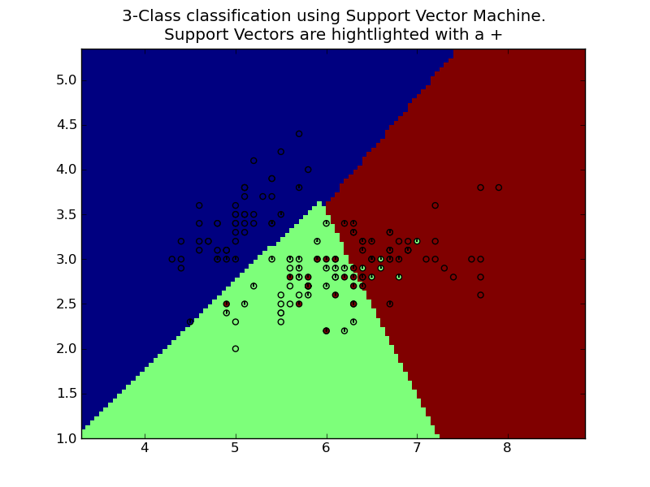

=======================
Support Vector Machines
=======================

**Support vector machines (SVMs)** are a set of supervised learning
methods used for classification and regression. In simple words, given
a set of training examples, witheach sample marked as belonging to one
of the multiple categories, an SVM training algorithm builds a model
that predicts whether a new example falls into one category or the
other.

More formally, a support vector machine constructs a hyperplane or set
of hyperplanes in a high or infinite dimensional space, which can be
used for classification, regression or other tasks. Intuitively, a
good separation is achieved by the hyperplane that has the largest
distance to the nearest training datapoints of any class (so-called
functional margin), since in general the larger the margin the lower
the generalization error of the classifier.

SVMs belong to a family of generalized linear classifiers. They can
also be considered a special case of Tikhonov regularization. A
special property is that they simultaneously minimize the empirical
classification error and maximize the geometric margin; hence they are
also known as maximum margin classifiers.

A comparison of the SVM to other classifiers has been made by Meyer,
Leisch and Hornik.[1]

Classification
==============
In the case of support vector machines, a data point is viewed as a
p-dimensional vector (a list of p numbers), and we want to know
whether we can separate such points with a (p-1)-dimensional
hyperplane. There are many hyperplanes that might classify the
data. One reasonable choice as the best hyperplane is the one that
represents the largest separation, or margin, between the two
classes. So we choose the hyperplane so that the distance from it to
the nearest data point on each side is maximized. If such a hyperplane
exists, it is known as the maximum-margin hyperplane and the linear
classifier it defines is known as a maximum margin classifier.

Classification of a dataset is implemented in class SVC.

.. autoclass:: scikits.learn.svm.SVC
   :members:

This class implements two classification algorithms using Support
Vector Machine, C-SVC and Nu-SVC. These can be selected using keyword
impl to the constructor. The following is a brief description of these
two algorithms (you don't have to understand it to use the
classifier). For a detailed info, please consult the references.

Regression
==========
Given a set of data points, :math:`{(x_1, z_1), ..., (x_l, z_l)}`, such that :math:`x_i \in \mathbb{R}^n` is an input and :math:`z_i \in \mathbb{R}` is a target output, the standard form of support vector regression:

.. autoclass:: scikits.learn.svm.SVR
   :members:

Distribution estimation
=======================
One-class SVM was proposed by Scholkopf et al. (2001) for estimating
the support of a high-dimensional distribution. Given training vectors
:math:`x_i \in \mathbb{R}^n, i=1, .., l` without any class
information, the primal form is:

.. math::    \min_{w, b, \xi} {1 \over 2} w^T w - \rho + {1 \over \nu l} \sum_{i=1}^l \xi_i

             \textrm{subject to} w^T \phi(x_i) \geq \rho - \xi_i

             \xi_i \geq 0, i=1,...,l

Parameters
==========

Kernel Type
-----------
The kernel of a Support Vector Machine is the function that computes
inner products in the transformed space.

Choices are one of 

  * linear :math:`(1 + <x, x'>)`
  * poly :math:`(1 + <x, x'>)^d`
  * rbf :math:`exp(-\gamma |x-x'|^2)`
  * 'sigmoid'
  * 'precomputed'.

Support Vectors
===============

Support vector machines ultimately depend on a subset of the training
set (the support vectors) to represent the classification boundary.

You can access the support vectors of the object in all classes using the member ``support_``

>>> from scikits.learn import svm
>>> X = [[-1, 1], [0, 0], [1, 1]]
>>> Y = [1, 2, 2]
>>> clf = svm.SVC(kernel='linear')
>>> clf.fit(X, Y) #doctest: +ELLIPSIS
<scikits.learn.svm.SVC object at ...>
>>> print clf.support_ #doctest: +NORMALIZE_WHITESPACE
          [[-1.  1.]
           [ 0.  0.]]

Coefficient for support vectors

TODO: include image

Examples
--------
.. literalinclude:: ../../examples/plot_svm.py

This creates the plot:

Mathematical formulation
========================

C-support vector classification (C-SVC)
---------------------------------------
Given training vectors :math:`x_i \in \mathbb{R}^n , i=1, ..., l` in
two classes, and a vector :math:`y \in \mathbb{R}^l` such that
:math:`y_i \in {1, -1}`, C-SVC solves the following primal problem:

.. math:: \min_{w, b, \xi} {1 \over 2} w^T w + C \sum_{i=1}^l \xi_i
.. math:: \textrm{subject to}\ y_i (w^T \phi(x_i) + b) \geq 1 - \xi_i
.. math:: \xi_i >= 0, i=1, .., l

Here training vectors :math:`x_i` are mapped into a higher (maybe
infinite) dimensional space by the function :math:`phi`. The decision
function is

.. math::    sgn(\sum_{i=0}^l y_i \alpha_i K(x_i, x) + b)

Nu-Support Vector Classification
--------------------------------
The nu-Support Vector Classification uses a new parameter :math:`\nu`
which controls the number of support vectors and trainign errors. The
parameter :math:`nu \in (0, 1]` is an upper bound on the fraction of
training errors and a lower bound of the fraction of support vectors.

Given training vectors :math:`x_i \in \mathbb{R}^n , i=1, ..., l` in
two classes, and a vector :math:`y \in \mathbb{R}^l` such that
:math:`y_i \in {1, -1}`, C-SVC solves the following primal problem:

.. math:: \min_{w, b, \xi} {1 \over 2} w^T w - \nu \rho + {1 \over 2} \sum_{i=1}^l \xi_i

          \textrm{subject to}\ y_i (w^T \phi(x_i) + b) \geq \rho - \xi_i

          \xi_i \geq 0, i=1, .., l, \rho \geq 0

The decision function is:

.. math::    sgn(\sum_{i=1}^l y_i \alpha_i K(x_i, x) + b

Low-level implementation
========================

Internally, we use libsvm[1] to handle all computations. Libsvm is binded
through some wrappers written in C and Cython.

.. [1] http://www.csie.ntu.edu.tw/~cjlin/libsvm/

References
==========

http://en.wikipedia.org/wiki/Support_vector_machine
