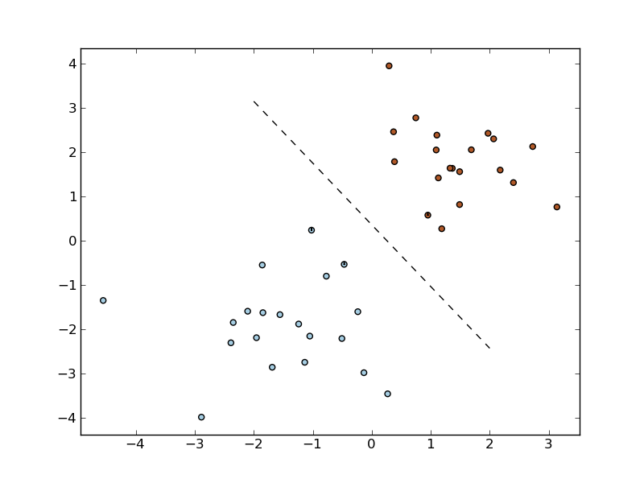
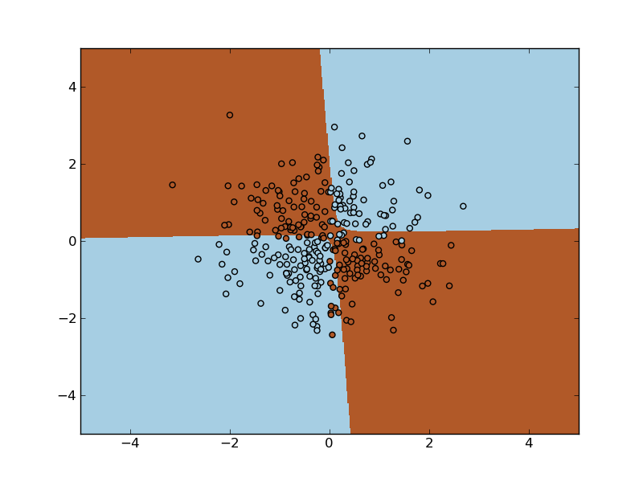
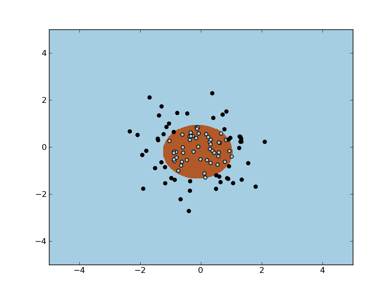

=======================
Support Vector Machines
=======================

**Support vector machines (SVMs)** are a set of supervised learning
methods used for classification and regression. In simple words, given
a set of training examples, with each sample marked as belonging to one
of the multiple categories, an SVM training algorithm builds a model
that predicts whether a new example falls into one category or the
other.

More formally, a support vector machine constructs a hyperplane or set
of hyperplanes in a high or infinite dimensional space, which can be
used for classification, regression or other tasks. Intuitively, a
good separation is achieved by the hyperplane that has the largest
distance to the nearest training data points of any class (so-called
functional margin), since in general the larger the margin the lower
the generalization error of the classifier.

Classification
--------------

Suppose some given data points each belong to one of two classes, and
the goal is to decide which class a new data point will be in. This
classification will be performed by creating a hyperplane that
maximizes the distance between any two classes.

.. TODO substitute this by a link

.. literalinclude:: ../../examples/svm/plot_svm_hyperplane.py

The original optimal hyperplane algorithm was a linear
classifier. However, in 1992, Bernhard Boser, Isabelle Guyon and
Vapnik suggested a way to replace every dot product by a non-linear
kernel function. This allows the algorithm to fit the maximum-margin
hyperplane in a transformed feature space. The transformation may be
non-linear and the transformed space high dimensional; thus though the
classifier is a hyperplane in the high-dimensional feature space, it
may be non-linear in the original input space.

The decision function in this case will be:

.. math:: sgn(\sum_{i=1}^l \alpha_i K(x_i, x) + \rho)

where :math:`\alpha, \rho` can be accessed through fields `support_` and
`intercept_` of the classifier instance, respectevely.

If the kernel used is a Gaussian radial basis function, the
corresponding feature space is a Hilbert space of infinite
dimension. Maximum margin classifiers are well regularized, so the
infinite dimension does not spoil the results. Available kernels are,

  * linear :math:`(1 + <x, x'>)`
  * polynomial :math:`(1 + <x, x'>)^d`
  * radial basis :math:`exp(-\gamma |x-x'|^2)`
  * sigmoid :math:`tanh(x_i x_j + c)`

The exclusive-OR is the simplest problem that cannot be solved using a
linear kernel. In this problem, point (x, y) belongs has target 1 if
and only if x > 0 XOR y > 0. In the following example, we create a
training set of random points X with target Y = XOR(X). We see that
the SVM correctly draws the decision function.

.. literalinclude:: ../../examples/svm/plot_svm_nonlinear.py

Complete class reference:

.. autoclass:: scikits.learn.svm.SVC
   :members:

Regression
----------
The method of Support Vector Classification can be extended to solve
the regression problem. This method is called Support Vector
Regression.

The model produced by support vector classification (as described
above) depends only on a subset of the training data, because the cost
function for building the model does not care about training points
that lie beyond the margin. Analogously, the model produced by Support
Vector Regression depends only on a subset of the training data,
because the cost function for building the model ignores any training
data close to the model prediction.

.. autoclass:: scikits.learn.svm.SVR
   :members:

Distribution estimation
=======================
One-class SVM is used for out-layer detection, that is, given a set of
samples, it will detect the soft boundary of that set.

.. literalinclude:: ../../examples/plot_svm_oneclass.py

.. autoclass:: scikits.learn.svm.OneClassSVM

Scaling
=======
Support Vector Machine algorithms are not scale-invariant, so it is
highly recommended to standarize the input vector X to have mean 0 and
variance 1. Note that the *same* scaling must be applied to the test
vector to obtain meaningful results.

See `The CookBook
<https://sourceforge.net/apps/trac/scikit-learn/wiki/CookBook>`_ for
some examples on scaling.

Implementation details
======================
Internally, we use libsvm[1] to handle all computations. Libsvm is wrapped
using C and Cython.

.. [1] http://www.csie.ntu.edu.tw/~cjlin/libsvm/

References
==========
For a description of the implementation and details of the algorithms
used, please refer to

    - http://www.csie.ntu.edu.tw/~cjlin/papers/libsvm.pdf
    - http://en.wikipedia.org/wiki/Support_vector_machine
