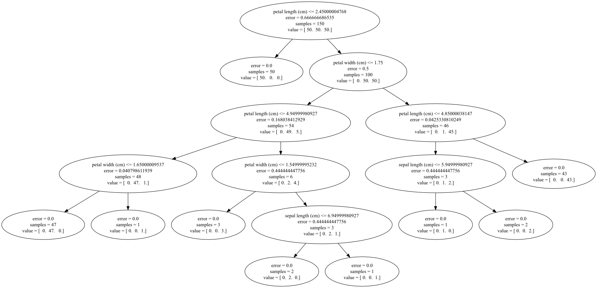

.. _tree:

==============
Decision Trees
==============

.. currentmodule:: sklearn.tree

**Decision Trees** are a supervised learning
method used for :ref:`classification <tree_classification>`,
:ref:`regression <tree_regression>`.

The advantages of Decision Trees are:

    - Simple to understand and interpret.  Trees can be visualised if needed.
    
    - Requires little data preparation. Other techniques often require data 
      normalisation, dummy variables need to be created and blank values to 
      be removed. This module does not support missing values though..
    
    - Able to handle both numerical and categorical data. Other techniques 
      are usually specialised in analysing datasets that have only one type 
      of variable.
    
    - Uses a white box model. If a given situation is observable in a model 
      the explanation for the condition is easily explained by boolean logic. 
      An example of a black box model is an artificial neural network since 
      the explanation for the results is difficult to understand.
    
    - Possible to validate a model using statistical tests. That makes it 
      possible to account for the reliability of the model.
    
    - Robust. Performs well even if its assumptions are somewhat violated by 
      the true model from which the data were generated.

The disadvantages of Decision Trees include:

    - The problem of learning an optimal decision tree is known to be 
      NP-complete under several aspects of optimality and even for simple 
      concepts. Consequently, practical decision-tree learning algorithms 
      are based on heuristic algorithms such as the greedy algorithm where 
      locally optimal decisions are made at each node. Such algorithms 
      cannot guarantee to return the globally optimal decision tree.  This
      can be mitigated by training multiple trees in an ensemble learner, 
      where the features and samples are randomly sampled with replacement.
    
    - Decision-tree learners can create over-complex trees that do not 
      generalise the data well. This is called overfitting. Mechanisms 
      such as pruning (not currently supported), setting the minimum 
      number of samples required at a leaf node or setting the maximum 
      depth of the tree are necessary to avoid this problem.
    
    - There are concepts that are hard to learn because decision trees 
      do not express them easily, such as XOR, parity or multiplexer problems. 

    - Decision tree learners create biased trees if some classes dominate. 
      It is therefore recommended to balance the dataset prior to fitting 
      with the decision tree.

    - Decision trees are unstable because small variations in the data might
      result in a completely different tree being generated.  This problem
      is mitigated by using decision trees with an ensemble. 

.. _tree_classification:

Classification
==============

:class:`DecisionTreeClassifier` is capable of performing multi-class 
    classification on a dataset.

.. figure:: ../auto_examples/tree/images/plot_iris_1.png
   :target: ../auto_examples/tree/plot_iris.html
   :align: center

    >>> from sklearn import tree
    >>> X = [[0, 0], [1, 1]]
    >>> Y = [0, 1]
    >>> clf = tree.DecisionTreeClassifier()
    >>> clf = clf.fit(X, Y)

After being fitted, the model can then be used to predict new values::

    >>> clf.predict([[2., 2.]])
    array([1])

.. topic:: Examples:

 * :ref:`example_tree_plot_iris.py`,
 * :ref:`example_tree_plot_separating_hyperplane.py`,

.. _tree_regression:

Regression
==========

Decision Trees can be applied to solve regression problems. 

Uses Mean Squared Error to find the best fit.

As with classification classes, the fit method will take as
argument vectors X, y, only that in this case y is expected to have
floating point values instead of integer values::

    >>> from sklearn import tree
    >>> X = [[0, 0], [2, 2]]
    >>> y = [0.5, 2.5]
    >>> clf = tree.DecisionTreeRegressor()
    >>> clf = clf.fit(X, y)
    >>> clf.predict([[1, 1]])
    array([ 2.5])

.. topic:: Examples:

 * :ref:`example_tree_plot_tree_regression.py`

Complexity
==========

Decision Trees are effective learners, and scikits-learn offers an efficient 
implementation to the computational complexity.  The main idea in a 
decision tree is to compute for each node both the feature and the threshold 
that offers the largest decrease in entropy (or increase in information).
An inefficient implementation would recompute the class label histograms 
(for classification) or the means (for regression) leading to a run time 
complexity of :math:`O(n_{features} \times n_{samples}^2)` for each node.
By presorting the feature over all relevant samples, and retaining a running
label count, we reduce the complexity at each node to 
:math:`O(n_{features} \times n_{samples})`. The relative compute time 
decreases for nodes further down the tree since there are fewer samples for
which to compute the error.  Assuming that the total number of nodes in the 
tree is approximately equal to :math:`log(n_{samples})`, the total time 
complexity for the algorithm is 
:math:`O(n_{features} \times n_{samples}) \times log(n_{samples})`

This implementation uses fancy indexing for data partitioning during the 
tree building phase.  While this does increase the memory requirement to 
3 to 4 times the size of the data in the worst case, it results in significantly 
faster training times (up to 20 times in certain cases).

Tips on Practical Use
=====================

  * Decision trees tend to overfit to data with large number of features.  
    Getting the right ratio of samples to number of features is important, since 
    a tree with few samples in high dimensional space is very likely to overfit.
  
  * Perform dimensionality reduction (PCA or ICA) beforehand to give your tree
    a better chance of finding features that are discriminative.
  
  * Visualise your tree as you are training by using the ``export_to_graphviz``
    function.  Use ``max_depth=3`` as an initial tree depth to get a feel for
    how the tree is fitting to your data, and then increase the depth.  
  
  * Remember that the number of samples required to populate the tree doubles 
    for each additional level the tree grows to.  Use ``max_depth`` to control
    the size of the tree to prevent overfitting. 
  
  * Use ``min_split`` to control the number of samples at a leaf node.  A very 
    small number will usually mean the tree will overfit, whereas a large number
    will prevent the tree from learning the data.  Try ``min_split=5`` as an 
    initial value.  

ID3, C4.5, C5.0 and CART
========================

What are all the various decision tree algorithms and how do they differ from 
each other? Which one is implemented in scikit-learn?

[ID3](http://en.wikipedia.org/wiki/ID3_algorithm) was developed in 1986 by Ross
Quinlan.  The algorithm creates a multiway tree, finding for each node the
categorical feature that will yield the largest information gain for 
categorical targets. C4.5 is the successor to this algorithm and removed the 
restriction that features must be categorical by dynamically defining a 
discrete attribute (based on numerical variables) that partitions the 
continuous attribute value into a discrete set of intervals. 

[CART](http://en.wikipedia.org/wiki/Predictive_analytics#Classification_and_regression_trees) 
is very similar to C4.5, but it differs in that it supports 
numerical target variables (regression) and does not compute rule sets.  
CART also uses the feature and threshold that yield the largest 
information gain and creates a binary split at each node. 

C5.0 is Quinlan's latest version release under a proprietary license. 
It uses less memory and builds smaller rulesets than C4.5 while being more 
accurate. 

We use CART in scikit-learn.

.. _tree_mathematical_formulation:

.. TODO 

Mathematical formulation
========================

.. topic:: References:

    * http://en.wikipedia.org/wiki/Decision_tree_learning

    * http://en.wikipedia.org/wiki/Predictive_analytics

    * L. Breiman, J. Friedman, R. Olshen, and C. Stone. Classification and
      Regression Trees. Wadsworth, Belmont, CA, 1984.

	* J.R. Quinlan. C4. 5: programs for machine learning. Morgan Kaufmann, 1993.

    * T. Hastie, R. Tibshirani and J. Friedman.
      Elements of Statistical Learning, Springer, 2009.
