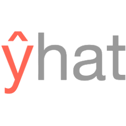
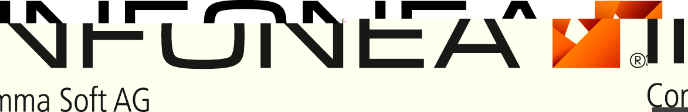

.. _testimonials:

================================================================================
Who is using scikit-learn?
================================================================================

.. raw:: html

  

.. to add a testimonials, just XXX

`Spotify <http://www.spotify.com>`_
------------------------------------

.. raw:: html

    

.. raw:: html

    

Scikit-learn provides a toolbox with solid implementations of a bunch of
state-of-the-art models and makes it easy to plug them into existing
applications. We've been using it quite a lot for music recommendations at
Spotify and I think it's the most well-designed ML package I've seen so
far.

.. raw:: html

   

Erik Bernhardsson, Engineering Manager Music Discovery & Machine Learning, Spotify

.. raw:: html

   

`Inria <http://www.inria.fr>`_
-------------------------------

.. raw:: html

  

.. raw:: html

  

.. title Scikit-learn for efficient and easier machine learning research
.. Author: Gaël Varoquaux

At INRIA, we use scikit-learn to support leading-edge basic research in many
teams: `Parietal <https://team.inria.fr/parietal/>`_ for neuroimaging, `Lear
<http://lear.inrialpes.fr/>`_ for computer vision, `Visages
<https://www.irisa.fr/visages/index>`_ for medical image analysis, `Privatics
<https://team.inria.fr/privatics>`_ for security. The project is a fantastic
tool to address difficult applications of machine learing in an academic
environment as it is performant and versatile, but all easy-to-use and well
documented, which makes it well suited to grad students.

.. raw:: html

   

Gaël Varoquaux, research at Parietal

.. raw:: html

   

`Evernote <https://evernote.com>`_
----------------------------------

.. raw:: html

  

.. raw:: html

  

Building a classifier is typically an iterative process of exploring
the data, selecting the features (the attributes of the data believed
to be predictive in some way), training the models, and finally
evaluating them. For many of these tasks, we relied on the excellent
scikit-learn package for Python.

`Read more <http://blog.evernote.com/tech/2013/01/22/stay-classified/>`_

.. raw:: html

   

Mark Ayzenshtat, VP, Augmented Intelligence

.. raw:: html

   

`Télécom ParisTech <http://www.telecom-paristech.fr>`_
--------------------------------------------------------

.. raw:: html

  

.. raw:: html

  

At Telecom ParisTech, scikit-learn is used for hands-on sessions and home
assignments in introductory and advanced machine learning courses. The classes
are for undergrads and masters students. The great benefit of scikit-learn is
its fast learning curve that allows students to quickly start working on
interesting and motivating problems.

.. raw:: html

   

Alexandre Gramfort, Assistant Professor

.. raw:: html

   

`Booking.com <http://booking.com>`_
-------------------------------------
.. raw:: html

  

.. image:: images/booking.png
    :width: 120pt
    :target: http://www.booking.com

.. raw:: html

  

At Booking.com, we use machine learning algorithms for many different
applications, such as recommending hotels and destinations to our customers,
detecting fraudulent reservations, or scheduling our customer service agents.
Scikit-learn is one of the tools we use when implementing standard algorithms
for prediction tasks. Its API and documentations are excellent and make it easy
to use. The scikit-learn developers do a great job of incorporating state of
the art implementations and new algorithms into the package. Thus, scikit-learn
provides convenient access to a wide spectrum of algorithms, and allows us to
readily find the right tool for the right job.

.. raw:: html

   

Melanie Mueller, Data Scientist

.. raw:: html

   

`AWeber <http://www.aweber.com>`_
------------------------------------------

.. raw:: html

  

.. raw:: html

  

The scikit-learn toolkit is indispensable for the Data Analysis and Management
team at AWeber.  It allows us to do AWesome stuff we would not otherwise have
the time or resources to accomplish. The documentation is excellent, allowing
new engineers to quickly evaluate and apply many different algorithms to our
data. The text feature extraction utilities are useful when working with the
large volume of email content we have at AWeber. The RandomizedPCA
implementation, along with Pipelining and FeatureUnions, allows us to develop
complex machine learning algorithms efficiently and reliably.

Anyone interested in learning more about how AWeber deploys scikit-learn in a
production environment should check out talks from PyData Boston by AWeber's
Michael Becker available at https://github.com/mdbecker/pydata_2013

.. raw:: html

   

Michael Becker, Software Engineer, Data Analysis and Management Ninjas

.. raw:: html

   

`Yhat <https://www.yhat.com>`_
------------------------------------------

.. raw:: html

  

.. raw:: html

  

The combination of consistent APIs, thorough documentation, and top notch
implementation make scikit-learn our favorite machine learning package in
Python. scikit-learn makes doing advanced analysis in Python accessible to
anyone. At Yhat, we make it easy to integrate these models into your production
applications. Thus eliminating the unnecessary dev time encountered
productionizing analytical work.

.. raw:: html

   

Greg Lamp, Co-founder Yhat

.. raw:: html

   

`Rangespan <https://www.rangespan.com>`_
------------------------------------------

.. raw:: html

  

.. raw:: html

  

The Python scikit-learn toolkit is a core tool in the data science
group at Rangespan. Its large collection of well documented models and
algorithms allow our team of data scientists to prototype fast and
quickly iterate to find the right solution to our learning problems.
We find that scikit-learn is not only the right tool for prototyping,
but its careful and well tested implementation give us the confidence
to run scikit-learn models in production.

.. raw:: html

   

Jurgen Van Gael, Data Science Director at Rangespan Ltd

.. raw:: html

   

`Birchbox <https://www.birchbox.com>`_
------------------------------------------

.. raw:: html

  

.. raw:: html

  

At Birchbox, we face a range of machine learning problems typical to
E-commerce: product recommendation, user clustering, inventory prediction,
trends detection, etc. Scikit-learn lets us experiment with many models,
especially in the exploration phase of a new project: the data can be passed
around in a consistent way; models are easy to save and reuse; updates keep us
informed of new developments from the pattern discovery research community.
Scikit-learn is an important tool for our team, built the right way in the
right language.

.. raw:: html

   

Thierry Bertin-Mahieux, Birchbox, Data Scientist

.. raw:: html

   

`Bestofmedia Group <http://www.bestofmedia.com>`_
--------------------------------------------------

.. raw:: html

  

.. raw:: html

  

Scikit-learn is our #1 toolkit for all things machine learning
at Bestofmedia. We use it for a variety of tasks (e.g. spam fighting,
ad click prediction, various ranking models) thanks to the varied,
state-of-the-art algorithm implementations packaged into it.
In the lab it accelerates prototyping of complex pipelines. In
production I can say it has proven to be robust and efficient enough
to be deployed for business critical components.

.. raw:: html

   

Eustache Diemert, Lead Scientist Bestofmedia Group

.. raw:: html

   

`Change.org <https://www.change.org>`_
--------------------------------------

.. raw:: html

  

.. raw:: html

  

At change.org we automate the use of scikit-learn's RandomForestClassifier
in our production systems to drive email targeting that reaches millions
of users across the world each week. In the lab, scikit-learn's ease-of-use,
performance, and overall variety of algorithms implemented has proved invaluable
in giving us a single reliable source to turn to for our machine-learning needs.

.. raw:: html

   

Vijay Ramesh, Software Engineer in Data/science at Change.org

.. raw:: html

   

`PHIMECA Engineering <http://www.phimeca.com/?lang=en>`_
----------------------------------------------------------

.. raw:: html

  

.. raw:: html

  

At PHIMECA Engineering, we use scikit-learn estimators as surrogates for
expensive-to-evaluate numerical models (mostly but not exclusively
finite-element mechanical models) for speeding up the intensive post-processing
operations involved in our simulation-based decision making framework.
Scikit-learn's fit/predict API together with its efficient cross-validation
tools considerably eases the task of selecting the best-fit estimator. We are
also using scikit-learn for illustrating concepts in our training sessions.
Trainees are always impressed by the ease-of-use of scikit-learn despite the
apparent theoretical complexity of machine learning.

.. raw:: html

   

Vincent Dubourg, PHIMECA Engineering, PhD Engineer

.. raw:: html

   

`HowAboutWe <http://www.howaboutwe.com/>`_
----------------------------------------------------------

.. raw:: html

  

.. image:: images/howaboutwe.png
    :width: 120pt
    :target: http://www.howaboutwe.com/

.. raw:: html

  

At HowAboutWe, scikit-learn lets us implement a wide array of machine learning
techniques in analysis and in production, despite having a small team.  We use
scikit-learn’s classification algorithms to predict user behavior, enabling us
to (for example) estimate the value of leads from a given traffic source early
in the lead’s tenure on our site. Also, our users' profiles consist of
primarily unstructured data (answers to open-ended questions), so we use
scikit-learn’s feature extraction and dimensionality reduction tools to
translate these unstructured data into inputs for our matchmaking system.

.. raw:: html

   

Daniel Weitzenfeld, Senior Data Scientist at HowAboutWe

.. raw:: html

   

`PeerIndex <https://www.brandwatch.com/peerindex-and-brandwatch>`_
------------------------------------------------------------------

.. raw:: html

  

.. raw:: html

  

At PeerIndex we use scientific methodology to build the Influence Graph - a
unique dataset that allows us to identify who’s really influential and in which
context. To do this, we have to tackle a range of machine learning and
predictive modeling problems. Scikit-learn has emerged as our primary tool for
developing prototypes and making quick progress. From predicting missing data
and classifying tweets to clustering communities of social media users, scikit-
learn proved useful in a variety of applications. Its very intuitive interface
and excellent compatibility with other python tools makes it and indispensable
tool in our daily research efforts.

.. raw:: html

   

Ferenc Huszar - Senior Data Scientist at Peerindex

.. raw:: html

   

`DataRobot <http://www.datarobot.com>`_
----------------------------------------

.. raw:: html

    

.. raw:: html

    

DataRobot is building next generation predictive analytics software to make data scientists more productive, and scikit-learn is an integral part of our system. The variety of machine learning techniques in combination with the solid implementations that scikit-learn offers makes it a one-stop-shopping library for machine learning in Python. Moreover, its consistent API, well-tested code and permissive licensing allow us to use it in a production environment. Scikit-learn has literally saved us years of work we would have had to do ourselves to bring our product to market.

.. raw:: html

   

Jeremy Achin, CEO & Co-founder DataRobot Inc.

.. raw:: html

   

`OkCupid <https://www.okcupid.com/>`_
--------------------------------------

.. raw:: html

    

.. raw:: html

    

We're using scikit-learn at OkCupid to evaluate and improve our matchmaking
system. The range of features it has, especially preprocessing utilities, means
we can use it for a wide variety of projects, and it's performant enough to
handle the volume of data that we need to sort through. The documentation is
really thorough, as well, which makes the library quite easy to use.

.. raw:: html

   

David Koh - Senior Data Scientist at OkCupid

.. raw:: html

   
   

`Lovely <https://livelovely.com/>`_
-----------------------------------

.. raw:: html

    

.. raw:: html

    

At Lovely, we strive to deliver the best apartment marketplace, with respect to
our users and our listings. From understanding user behavior, improving data
quality, and detecting fraud, scikit-learn is a regular tool for gathering
insights, predictive modeling and improving our product. The easy-to-read
documentation and intuitive architecture of the API makes machine learning both
explorable and accessible to a wide range of python developers. I'm constantly
recommending that more developers and scientists try scikit-learn.

.. raw:: html

   

Simon Frid - Data Scientist, Lead at Lovely

.. raw:: html

   

`Data Publica <http://www.data-publica.com/>`_
----------------------------------------------

.. raw:: html

    

.. raw:: html

    

Data Publica builds a new predictive sales tool for commercial and marketing teams called C-Radar.
We extensively use scikit-learn to build segmentations of customers through clustering, and to predict future customers based on past partnerships success or failure.
We also categorize companies using their website communication thanks to scikit-learn and its machine learning algorithm implementations.
Eventually, machine learning makes it possible to detect weak signals that traditional tools cannot see.
All these complex tasks are performed in an easy and straightforward way thanks to the great quality of the scikit-learn framework.

.. raw:: html

   

Guillaume Lebourgeois & Samuel Charron - Data Scientists at Data Publica

.. raw:: html

   

`Machinalis <http://www.machinalis.com>`_
-----------------------------------------

.. raw:: html

   

.. raw:: html

   

Scikit-learn is the cornerstone of all the machine learning projects carried at
Machinalis. It has a consistent API, a wide selection of algorithms and lots
of auxiliary tools to deal with the boilerplate.
We have used it in production environments on a variety of projects
including click-through rate prediction, `information extraction <https://github.com/machinalis/iepy>`_,
and even counting sheep!

In fact, we use it so much that we've started to freeze our common use cases
into Python packages, some of them open-sourced, like
`FeatureForge <https://github.com/machinalis/featureforge>`_ .
Scikit-learn in one word: Awesome.

.. raw:: html

  

Rafael Carrascosa, Lead developer

`solido <http://www.solidodesign.com/>`_
-----------------------------------------

.. raw:: html

   

.. raw:: html

   

Scikit-learn is helping to drive Moore’s Law, via Solido. Solido creates
computer-aided design tools used by the majority of top-20 semiconductor
companies and fabs, to design the bleeding-edge chips inside smartphones,
automobiles, and more. Scikit-learn helps to power Solido’s algorithms for
rare-event estimation, worst-case verification, optimization, and more. At
Solido, we are particularly fond of scikit-learn’s libraries for Gaussian
Process models, large-scale regularized linear regression, and classification.
Scikit-learn has increased our productivity, because for many ML problems we no
longer need to “roll our own” code. `This PyData 2014 talk <https://www.youtube.com/watch?v=Jm-eBD9xR3w>`_ has details.

.. raw:: html

  

Trent McConaghy, founder, Solido Design Automation Inc.

.. raw:: html

  

`INFONEA <http://www.infonea.com/en/>`_
-----------------------------------------

.. raw:: html

   

.. raw:: html

   

We employ scikit-learn for rapid prototyping and custom-made Data Science
solutions within our in-memory based Business Intelligence Software
INFONEA®. As a well-documented and comprehensive collection of
state-of-the-art algorithms and pipelining methods, scikit-learn enables
us to provide flexible and scalable scientific analysis solutions. Thus,
scikit-learn is immensely valuable in realizing a powerful integration of
Data Science technology within self-service business analytics.

.. raw:: html

  

Thorsten Kranz, Data Scientist, Coma Soft AG.

.. raw:: html

  

`Dataiku <http://www.dataiku.com/>`_
-----------------------------------------

.. raw:: html

   

.. raw:: html

   

Our software, Data Science Studio (DSS), enables users to create data services 
that combine `ETL <https://en.wikipedia.org/wiki/Extract,_transform,_load>`_ with 
Machine Learning. Our Machine Learning module integrates 
many scikit-learn algorithms. The scikit-learn library is a perfect integration 
with DSS because it offers algorithms for virtually all business cases. Our goal 
is to offer a transparent and flexible tool that makes it easier to optimize 
time consuming aspects of building a data service, preparing data, and training 
machine learning algorithms on all types of data.

.. raw:: html

  

Florian Douetteau, CEO, Dataiku

.. raw:: html

  

