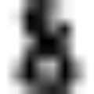

Getting started: an introduction to learning with the scikit
=============================================================

.. topic:: Section contents

    In this section, we introduce the machine learning vocabulary that we
    use through-out the `scikit.learn` and give a simple example of
    solving a learning problem.

Machine learning: the problem setting
---------------------------------------

In general, a learning problem considers a set of n *samples* of data and
try to predict properties of unknown data. If each sample is more than a
single number, and for instance a multi-dimensional entry (aka
*multivariate* data), is it said to have several attributes, or
*features*.

We can separate learning problems in a few large categories: 

 * **supervised learning**, in which the data comes with additional
   attributes that we want to predict. This problem can be either:
   
    * **classification**: samples belong to two or more classes and we
      want to learn from already labeled data how to predict the class
      of un-labeled data.

    * **regression**: each sample is associated with a numerical
      attribute, often called explanatory variable. The goal is to 
      learn the relationship between the data and the explanatory
      variable to be able to predict its value on new data.

 * **unsupervised learning**, in which we are trying to learning a
   synthetic representation of the data.

.. topic:: Training set and testing set

    Machine learning is about learning some properties of a data set and
    applying them to new data. This is why a common practice in machine 
    learning to evaluate an algorithm is to split the data at hand in two
    sets, one that we call a *training set* on which we learn data
    properties, and one that we call a *testing set*, on which we test
    these properties.

Loading an example dataset
--------------------------

The `scikit.learn` comes with a few standard datasets, for instance the
`iris dataset <http://en.wikipedia.org/wiki/Iris_flower_data_set>`_, or
the `digits dataset
<http://archive.ics.uci.edu/ml/datasets/Pen-Based+Recognition+of+Handwritten+Digits>`_::

    >>> from scikits.learn import datasets
    >>> iris = datasets.load_iris()
    >>> digits = datasets.load_digits()

A dataset is a dictionary-like object that holds all the data and some
metadata about the data. This data is stored in the `.data` member, which
is a `n_samples, n_features` array. In the case of supervised problem,
explanatory variables are stored in the `.target` member.

For instance, in the case of the digits dataset, `digits.data` gives
access to the features that can be used to classify the digits samples::

    >>> digits.data
    array([[  0.,   0.,   5., ...,   0.,   0.,   0.],
           [  0.,   0.,   0., ...,  10.,   0.,   0.],
           [  0.,   0.,   0., ...,  16.,   9.,   0.],
           ..., 
           [  0.,   0.,   1., ...,   6.,   0.,   0.],
           [  0.,   0.,   2., ...,  12.,   0.,   0.],
           [  0.,   0.,  10., ...,  12.,   1.,   0.]])

and `digits.target` gives the ground truth for the digit dataset, that
is the number corresponding to each digit image that we are trying to
learn:

>>> digits.target
array([0, 1, 2, ..., 8, 9, 8])

.. topic:: Shape of the data arrays
   
    The data is always are 2D array, `n_samples, n_features`, although
    the original data may have had a different shape. In the case of the
    digits, each original sample is an image of shape `8, 8` and can be
    accessed using:

    >>> digits.images[0]
    array([[  0.,   0.,   5.,  13.,   9.,   1.,   0.,   0.],
           [  0.,   0.,  13.,  15.,  10.,  15.,   5.,   0.],
           [  0.,   3.,  15.,   2.,   0.,  11.,   8.,   0.],
           [  0.,   4.,  12.,   0.,   0.,   8.,   8.,   0.],
           [  0.,   5.,   8.,   0.,   0.,   9.,   8.,   0.],
           [  0.,   4.,  11.,   0.,   1.,  12.,   7.,   0.],
           [  0.,   2.,  14.,   5.,  10.,  12.,   0.,   0.],
           [  0.,   0.,   6.,  13.,  10.,   0.,   0.,   0.]])

    The :ref:`simple example on this dataset <example_plot_digits_classification.py>`
    illustrates how starting from the original problem one can shape the 
    data for consumption in the `scikit.learn`.

Learning and Predicting
------------------------

In the case of the digits dataset, the task is to predict the value of a
hand-written digit from an image. We are given samples of each of the 10
possible classes on which we *fit* an `estimator` to be able to *predict*
the labels corresponding to new data.

In `scikit.learn`, an *estimator* is just a plain Python class that
implements the methods `fit(X, Y)` and `predict(T)`.

An example of estimator is the class ``scikits.learn.neighbors.SVC`` that
implements `Support Vector Classification
<http://en.wikipedia.org/wiki/Support_vector_machine>`_. The
constructor of an estimator takes as arguments the parameters of the
model, but for the time being, we will consider the estimator as a black
box and not worry about these:

>>> from scikits.learn import svm
>>> clf = svm.SVC()

We call our estimator instance `clf` as it is a classifier. It now must
be fitted to the model, that is, it must `learn` from the model. This is
done by passing our training set to the ``fit`` method. As a training
set, let us use the all the images of our dataset appart from the last
one:

>>> clf.fit(digits.data[:-1], digits.target[:-1]) #doctest: +ELLIPSIS
<scikits.learn.svm.SVC object at 0x...>

Now you can predict new values, in particular, we can ask to the
classifier what is the digit of our last image in the `digits` dataset,
which we have not used to train the classifier:

>>> print clf.predict(digits.data[-1])
array([ 8.])

The corresponding image is the following:

As you can see, it is a challenging task: the images are of poor
resolution. Do you agree with the classifier?

A complete example of this classification problem is available as an
example that you can run and study:
:ref:`example_plot_digits_classification.py`. 
