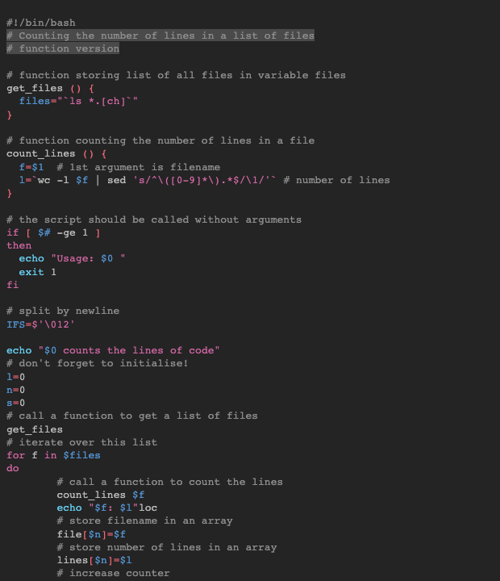

# Blinds Dark

This style mimics the blinds dark theme from vscode themes.

## Colors

Background color:  `#242424`

Highlight color:  `#66666691`

**WCAG compliance**

| Color                                             | Hex       | Ratio   | Normal text | Large text |
| ------------------------------------------------- | --------- | ------- | ----------- | ---------- |
|  | `#8c8c8c` | 4.6 : 1 | AA          | AAA        |
|  | `#ee6677` | 5.0 : 1 | AA          | AAA        |
|  | `#ccbb44` | 8.0 : 1 | AAA         | AAA        |
|  | `#66ccee` | 8.5 : 1 | AAA         | AAA        |
|  | `#5391cf` | 4.7 : 1 | AA          | AAA        |
|  | `#d166a3` | 4.5 : 1 | AA          | AAA        |
|  | `#bbbbbb` | 8.1 : 1 | AAA         | AAA        |
