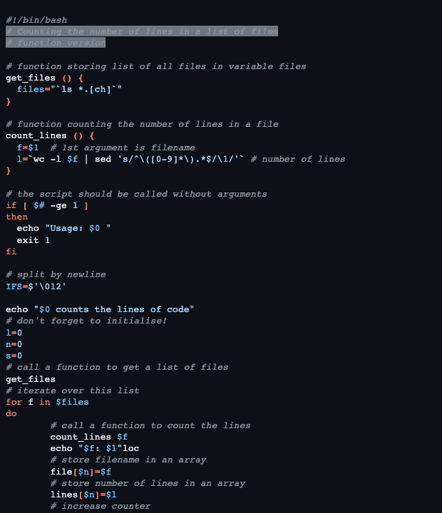

# Github Dark

This style mimics the github dark default theme from vs code themes.

## Colors

Background color:  `#0d1117`

Highlight color:  `#6e7681`

**WCAG compliance**

| Color                                             | Hex       | Ratio    | Normal text | Large text |
| ------------------------------------------------- | --------- | -------- | ----------- | ---------- |
|  | `#8b949e` | 6.2 : 1  | AA          | AAA        |
|  | `#ff7b72` | 7.5 : 1  | AAA         | AAA        |
|  | `#ffa657` | 9.8 : 1  | AAA         | AAA        |
|  | `#7ee787` | 12.3 : 1 | AAA         | AAA        |
|  | `#79c0ff` | 9.7 : 1  | AAA         | AAA        |
|  | `#d2a8ff` | 9.7 : 1  | AAA         | AAA        |
|  | `#c9d1d9` | 12.3 : 1 | AAA         | AAA        |
