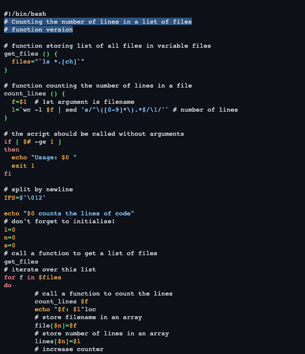

# Github Dark High Contrast

This style mimics the github dark high contrast theme from vs code themes.

## Colors

Background color:  `#0d1117`

Highlight color:  `#58a6ff70`

**WCAG compliance**

| Color                                             | Hex       | Ratio    | Normal text | Large text |
| ------------------------------------------------- | --------- | -------- | ----------- | ---------- |
|  | `#d9dee3` | 14.0 : 1 | AAA         | AAA        |
|  | `#ff9492` | 8.9 : 1  | AAA         | AAA        |
|  | `#ffb757` | 11.0 : 1 | AAA         | AAA        |
|  | `#72f088` | 13.1 : 1 | AAA         | AAA        |
|  | `#91cbff` | 11.0 : 1 | AAA         | AAA        |
|  | `#dbb7ff` | 11.0 : 1 | AAA         | AAA        |
|  | `#c9d1d9` | 12.3 : 1 | AAA         | AAA        |
