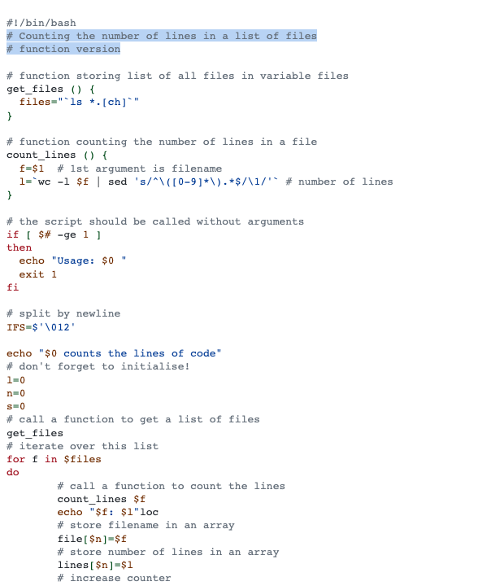

# Github Light High Contrast

This style mimics the github light high contrast theme from vscode themes.

## Colors

Background color:  `#ffffff`

Highlight color:  `#0969da4a`

**WCAG compliance**

| Color                                             | Hex       | Ratio    | Normal text | Large text |
| ------------------------------------------------- | --------- | -------- | ----------- | ---------- |
|  | `#66707b` | 5.0 : 1  | AA          | AAA        |
|  | `#a0111f` | 8.1 : 1  | AAA         | AAA        |
|  | `#702c00` | 10.2 : 1 | AAA         | AAA        |
|  | `#024c1a` | 10.2 : 1 | AAA         | AAA        |
|  | `#023b95` | 10.2 : 1 | AAA         | AAA        |
|  | `#622cbc` | 8.1 : 1  | AAA         | AAA        |
|  | `#24292f` | 14.7 : 1 | AAA         | AAA        |
