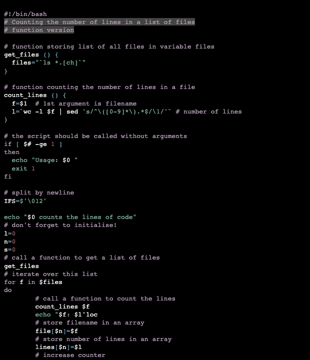

# Gotthard Dark

This style mimics the gotthard dark theme from vscode.

## Colors

Background color:  `#000000`

Highlight color:  `#4c4b4be8`

**WCAG compliance**

| Color                                             | Hex       | Ratio    | Normal text | Large text |
| ------------------------------------------------- | --------- | -------- | ----------- | ---------- |
|  | `#f5f5f5` | 19.3 : 1 | AAA         | AAA        |
|  | `#ab6369` | 4.7 : 1  | AA          | AAA        |
|  | `#b89784` | 7.8 : 1  | AAA         | AAA        |
|  | `#caab6d` | 9.6 : 1  | AAA         | AAA        |
|  | `#81b19b` | 8.7 : 1  | AAA         | AAA        |
|  | `#6f98b3` | 6.8 : 1  | AA          | AAA        |
|  | `#b19db4` | 8.4 : 1  | AAA         | AAA        |
