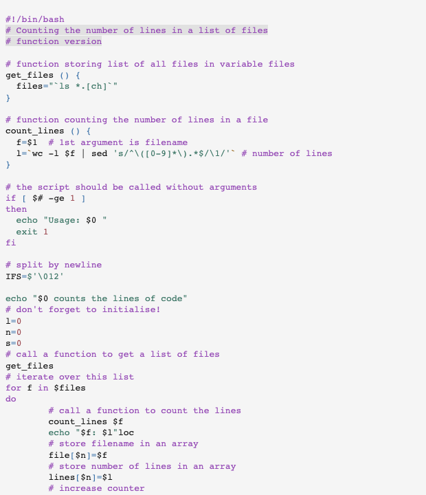

# Gotthard Light

This style mimics the gotthard light theme from vscode.

## Colors

Background color:  `#F5F5F5`

Highlight color:  `#E1E1E1`

**WCAG compliance**

| Color                                             | Hex       | Ratio    | Normal text | Large text |
| ------------------------------------------------- | --------- | -------- | ----------- | ---------- |
|  | `#141414` | 16.9 : 1 | AAA         | AAA        |
|  | `#9f4e55` | 5.2 : 1  | AA          | AAA        |
|  | `#a25e53` | 4.5 : 1  | AA          | AAA        |
|  | `#98661b` | 4.5 : 1  | AA          | AAA        |
|  | `#437a6b` | 4.5 : 1  | AA          | AAA        |
|  | `#3d73a9` | 4.6 : 1  | AA          | AAA        |
|  | `#974eb7` | 4.7 : 1  | AA          | AAA        |
