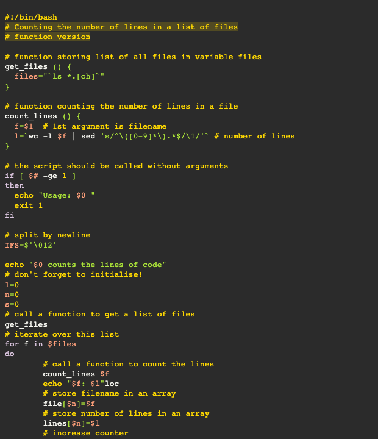

# A11Y High Contrast Dark

This style mimics the a11 light theme from eric bailey's accessible themes.

## Colors

Background color:  `#2b2b2b`

Highlight color:  `#ffd9002e`

**WCAG compliance**

| Color                                             | Hex       | Ratio    | Normal text | Large text |
| ------------------------------------------------- | --------- | -------- | ----------- | ---------- |
|  | `#ffd900` | 10.2 : 1 | AAA         | AAA        |
|  | `#ffa07a` | 7.1 : 1  | AAA         | AAA        |
|  | `#abe338` | 9.3 : 1  | AAA         | AAA        |
|  | `#00e0e0` | 8.6 : 1  | AAA         | AAA        |
|  | `#dcc6e0` | 8.9 : 1  | AAA         | AAA        |
|  | `#f8f8f2` | 13.3 : 1 | AAA         | AAA        |
