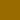

# Blinds Light

This style mimics the blinds light theme from vscode themes.

## Colors

Background color:  `#fcfcfc`

Highlight color:  `#add6ff`

**WCAG compliance**

| Color                                             | Hex       | Ratio    | Normal text | Large text |
| ------------------------------------------------- | --------- | -------- | ----------- | ---------- |
|  | `#737373` | 4.6 : 1  | AA          | AAA        |
|  | `#bf5400` | 4.6 : 1  | AA          | AAA        |
|  | `#996b00` | 4.6 : 1  | AA          | AAA        |
|  | `#008561` | 4.5 : 1  | AA          | AAA        |
|  | `#0072b2` | 5.1 : 1  | AA          | AAA        |
|  | `#cc398b` | 4.5 : 1  | AA          | AAA        |
|  | `#000000` | 20.5 : 1 | AAA         | AAA        |
