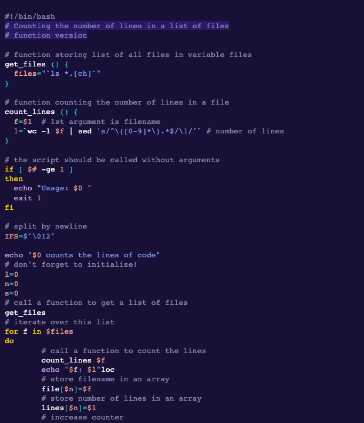

# Pitaya Smoothie

This style mimics the a11 light theme from eric bailey's accessible themes.

## Colors

Background color:  `#181036`

Highlight color:  `#2A1968`

**WCAG compliance**

| Color                                             | Hex       | Ratio    | Normal text | Large text |
| ------------------------------------------------- | --------- | -------- | ----------- | ---------- |
|  | `#8786ac` | 5.2 : 1  | AA          | AAA        |
|  | `#f26196` | 5.9 : 1  | AA          | AAA        |
|  | `#f5a394` | 9.0 : 1  | AAA         | AAA        |
|  | `#fad000` | 12.1 : 1 | AAA         | AAA        |
|  | `#18c1c4` | 8.1 : 1  | AAA         | AAA        |
|  | `#66e9ec` | 12.4 : 1 | AAA         | AAA        |
|  | `#7998f2` | 6.5 : 1  | AA          | AAA        |
|  | `#c4a2f5` | 8.4 : 1  | AAA         | AAA        |
|  | `#fefeff` | 17.9 : 1 | AAA         | AAA        |
